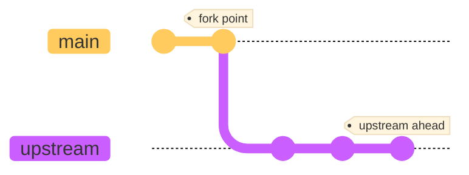
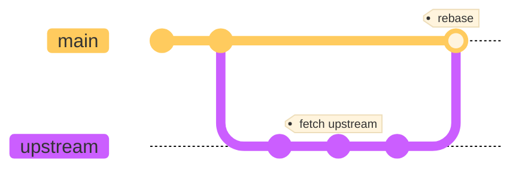
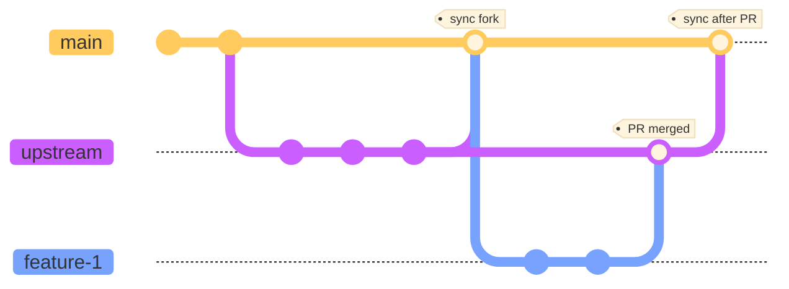
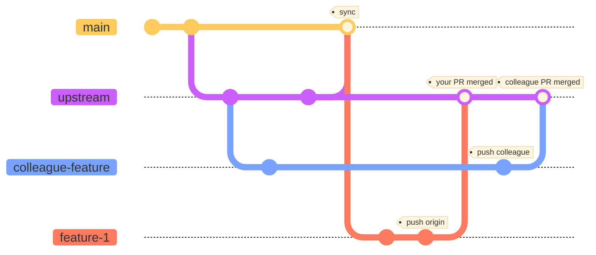
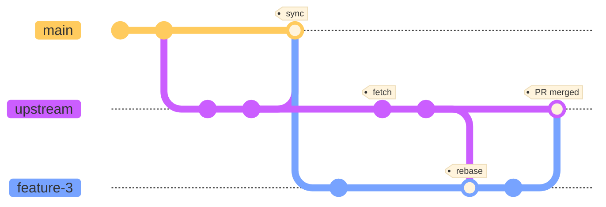

In some occasion you can't work with only the <strike>master</strike> _main_ branch.
For example when working with open source, the upstream repository is not owned by you.
So in order to add your contribution you'd likely need to fork it and make a pull request.

> As of the release of this article, most online git like [GitHub][1] renamed `master` into `main` for the default branch.

## Practice environment

In order to practice all that without making pointless pull request to actual project.
You can either do it on one your own repository, or use this demo **[Upstream Organization][2]** on GitHub.

Make sure your GitHub account is set up. Or follow "[Get started With GitHub][3]"
for a quick ramp up.

For the example, you can fork this **[Upstream Repository][4]** for this example.
You should now have `<your username>/UpstreamRepo` in your GitHub repositories.
Then clone your fork locally:

```bash
git clone git@github.com:<your username>/UpstreamRepo.git
```

Let's review the git _workflow_ and try to make some contributions.

## Workflow setup

### Set up your fork

Let's configure the upstream, and add some rule, so you don't try to push to upstream by mistake:

```bash
git remote add upstream "git@github.com:UpstreamOrg/UpstreamRepo.git"
git remote set-url --push upstream nope
git remote -v
```
Not that you can set any url as upstream, here by putting `nope` it will just not work.
You should see something like that with your username instead of mine:

```bash
origin     git@github.com:sylhare/UpstreamRepo.git (fetch)
origin     git@github.com:sylhare/UpstreamRepo.git (push)
upstream   git@github.com:UpstreamOrg/UpstreamRepo.git (fetch)
upstream   nope (push)
```



You should have `origin` as the forked repository and `upstream` as the upstream repository.
If you have cloned the wrong one you can always update the remote branches using:

```bash
git remote set-url origin git@github.com:<your username>/UpstreamRepo.git
```

### Sync your fork with _upstream/main_

When you fork, you copy the upstream at a point in time.
So since you create feature branch out of your fork, you need to keep your fork in sync.
To do that, you should make no commits should be directly made in _origin/main_.

To your sync fork _origin/main_ with _upstream/main_ use:

```bash
git checkout main
git fetch upstream
git merge upstream/main # Or git rebase upstream/main
git push origin
```



This way you can keep your main branch as a mirror of upstream's main.
If you've deleted the branch locally, you can use:

```bash
git checkout --track origin/main
```

That will track locally the remote origin/main branch.

### Create a new feature branch

Once your fork is up-to-date, you can create a feature branch using:

```bash
# Create and go on branch
git checkout -b feature-branch 
# To push branch remotely
git push -u origin feature-branch 
```



Don't forget to sync your fork's origin with upstream/main once your PR gets merged, so that you won't be creating your next feature branch on an old version of the code.

#### Work on someone else's fork

Same as working with upstream you can add a remote to your `Colleague` branch:

```bash
git remote add colleague "git@github.com:Colleague/UpstreamRepo.git"
```

Then you can `pull` and `checkout` on the branch that you want to work on.
When pushing, it will update the branch your colleague's fork `Colleague/UpstreamRepo.git` using:

```bash
git push colleague
```



When pushing on "colleague", you are not pushing to your fork, but to your colleague's branch on his fork.

### Rebase your feature branch from upstream/main

That's usually before merging your feature branch, you need to add all the changes from upstream/main.
To do that go on your feature branch and do:

```bash
git fetch upstream
git rebase upstream/main
git push -f origin 
```

What it does is to fetch all the commits from _upstream/main_ and add them to your feature branch.
That may produce merge conflicts that you will need to solve. Then you can force push to remote once your branch is up to date.



You will see this error if you don't force push with `-f` to rewrite the history of your fork with the changes that were merged into main.

```bash
error: failed to push some refs to 'git@github.com:user/repo.git'
hint: Updates were rejected because the tip of your current branch is behind
hint: its remote counterpart. Integrate the remote changes (e.g.
hint: 'git pull ...') before pushing again.
hint: See the 'Note about fast-forwards' in 'git push --help' for details.
```

Branches allow asynchronous changes by default, which is why you can have changes made *behind* your own commits.

### Suppress your feature-branch

When you're done with a `feature-branch` or when you've messed up locally, you can always delete it with:

```bash
# -D for force delete, otherwise -d
git branch -D feature-branch
```

## Automation 🤖

### Git Aliases

So now that we have seen the workflow, let's add some alias in your `~/.gitconfig` to ease it up:

```bash
[alias]
        sync = !git stash && git checkout main && git fetch upstream && git rebase upstream/main && git push origin
        new = !git checkout -b $1 && git push -u origin $1 && :
        fur = !git fetch upstream && git rebase upstream/main
        pull = pull --rebase
```

You got it, it should make your life easier.

### Bash script

This one is mainly to automate the creation of an upstream repository's fork from GitHub.
Basically it needs two inputs:
- Your fork repository's SSH address
- The Upstream organisation name

Here is the `clone` script that should be in your `~/.zshenv`:

```bash
clone() {
  upstream=$1
  repo=$(echo "$2" | awk -F"[/.]" '{print $3}')
  
  echo "1. Cloning repo $repo at $(pwd)/$repo"
  git clone "$repo" && cd "$repo" || return 1
  echo "2. Setting up upstream $upstream and disallow push"
  git remote add upstream "git@github.com:$upstream/$repo.git"
  git remote set-url --push upstream nope
  git remote -v
  echo "3. Checkout to another branch"
  git checkout -b dev
}
```

Using it while replacing with `<your username>` should be:

```bash
clone UpstreamOrg git@github.com:<your username>/UpstreamRepo.git
```

The auto checkout to another branch in the end is to avoid any mistaken commit to main,
as previously stated we want to keep it clean to sync up with upstream.

[1]: https://github.com/github/renaming#new-repositories-use-main-as-the-default-branch-name
[2]: https://github.com/UpstreamOrg
[3]: 
[4]: https://github.com/UpstreamOrg/UpstreamRepo
