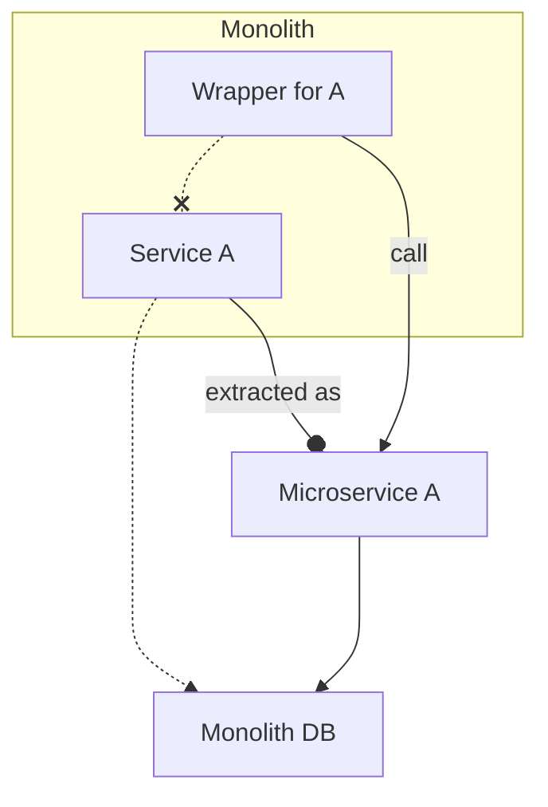
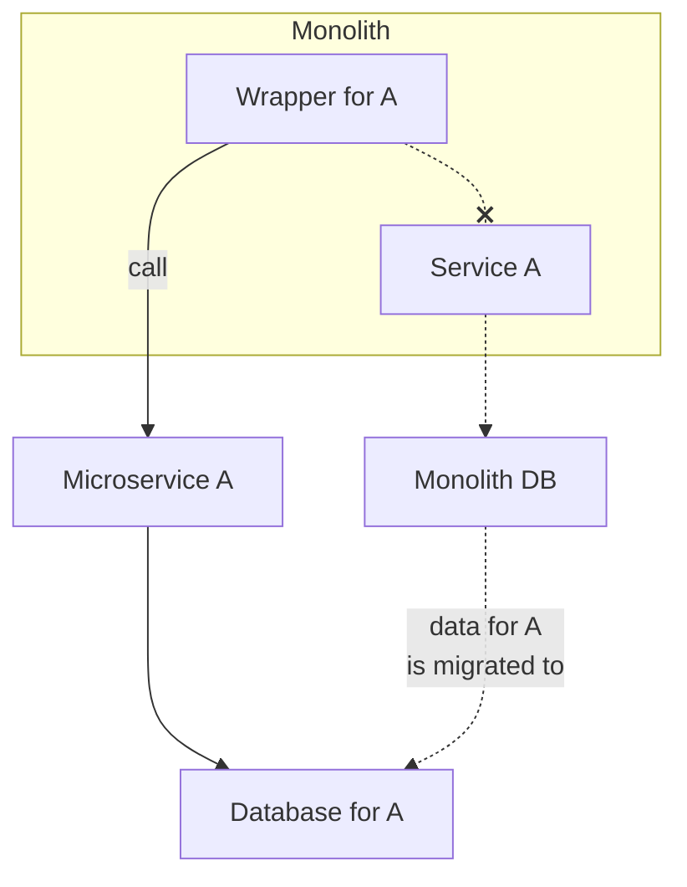
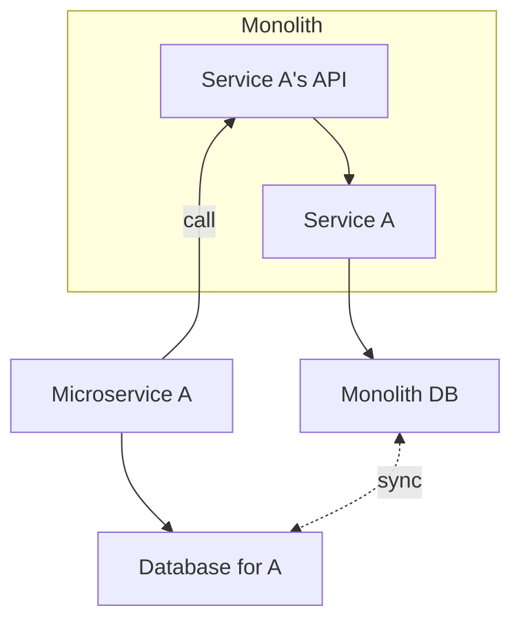

## _A Story about a Monolith ..._

A Monolith is a single codebase that contains all the functionality of an application. It is a good pattern to get 
started, because it allows faster development for a new application. Having one service instead of a fleet of microservices
tends to be slightly easier to manage from an infrastructure point of view.

However, as the application grows, the monolith becomes harder to maintain and scale. We're not here to start a debate,
chances are that if you’re looking at this article, yours might have already grown beyond sanity!

Layered 15+ year patchwork of technology history, you may realize that it's time to do
something about it. But where to start? In this article we'll dive toward improving our condition as a developer. 🤿

## Monolith Extraction Game plan

### 1. Monolith Check-up 

Touching the monolith can be costly, so before you start meddling with the it you may want to have a look at what's your 
biggest issue with it.
The first step is identifying the problem(s) so you can prioritize the changes, then structure those changes around a
plan that will bring you one step closer to the end goal.

#### 👩‍⚕️ Identifying the problem 

Obviously, you can't just get rid of the monolith and start from scratch. you’re dealing with a complex system that has 
been piled on for years.
And as the business will not wait for you to tackle the monolith tech debt before delivering new features, you will
have to make a business case about why improving the situation is important. This will lead to why the business may start
to care _a little_ about it.

Here are some common issues with monoliths:

- **Complexity**: Usually, the system has amalgamated over time, the code gets coupled and unstable. Changes in one part
  of the system can have unintended consequences in other parts of the system.  Complexity is a problem that tends to worsen very fast, as the system grows.
  - This reduces the development velocity, as it takes more time to understand the system and make changes.
  - New hires will take longer to become productive and are more error-prone.
- **Too big**: When the monolith while it could be well written gets so large that it tests the physical limits of your 
  coding hardware.
  - The bigger the application gets, the longer it may take for it to compile/build testing becomes a hassle, 
  and implementing a feature will introduce a lot of wait time.
  - Bigger applications with multiple dependencies can introduce complexity in the deployment process. 
  Automated CI/CD becomes a challenge.
- **Technology lock-in**: The monolith is locked into a specific technology stack, making it hard to change and hard to
  keep up with new technologies.
  - Part of the application may use a patchwork of different technology, some of them legacy or totally deprecated.
  - New security fixes require major library updates on sometime customized packages which can break the application "silently" as
  the unit test may pass, but uncovered e2e scenario will fail.
  - The increased pool of knowledge required to maintain the application can become a challenge are less and less available in the market
- **Unstable**: With one monolithic application that does it all, having a single point of failure is a high risk. 
  - A bug or an error in one part of the system can bring down the entire application.
  - One part feature can become sluggish and slow down the entire application. 

In your particular case, you will have to identify which part of the problem you want to tackle first. Usually you will
aim at one that will have the most impact on the business, or that will be the easiest/fastest to handle.

#### 🏗️ Structured approach to architectural changes

Before you jump head first into implementing your thought to be perfect solution, it would be wise to take a step back
and design a plan.
The goal of that design is to build a reference that can be used to communicate the changes to the team and stakeholders.
But also to have a clear understanding of the changes that will be made and the impact they will have on the system.

Having a source material will help create discussions and get feedback so you don't miss out on some key functionalities
right outside your domain.

- **Current Mode of Operation**: Or CMO, this a picture of today's current infrastructure, how it works and the major pain points.
- **Final Mode of Operation**: Or FMO, this is the desired state, how it will look like after the changes. This should solve the targeted pain points.

Now you aren’t going to go from the CMO to the FMO in one go, you will have to go through a series of steps to get there.
Those are designed within the:
- **Transition Mode of Operation**: Or TMO, which takes into consideration how you can switch from the CMO to the FMO with none or
  limited impact to the customer.

For the plan to be accepted, it needs to be feasible while maintaining the service running. Exceptional downtime can be
scheduled but should be kept to a minimum.

### 2. Extraction Strategies

To shape up your plan, you may want to try one of the following strategies. With extraction always comes the risk of 
losing a functionality or creating a bug due to some forgotten context, but that the risks that can't be avoided independently
of the chosen strategy.

#### 📋 Copy over to Microservice 

A copy-over of the monolith's functionality to a new microservice can happen if enough criteria are met:
- Language match: The team supporting the feature is knowledgeable in the programmatic language of the monolith
- Isolation: The feature is isolated enough to be chopped off with limited efforts, usually not a core feature.
- Relevant data model: The current feature is designed to support the current features and any new one coming in, and is
  not tied or dependent on other data.
- Code quality: If the codebase has quirky bits or hidden bug, those may get carried over to the new microservice.

A copy over is not a re-write in the same language, it's literally copying the code into a new microservice. 
The complexity and design of the system won't change. Else it falls into the next pattern.

#### 🛠️ Re-engineer the functionality to a Microservice 

An extraction to a new Microservice is often the goto solution, since you start back from scratch and build on what you
know and understand. Before you do an extraction check, it is important to define the new microservice's:
- Responsibility: It is clear what the microservice should be doing, and that task can be completed entirely within the 
  microservice. You don't want your microservices to become co-dependent.
- Data encapsulation: The data necessary for the microservice should be clearly identified and only accessible and mutated
  by the microservice.
- Interface: This represents how you will interact with the microservice, via APIs, event bus or whichever you see fit

Extraction has some benefits, it allows you to:
- Rewrite the feature: use newer frameworks and technologies to remove complexity and increase maintainability
- Data flexibility: the data model can change and be adapted to support new range of features to expand the service
 

#### 🧰 Leverage libraries

A library (as part of a SDK "software development kit" or not), can be used to reduce the impact of working within the 
monolith and work both with and without microservice extraction.
- In the case of a microservice extraction, a library could be developed for the monolith or any other services to
interact with the microservice. 
- Without extraction, you can have self-encapsulated features that are integrated running within the monolith, 
but are developed outside it.  

This can be a good step to start with when the core functionality of the monolith is too entangled to be extracted.
It can be started either from a new feature or as an ongoing process for a current process. 
It also allows you to pivot if you deem extraction necessary from the monolith.

### 3. Common practices

#### 🗂️ Design Pattern 

The **inversion of responsibility** design pattern for monolith extraction is about moving features to external services
in a transitional phase where the microservice is first dependent on the monolith before inverting the dependency.
The responsibility shifts from the monolith to the microservice, and the monolith becomes a client of the microservice.

As you can see at first, the microservice goes through an API in the Monolith to access part of the data and functionality
of _service A_. This way you can leverage the new data structure in _Database for A_ to deploy new features while you 
work on extracting the older ones.

Monolith extraction can also follow some type of [Strangler Pattern][1] by Martin Fowler,
_Strangler_ coming from the [`strangler fig`][2] plant 🌱 that grows on another tree, eventually killing it.  

> Microservices grow around the monolith, eventually breaking it down.

Find other examples of this pattern by [Paul Hammant][3] with a case study.

#### ♻️ Data synchronization 

One of the big aspects of this extraction is related to the data. Either keeping the same data structure or
evolving it in a new one supported by a different technology. Maintaining consistency in the data will be key for a
successful transition.

Here are some leads on how to keep the data flow:
- Shared access to the database: Both microservice and monolith have access to the same database, so that every time a 
  a change on the legacy system happens, the microservice which is relying on the same data is not impacted.
- Event sourcing: The microservice listens to events from the monolith and updates its own database accordingly. This 
  can be error-prone, but tools like [debezium][10] listening on the database itself can prove useful.
- One-off migration: Not recommended, but a one-off migration can be done to move the data from one data system to the other.
  But this will may slow down the extraction as either the full functionality is ready to be replaced in the microservice 
  or we fall into the shared access but on the new database system.

Once you've opened the gate to access the data, it will be easier to start writing new features and extract the older ones
as your microservice matures.

#### 📦 Delivery 

The extraction is not going to happen within a quarter or even a year! It will be a long process and should really be 
phased. This type of work needs to happen while you keep on delivering features to the customer.

The extraction is a north start which will help architect each following functionality, taking an extra step here and
there to move to the greater goal. [Agile methodologies][11] and mentality usually excels in this type of work, since you 
don't need to have the full detailed plan to start, you only need to know the final destination and the next step.
(Does it sound like [kanban][11]?)

Keeping in phases and aligning with the stakeholders and providing benefits will help keep everyone onboard. Reducing
operational costs, instability, vulnerabilities and bugs or increasing feature delivery may become strong arguments for
your case.

Finally, real feature test coverage is key, testing the features will help to document the current behaviour and ensure 
that the knowledge of the system doesn't leave when the key people do. With the additional benefit of bringing confidence in
the microservice for the team. Additionally, don't underestimate non-functional requirements, as you don't want to cut
corners on monitoring to understand how the new and old systems are behaving with the migrated functionalities.

[1]: https://martinfowler.com/bliki/StranglerApplication.html
[2]: https://en.wikipedia.org/wiki/Strangler_fig
[3]: https://paulhammant.com/2013/07/14/legacy-application-strangulation-case-studies/
[4]: https://agilefromthegroundup.blogspot.com/2011/03/strangulation-pattern-of-choice-for.html
[10]: 
[11]: 
