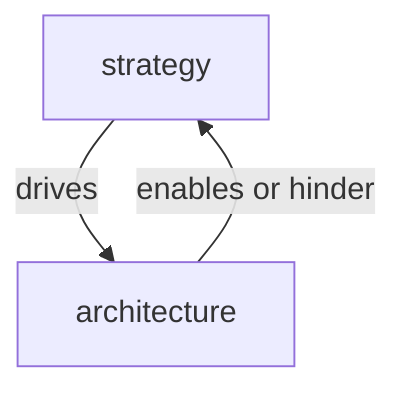
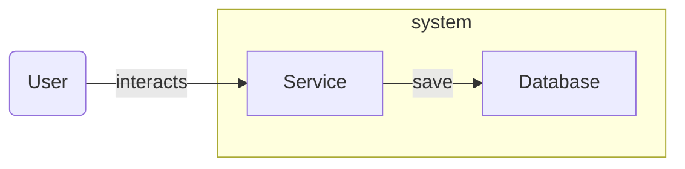
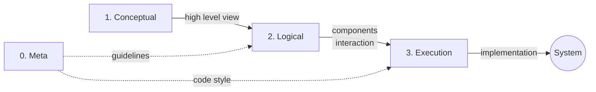

Let's talk about software architecture, how you come about them, how to make architecture decisions and what influences
 them, and finally, how to categorize the different type of architecture.

### Approaches

There are usually three ways to go with software architecture, beside all the none-functional ones:
- Good: With a proposed solution that's technically sound. 
  - (But it takes too long to implement, or the organisation lacks skill knowledge, personnel to support it).
- Right: With a proposed solution answering the customer or stakeholder's problem. 
  - (But adds technical debts, is a short-term solution or does not account for growth or some possible future extra functionality).
- Successful: With a proposed solution that brings value to both the user (customer or stakeholder) and the organisation (The company developing and supporting the software). 
  - (A compromise that benefits both sides.)

Looking at a new software architecture, it may not always be unanimously agreed upon. 
However, it's often better to start acting on it rather than stay in an analysis paralysis mode. 

How so? By being flexible. 
Architecture direction can change, as long as the proposed solution provides an improvement, it may be sufficient for some to yield.
Meaning that we can argue which direction to take at the moment, but some decisions can't be delayed forever.

### Architecture Decision

In software architecture, you make choices, but also you intentionally don't choose. 
Those decisions need to be classified based on their impacts and visibility on the system.

The less architecture and the fewer decisions you make, the more flexible the architect and developing are.
In other words, set the walls and the roof first before choosing the furniture for your house. 🏠

1. Impactful decisions should come first and soon in the process.
   - Decisions that drive the architecture
   - Decisions that would cost more resources if delayed.

2. Defer decisions until you must make it
   - Decisions that are less impactful and that can wait until you start working on that particular part of the plan.

3. Delegate decision that does not impact the whole system
   - Decisions like property names and implementation details.
   - Decisions regarding an encapsulated service or logic owned by one team and not exposed to other teams.

The complexity comes from the system and the team associated with those parts of the system.
The importance of the architectural decision is correlated with the amount of work impacted by it. 
Simpler project, less team involved, smaller scale.

### Architecture Influences

When there are multiple good options to choose from, making that decision becomes harder.
But it needs to happen! So you will have to take a step back and consider why we are making the decision.

A strategy is a plan of action to achieve a certain goal. 
This is what is driving the architecture to design a solution that will answer the current needs, 
but also to anticipate future needs with a robust foundation.

Good architecture choices make achieving the strategy's goal easy, while the bad one may delay the progress or result
in failure. 
There are trade-offs and not all decisions are the life or death of the company. 
High impact and high-level architecture might not be the one you would take care of most of the time.

Let's take a more low-level example where you need to add a new API in your [monolithic system][10].
There are two types of decisions you can make:
- Consistency: Add the new API within the monolith.
    - Stay consistent with the rest of the system as one big monolith in its encapsulated section of it.
- Cross-cutting: Deploy a new microservice to host the API.
    - Impact on the system's paradigm from monolith to microservice 
    - (changes can't be encapsulated in one service, the microservice will be at first heavily dependent on the monolith)

Going towards a microservice architecture or staying as a monolith will either enable or hinder the strategy. 
Architecture built with the strategy in mind tends to last.

I had written an [article][10] following the cross-cutting approach for a more practical of an applied architecture example.

### Architecture types

#### Meta

Not as a reference to Facebook's head company but as _meta architecture_.
Which means architecting about architecture or rather the generic architecture principles that can be applied independently of the project.

It usually features guidelines, policies, key concepts and mechanisms' explanation and so on...
For example:
  - codestyle or preferred syntax.
  - framework to use when starting.
  - API guidelines.

These help maintain coherence throughout the codebase. 
They can be defined for your particular context (team-specific) up to company-wide rules.

Beware of an architecture _Ivory tower_ syndrome when implementing it. 
Where the architects are proposing/imposing rules or system designs in isolation disconnected from the practical concerns
of the day-to-day developer.
Having rules that are not practical or that nobody follows is a waste, this is implemented best when there are champions
in every team that understand and contribute to those guidelines, so they stay relevant and applied.

#### Conceptual

Conceptual architecture is more of a high-level sometimes abstract representation of the system and its main elements.
They are usually represented by blocks loosely tied together.

This conceptual representation is low cost, easy to produce and is meant to share knowledge. 
It increases collaboration by setting the same overall high-level architecture and where the components interact.

Here is an example:

This type of architecture usually happens in the early stage to demonstrate the expected final mode of operation.
Implementation details do not need to be known.
For example, the type of database or framework used is of no concern.

Conceptual architecture helps in aligning technical decisions with business needs.

#### Logical

When the architecture gets actionable and documented in a tech design, ADR or RFC.

- Tech design (Technical Design Document): It is a document that captures every necessary information for any developer 
  in the team to be able to implement the described solution. 
- ADR (Architecture Decision Record): It is a formal document that captures an important architectural decision made 
  along with its context and consequences. It has a status (ex: Proposed, Accepted, Rejected, Superseded, Deprecated)
- RFC (Request for comments): It is a document or proposal for a feature/process/standard or a change where feedback is solicited.
  This feedback is then used to refine and improve the proposal before it is implemented.

Using these types of technical document helps keep a trace of how the system evolved.
This becomes helpful as it also documents the system and provides information to rely on when designing future features.

However, in case something is not clear enough, or a technical document can't be made, you can leverage one of those:

- A Proof of Concept (POC) to test the functionality or technology and make a small working example.
- A Spike, a timeboxed exploration time which helps to make a decision between multiple technology or research a particular topic.

Now with any doubts cleared and documented, 
the technical solutions should be fully known and understood by the implementing team:

- The interfaces and functionalities of what's expected from the subsystem and how to interact with.
- The component responsibilities of each part of the subsystem.

At the end of this phase, there should be enough information to get started.

#### Execution

This is the type of architecture decision that should not impact the solution's design and can be delayed until the end. 
Small architecture decisions to make while implementing the expected design from the previous steps.

- Non-functional requirements (logging, monitoring, alarming)
- Deal with integration issues (system configuration, access rights)
- Decide on run time properties (the actual code)

It links the conceptual and logical steps while applying the _meta_ one (with the guidelines).

This type of architecture is usually undocumented but is reviewed as part of code reviews.
That's the daily decisions a developer needs to make, _how to name that variable?_, _what pattern should I use?_,
_how can I make it "better"?_.

### Conclusion

Software architecture is reaching at every level of your software engineering journey.
Depending on your role and experience, you might get involved in different layers.

To sum it up, find how the different architecture types intervene from the conception to the implementation of the
system:

The conceptual side is not often under any particular rules, so meta-architecture doesn't really apply.
But you could have in a different company, a tool of preference to write the diagrams or a specific colour scheme.
I did not mention it, but as opposed to the high-level view, 
the low-level architecture is when you start touching the actual code of the system deep inside one of its components.

Usually when we talk about software architects or solution architects, they are usually more on the conceptual level
or architecture, as they explain how the design is going to address the presented problem.

Software architecture is a team sport, so that there are no pieces from the inception from that's left on side at the time
of implementation. 

[10]: 