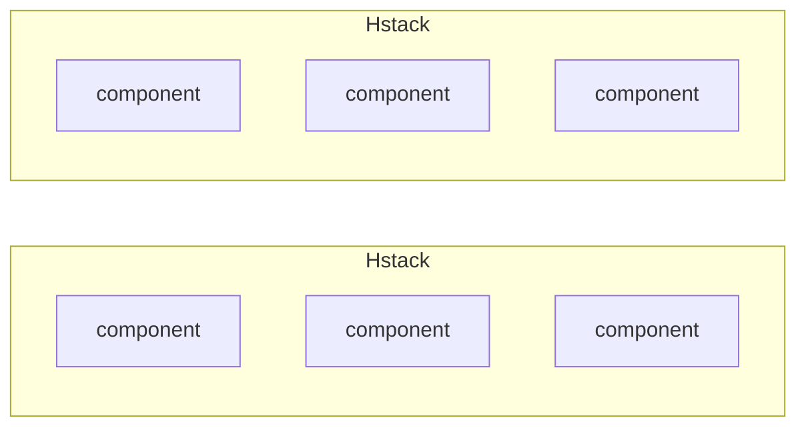
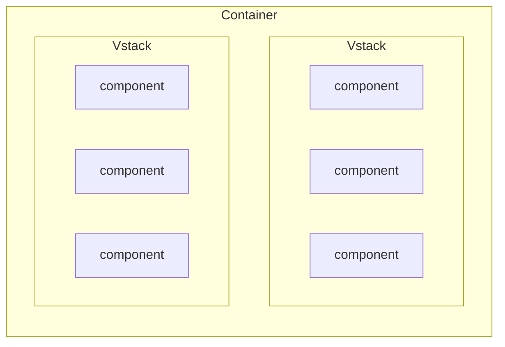
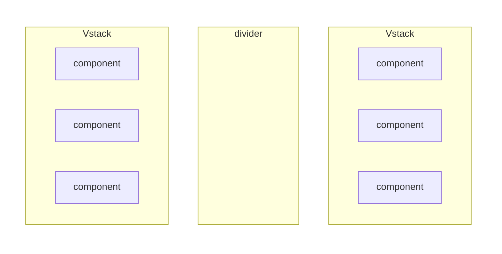

[Chakra UI][1] provides a range of flexible and composable components that can be used to build complex layouts. 
Alignment and how to position components in a webpage are frequent questions, so I wanted to paste out here some 
examples to get started.

## Introduction

For the [Chakra UI components][4] we are going to talk about, knowing about [CSS flexbox][10] is a plus. 
It's used to display and style the Chakra UI component and can be passed as props for finer control.
Here are the main libraries to install:

```shell
yarn add react @chakra-ui/react @emotion/react @emotion/styled framer-motion
```

Chakra UI is to be used with [react][11], so you will want to be familiarized with it. 
While it can be used without any framework, it may require some boilerplate to be able to start your frontend application
(like with webpack/babel setup).
Another way is to use a framework like [Next.js][5], [Gatsby][5] or one of the available options in the Chakra UI's
[documentation][5] to get you started.

### Components

You can test the Chakra UI with an example component that you can place within your project.
Here is the skeleton, so you can pass the snippet from this article within it to test it out:

```tsx
import React from 'react';
import { Box, Divider, Flex, HStack, Spacer, StackDivider, VStack } from '@chakra-ui/react';

export const Example = (): React.JSX.Element => {
  return (
    <Box margin={4} padding={4} border="1px solid lightgray">
      {/* Paste the snippet here*/}
    </Box>
  );
};
```

The `Box` component used here has some default styling to it makes the examples render more visibly in the page.
It is not mandatory but does highlight the snippet when trying it locally.

Now I'll go into the example, skipping the React component boilerplate and imports since you can use this example
as a reference.

## Using Flexbox with Chakra UI

### Flex

The [Flex][2] component is a wrapper around the [CSS flexbox][10] properties.

```tsx
<Flex direction="row" justify="space-between" align="center">
  <Box w="100px" h="50px" bg="tomato"/>
  <Box w="100px" h="50px" bg="dodgerblue"/>
  <Box w="100px" h="50px" bg="orange"/>
</Flex>
```

Let's look at the props:
- The `direction` takes the same input as the css `flex-direction`
  - `row` / `reverse-row` for left to right or right to left row.
  - `column` / `reverse-column` for top to bottom or bottom to top column.
- The `justify` takes the same input as the css `justify-content`
  - `start` / `end` / `center` to have the content at the start, end or center of the container.
  - `space-between` to have the content spaced in the container from start to end
  - `space-around` to have the content centered with space around them.
- The `align` takes the same input as the css `align-items`
  - `start` / `end` / `center` / `stretch` / `baseline` to align the items in the opposite direction of the flex direction.
- The css `align-content` used to align the lines in the container is not available as a props but can be reached via direct css styling.
  ```ts
  <Flex css={{ alignContent: 'space-between' }} />
  ```
  
The advantages of using `Flex` or `Box` is that they will automatically work as _flex object_ and display in a predictive
way.
While they remove some of the CSS configuration necessary, they will still need some props to be passed to for optimal use.

### Spacer

A spacer can be used in a `Flex` component to add space between the children.
It can be added using:

```tsx
<Spacer />
```

If you know about [flexbox][10], it will just add more space between elements in the flex container.
This is a shorthand for adding a `Box` with a `flex-grow` of `1`.

## Stacks

Now Chakra UI provides a [Stack][3] component that is a wrapper around the `Flex` component.
So you can do horizontal or vertical Flex components named as `HStack` and `VStack`.

### Stack

The `Stack` doesn't have a direction and is a great neutral element that can be used within your UI.
The children are position in a column by default, _stacking_ on top of each other.

```tsx
<Stack alignItems={{ base: 'stretch', md: 'end' }}> </Stack>
```

Using a `Stack`, a `Box` or a `Flex` component, there are no real guidelines. 
It's more about what you are trying to achieve.

> The key difference between a `Stack` and a `Flex` is that unlike the `Flex`, 
> the `Stack` component won't span the entire width of the container.

### HStack

Now the `HStack` is an abstraction of a `Flex` component where the elements are aligned horizontally.
This removes a bit of the flexbox properties' boilerplate.
Create one with a text and an icon as:

```tsx
<HStack>
  <Icon as={PiTrash} />
  <Text fontWeight="bold">Delete</Text>
</HStack>
```

It will display as:

```md
🗑️ Delete
```

They should be already horizontally aligned, but you can still pass the `justify` and `align` props to it.
- Using `justify={'end'}` will make the element displayed on the right of the _HStack_ instead of starting from the left.

Here is a diagram of how a `HStack` would look:



### VStack

The `VStack` is an abstraction of a `Flex` component where the elements are aligned vertically.
This removes a bit of the flexbox properties' boilerplate.
Create one with a title and a text as:

```tsx
<VStack align={'start'} flex={1}>
  <Heading as="h2">
    Title
  </Heading>
  <Text>
    Lorem ipsum dolor sit amet, consectetur adipiscing elit. Nullam commodo dictum turpis, in feugiat ex tincidunt vitae. 
    Quisque sit amet commodo erat. In laoreet diam in lacinia temp  
  </Text>
</VStack>
```

By default, the _VStack_ will centre the element in the middle of the stack.
- Using `align={'start'}` will make the element starts on the right of the _VStack_.

Using a `Text` component which acts as a `p` element and a `Heading` component whic acts as a `h2` element, 
it will render as:

```md
## Title

Lorem ipsum dolor sit amet, consectetur adipiscing elit. Nullam commodo dictum turpis, in feugiat ex tincidunt vitae. 
Quisque sit amet commodo erat. In laoreet diam in lacinia temp
```

And to better illustrate it, I have added a diagram of how a _VStack_ would look:



This should mimic the rendered output of the React component.

### Divider 

If you need to add a divider between the component, you could play with the border properties of the _stacks_ or the
component within them or use the `divider` props that is available in the stack components.

```tsx
<Stack divider={<StackDivider />} />
```

But if you don't need a divider between all components, you could use a `Divider` component and insert it where needed.
It is a simple line that can be added between the components.

Here is how you would do it:

```tsx
// Divider (horizontal by default)
<Divider w={'100%'} />
// Vertical divider
<Divider orientation="vertical" sx={{ height: 'auto', alignSelf: 'stretch' }} />
```

The vertical divider is trickier than the horizontal one. By default, it's 1 pixel wide, so it needs to be stretched
to be visible.
The `sx` props is used to pass custom styles to the component.

Here is how the Divider would look on a rendered component:



I had some fun doing some mermaid diagram to try and represent it all visually.
But I guess it doesn't beat the actual generated examples like the ones you can find in the [documentation][4].

Chakra UI has been really easy to work with and is pretty simple and flexible. 
I managed to render complex layouts within days, so I would recommend testing it out.


[1]: https://v2.chakra-ui.com/
[2]: https://v2.chakra-ui.com/docs/components/flex
[3]: https://v2.chakra-ui.com/docs/components/stack
[4]: https://v2.chakra-ui.com/docs/components
[5]: https://v2.chakra-ui.com/getting-started
[10]: 
[11]: 