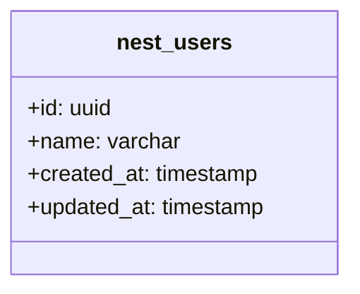

If you are new to [NestJS][10] or [TypeORM][11], I've got you covered with some articles to get started with a 
[Nest backend in Typescript][10] and [how to connect it to an SQL database][11].

In this article, we are going to look at some more advanced SQL concepts you can put in place in your NestJS application.
We are going to start from a [simple setup][11] and add new relations and tables to it.

## Architecture

Let's have a high-level view of what we have now and want to achieve with our SQL schema.
So far we only have a `nest_users` table that's created via or `users.entity.ts` file.



To make it a bit more complex, we want to have two new entities:
- A `Home` for the users: A user can only have one home, but a home can have many users.
- A `Job` for the users: A user can have many jobs, and the same job can be done by many users.

Our users can't afford to have multiple houses even while they are working multiple jobs! 😅

> _Any similarity with fictitious events or characters was purely coincidental_, it's only as an example.

Now here's what it looks like (using [pgadmin][1] `ERD` tool) since we are using a `postgres` database.
The **ERD** stands for _Entity Relationship Diagram_ which display the tables and their relations nicely.
The UI is a bit chunky, but it gets the job done.



See the links between the tables? That's the relations we are going to create in our entities.

## Implementation

In our existing NestJS application that's setup with TypeORM, we are going to add two new entities.

> Remember to generate and run the migrations after creating the entities.

### Home with "One to Many"

Let's have the _Home_ entity wit a [One To Many][2] relation as follows:

```ts
import { Column, Entity, PrimaryGeneratedColumn, OneToMany } from 'typeorm';

@Entity('nest_homes')
export class Home {

  @PrimaryGeneratedColumn()
  id: number;

  @Column({ unique: true })
  address: string;

  @OneToMany(() => User, (user) => user.home)
  inhabitants: User[];
}
```

Here we are adding a **"one to many"** relation between the `Home` and the `User` entities.
This means that a `Home` can have many `User` entities, but a `User` can only have one `Home`.

So on the _User_ side it looks like:

```ts
@Entity('nest_users')
export class User {
  @ManyToOne(() => Home, (home) => home.inhabitants, { onDelete: 'CASCADE' })
  home: Home;
}
```

As you can see both entities are linked with a mirrored `OneToMany` with `ManyToOne` relation.
On the annotation we have three parameters:
- The first one is the type of the entity we are linking to.
- The second one is a function that returns the property of the linked entity.
- The third optional one is an object with the options, 
  - here we are setting the `onDelete` to `CASCADE` which means that if a `Home` is deleted, all the `User` linked to it will be deleted too 😱.

In this case, we're assuming everyone's home when the home gets destroyed; they don't survive it. 😵‍
Where's the disclaimer again, I should have named my entities better, the scenario just got darker by the minute!

### Job 

#### with custom "Many to Many"

Let's look at the _Job_ entity, it's a bit more complex as we have a [Many-to-many][3] relation between the `User` and the `Job`.

```ts
@Entity('nest_jobs')
export class Job {
  @PrimaryGeneratedColumn()
  id: number;

  @Column()
  title: string;

  @OneToMany(() => UserToJob, (userToJob) => userToJob.job)
  jobToUsers: UserToJob[];
}
```

Interestingly, here we have a _One-to-many_ relation, but it's not the same as the previous one.
We have an intermediate table linking the two entities.

On the _User_ entity we have something similar:

```ts
@Entity('nest_users')
export class User {
  @OneToMany(() => UserToJob, (userToJob) => userToJob.user)
  userToJobs: UserToJob[];
}
```

Both entities have a `@OneToMany` relation to the `UserToJob` entity, but with different properties.

Let's have a look at that new _UserToJob_ entity we have created:

```ts
@Entity('users_to_jobs')
export class UserToJob {
  @PrimaryGeneratedColumn()
  id: number;

  @Column()
  userId: string;

  @Column()
  jobId: number;

  @ManyToOne(() => User, (user) => user.userToJobs)
  @JoinColumn({ name: 'userId' })
  user: User;

  @ManyToOne(() => Job, (job) => job.jobToUsers)
  @JoinColumn({ name: 'jobId' })
  job: Job;
}
```

As you can see the `UserToJob` is linked to both the `User` and the `Job` entities. 

> _Why not use the `@ManyToMany` relation directly?_
> - Because we want to have more control over the intermediate table, like adding more properties to it.

But now that I have talked about that `ManyToMany` relation, let's have an example free of charge!

### Role with "Many to Many"

Surprise a new requirement! That's not part of the initial architecture diagram we had set to do!
But who doesn't like a bit of scope creep... 🙃
Let's have the role in a _many-to-many_ relation with the job, 
as you can have multiple roles for a job, and a role can be done by multiple jobs. 

I try to make them generic while using term that would make some sense, I hope it's not too much of a stretch.
Let's see what the entity would look like:

```ts
@Entity('nest_roles')
export class Role {
  @PrimaryGeneratedColumn()
  id: number;

  @Column()
  name: string;

  @ManyToMany(() => Job, job => job.roles)
  jobs: Job[];
}
```

Easy enough, it's more straightforward than the `UserToJob` entity we had to create earlier.
The complexity here is handled under the hood by [TypeORM][4] but the principle stays the same.

For the Job entity, we would need to add:

```ts
@Entity('nest_jobs')
export class Job {
  @ManyToMany(() => Role, role => role.jobs)
  @JoinTable()
  roles: Role[];
}
```

We have the `@JoinTable()` annotation that is used to determine who's the "owner" of the relation, and there can be only
one. (It can't be on both entities)
If you remember our `UserToJob` entity, the owner would be the `user` according to its name. 
It doesn't change anything in the database, 
but you don't need to have both a `UserToJob` and a `JobToUser` entity.

This annotation will let TypeORM know to create the intermediate table for us to store this relation.



And as you can see once the migration is run, we have a new `nest_jobs_roles_nest_roles` table that is created for us.
Which is the intermediate table between the _Job_ and the _Role_ entities as `[table name]_[annotated field]_[linked table name]`.

### With the entity manager

Now that we have seen how to do a "Many to Many", "One to Many" relations and so on, let's have a quick example on how
to retrieve these objects from the database.

Let's have a simple database service with the `User` and `Job` repository

```ts
export class DatabaseService {
  private readonly logger = new Logger(DatabaseService.name);

  constructor(
    @InjectRepository(User) private readonly userRepository: Repository<User>,
    @InjectRepository(Job) private readonly jobRepository: Repository<Job>,
  ) {}

}
```

We could also use the `EntityManager` to get the jobs from the user's repository, but having it both is more convenient.
Here is the syntax in case you need to use the entity manager for more complex queries, it's always available from
the repository:

```
this.userRepository.manager.findOne(Job, {/* */})
``` 

Now let's get the user, its home and its jobs:

```ts
const user = this.userRepository.findOne({
  where: { id },
  relations: ['home', 'userToJobs', 'userToJobs.job'],
});
```

Here we are using the `relations` property to get the **home** and the **userToJobs** with the **job** linked to it.
Without that _relations_ property, the _home_ and _userToJobs_ would be `undefined`, 
and without the _userToJobs.job_ the _job_ would be `undefined` in that entity as well.

For the job, with the roles, thanks the `@ManyToMany` relation, we can get the roles directly from the job entity:

```ts
const job = this.jobRepository.findOne({
  where: { id },
  relations: ['roles', 'jobToUsers', 'jobToUsers.user'],
});
```

No need to know the intermediate auto-generated table, you get the roles directly. 
And for the users from the job, it's similar to getting the jobs from the user.

To manage the relation, you can use the entity manager functionality like `save`, `remove`, `update`, etc. 
Like a normal entity the change should propagate to the linked entities.

[1]: https://www.pgadmin.org/
[2]: https://typeorm.io/#/many-to-one-one-to-many-relations
[3]: https://typeorm.io/#/many-to-many-relations
[4]: https://typeorm.io/#/
[10]: 
[11]: 