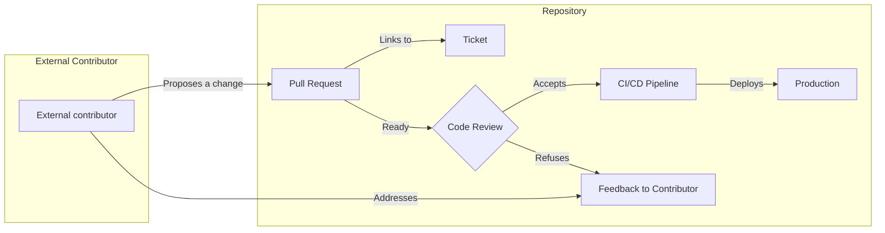

What's [Innersource][1]? It can be summed up as applying the principles of open source within a company.
This is usually a common practice in small tech companies, since during the start-up phase there are usually fewer people,
and founding members are likely to wear multiple dev hats.

But as the company grows, the codebase may silo or the need for better structure arises.
As for other big companies in which IT might not be the core business, or that were big before, those are common problems
faced with digital transformation. 
Becoming a leading tech company has roots in its codebase, and that's where Innersource can help.

Innersource is backed by [InnerSource Commons][1], a community of companies that have successfully implemented Innersource.
It's a great place to start to interact with the community learn from others and find events nearby.
 (Though I prefer removing the camel case and have it as _Innersource_ rather than _InnerSource_ 🙇)

## The problem

Let's first explain [what we are trying to solve][2], this comes from observation from different companies and may apply to
yours. You don't need to believe me, read the [success stories][1] of companies like PayPal, Bloomberg, and others that
succeeded in their transition to Innersource.

In many organisations, teams work in isolation, which means you may have multiple _IT teams_ creating code to solve
their own problems. Those problems could be totally unrelated to each other, which wouldn't warrant merging their codebase.

However, they both need a place to store the code (like a git repository), a place to deploy their application, some
tools to automate their tests and monitor the running application.

Now the more separated _IT teams_ you have, the more likely you'll have duplication of effort between them. 
It could be small templated apps that are team agnostic or specific services that provide an endpoint for a company-wide
resource.
Not having to re-do the work twice or maintain _x times_ the same app could lead to development speed up and also
with pool resources empower innovation through cross-team collaboration.

## What is Innersource?

### Introduction

The idea was to bring the benefits of [open-source][6] development, such as transparency, collaboration, and community, 
into the corporate environment.
The goal is to break down silos, encourage cross-team collaboration, and improve the quality and speed of software development.

> Innersource doesn't mean making your private code base public!

Instead, it is about using the key winning steps of open source software crafting and bringing it in the corporate realm.
This means that the code is still private, but the development process is open and collaborative.
So the maintaining team still has control over what goes into the codebase, but the whole company can contribute to it.

It gives also another option for developers when implementing a feature to look for existing _internal_ libraries before 
exploring _external_ ones before having to implement it from scratch.

### Guiding principles

You can find a list of [principles][3] on the Innersource Commons website, 
but it differs a bit from the [Adopt Innersource][4] book.
From what we talked in the introduction, you should get the gist of it, so let's review what's needed for 
Innersource to be successful:

1. Openness: 
    - The projects are discoverable and accessible for potential contributors.
    - They don't require special access to find the related documentation.
    - You can find the host team contact easily.
2. Transparency
    - Decisions regarding the project are visible, and there are traces.
    - The related processes or contribution workflow are clear and documented.
    - Information about the project and its progress toward newer features is accessible.
3. "Prioritized" Mentorship
    - Key people in the host team will foster the project's community
    - Project newcomers are welcomed and guided to become effective contributors.
    - As contributors gain knowledge and skills, they can take more responsibility as trusted committers.
4. Voluntary Code Contribution
   - Embrace any contributions, code, documentation, bug reports, and so on.
   - The host team doesn't have to accept a contribution (there could be any reason)
   - The contributors are not compelled to contribute more than they want.

Based on those principles, if you know a bit about open-source, it should sound familiar.
Let's dig a bit more into each of these concepts and how they can be applied.

#### 1. Openness

These principles it to simplify onboarding of a new contributor so that it's easier to participate.
To make it happen, you need to make sure that:

- The code is stored on the same _git-repository_ manager (such as GitLab, GitHub, BitBucket, and so on).
- The documentation for the project is either directly next to the code or internally available on a company documentation site.
  - Credentials or sensitive information should most likely not be shared at large and saved in a secure vault.
- The project's board and team information should be visible and linked to the repository
  - From a company perspective, having teams using the same tool makes it easier to follow and track progress.

Openness is not free for all, users of a different team will have privileges over repository. 
It is important that the maintaining team has higher permission, so they can accept or not contributions.
Having a strong user-based and group-based permission system will allow you to quickly give the right access at large to
the right people while keeping the content safe.

It is important that the information regarding the team (from the development team to the product side) is readily
available. This pushes collaboration as you don't have to wonder who owns it and where to find help.

#### 2. Transparency

Now the code, the documentation, and the projects are consolidated and can be accessible by any willing contributor 
within the company!
Transparency is about fostering better practice overall, leaving traces and good documentation will help reduce the 
burden to the few individuals that know the project within the team.
And it will also ease the onboarding burden of new member or external contributors.

- Push for written over verbal communication
  - This should reduce the need for a meeting to discuss a feature, and the decision should be traceable.
  - It allows asynchronous follow-up and decision-making for a distributed team (using the _no answer is a silent yes_ method)
- Don't blame and embrace mistakes, so you can learn from them instead!
  - Following back on a project, understanding why a mistake happens will help prevent it in the future.
- Maintain a project memory
  - Decisions, design documents and such should be tied to the project; it's also a good [architecture best practice][10]
  - Prefer using _permalink_, stable URL that won't change over time, to reference a discussion or a decision.

As well as the project's board, to track the progress you can use `issues` like in GitHub or Gitlab, or a specialised
tool like JIRA. What's important is for the feature code to be traceable back to the ticket.
You can also follow [commit good practices][11] to introduce a common process to reference issues in commit.

#### 3. Prioritised Mentorship

As much as we would like, not all repositories are up to the standard we'd like them to be.
When teams start to share ownership of a repository or are dependent of the code or service using the code, 
then it becomes important to share common rules.

That's why it's "prioritized" mentorship, it's all about making sure we mentor and train the right people at the right
time with the right information.
Let's have some examples:
- helping QA-capped people understand some part of the code may help them log better issues or have them
fix it themselves.
- UX Designer, when explained, could make colour changes on their own to update some style typo.
- External contributors could be accepted as trusted members and validate PRs like anyone else from the team.

This usually goes beyond how to run the code itself, where is the documentation or privileges to accept code reviews. 
When linked to live service, it also goes into reading the alarms and monitoring the service that's running the repository's code.
Innersource takes another dimension and is not about just development but also operation of the live services from the
code.

#### 4. Voluntary Code Contribution

Using git with [trunk-based development][12], you might not see how contributions fit in the picture.
While your core team may use trunk-based development, allowing anyone un-mentored to push to main is not ideal.

That's why Pull Requests are encouraged for _external_ contributions; they give flexibility for others to propose 
changes without needing elevated access to the project.
For other git strategies, [feature-based][12] or [stage-based][12], pull requests or PR are a more common occurrence and
whether it's from someone from the team or not, the process will most likely remain the same.

Code contribution creates the most impact out of Innersource, but other contributions from anyone should be welcome and
may improve the repository in many ways.
Clearing up processes, improving documentation, creating or tidying up issues which may not appear as the most value-added
work but can drastically improve the development experience of the contributors and team maintaining the project.

Emphasis on the voluntary aspect is important to make everyone feel comfortable.
Contributors can fast-track needed feature by tackling part or most of the development in place of 
the owning team.
But with live services, the maintaining might be also supporting the code in production, 
so they will not accept code that may break the service. 
It should all work in favour of quality.

### Example Process

You can find more information about feature branching in this [article][12], but since it's at the core of Innersource
for _external_ code contribution, (external as from another team in the company) it's worth mentioning here.

Here is a diagram of how it would look with a pull request from an external contributor:

We have in this example a project that is set up with a CI/CD pipeline, so testing and deployment are done
automatically. (The code in the PR is also tested)
The external contributor proposes a change, which is reviewed by the team maintaining the repository.
Feedbacks can be addressed by the external contributor or the owning team, once approved, it can be merged and deployed.

To improve reliability, knowing how and what to review will become important skills. Check this article for some [tips][15].
To ensure quality, you may also buff your automated pipeline with static code and artifact analysis tools,
set a coverage threshold, add a linter (for code formatting), and so on. 

### Onboarding!

Welcome aboard! You are now ready to start your [Innersource journey][5].
But how do you make it grow and succeed in your company? You'll need support!

Innersource is about collaboration and breaking silos between teams, which is usually easier said than done depending
on your company's culture.
Besides the possible infrastructure challenges you may face (consolidating the different tools development teams are using),
you will possibly face resistance to change from the teams involved.

Start small as a _pilot_ program, reach out to key members of other teams to act as "_champions_" 
and mentor their own team members. Reach around your own team first before trying to over extend, 
it's better to promote with a small working program than a large failing one.
Like in development, it's best to go by iteration baby steps at a time toward the goal.

These types of change can take time and are frustrating, being in a management position or having the full backup of 
a director or VP will come handy. 
To earn those, you'll most likely need a strong technical reputation within the company 
and demonstrate in a _costs vs benefits way_ the [advantages][7] of Innersource 
(faster development, less duplication, more innovation, and so on).

[1]: https://innersourcecommons.org/
[2]: https://about.gitlab.com/topics/version-control/what-is-innersource/
[3]: https://innersourcecommons.org/learn/learning-path/introduction/05/
[4]: https://paypal.github.io/InnerSourceCommons/assets/files/AdoptingInnerSource.pdf
[5]: https://resources.github.com/innersource/fundamentals/
[6]: https://github.com/resources/articles/software-development/innersource
[7]: https://resources.github.com/innersource/what-is-innersource/
[10]: 
[11]: 
[12]: 
[13]: 
