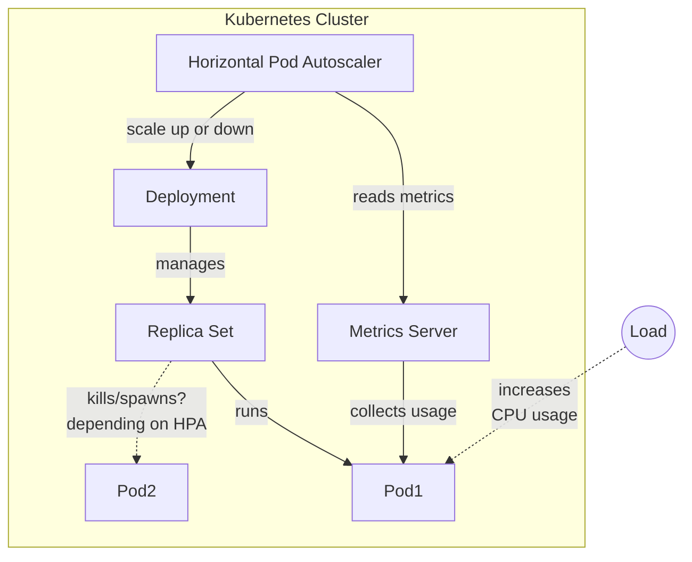

To increase the stability of your Kubernetes cluster, you can use **horizontal** auto-scaling.
This means to automatically increase the number of deployed pods for an application based on the load it receives.
This can be done dynamically without any downtime using the Horizontal Pod Autoscaler (HPA) feature in Kubernetes.

> Wait!? Before we go on, what would be "_**vertical** auto-scaling_" then?

Vertical auto-scaling is about increasing the resources allocated (CPU or memory) up to hardware limits.
There's a form a vertical auto-scaling through [memory and CPU requests and limits][10] in Kubernetes.
Passed the hardware limit, the only way to add more is either to change hardware or physically add to it.

We talked about memory and CPU requests and limits in a previous [article][10], and increasing allocated resources to 
match spikes in demand may end up over-provisioning them and increasing costs.
So this time let's look at Horizontal auto-scaling, which is another strategy to handle spikes in demand.

## Kubernetes HorizontalPodAutoscaler (HPA)

Horizontal auto-scaling is done via the [HorizontalPodAutoscaler][1] resource in Kubernetes, called _HPA_ for short.
The `HorizontalPodAutoscaler` automatically updates a workload resource (such as a Deployment/Rollout or StatefulSet),
with the aim of automatically scaling the workload to match demand based on perceived CPU utilisation by default.

After that specific threshold has been reached, the HPA will automatically scale the number of pods in the deployment.
The more load the application receives, the more pods will be deployed to handle it up to a maximum number of pods
specified in the HPA configuration.

## Implementing the HorizontalPodAutoscaler

### Pre-requisites

As your pod will be scaled based on usage, they will need to be able to gracefully handle termination requests.
This means that on `SIGTERM` signal, 
the pod should stop receiving new requests and finish processing ongoing ones before shutting down.

Most modern frameworks should have built-in support for this, but you may need to configure it.
For example, the `server.shutdown` property in [Spring Boot applications][2], or handling the signal directly like in
javascript with `process.on('SIGTERM', () => {})`.

You can test your graceful shutdown implementation locally on the app's process id with `KILL -TERM <process_id>`

This is to make sure that while scaling down, users interacting with a pod targeted for termination are not affected.
Horizontal scaling is about preventing downtime during spikes, not pushing it during cool down.

### Horizontal Autoscaler in a Diagram

To illustrate the process, here is a diagram of how the HPA works in the Kubernetes cluster:



In this diagram, we can see that the HPA talks to _Metrics Server_, which is a key built-in component in Kubernetes.
Based on the information (CPU consumption in our case) it receives, it will scale up or down the number of pods in the deployment.
When the deployment is scaled up, new pods next to _Pod1_ will be created in the _Replica Set_ if CPU and memory are available.

### Adding the HPA to your deployment

Let's have a simple example of an HPA resource using CPU utilisation as a metric for scaling.
We have a [Kubernetes deployment][11] named _my-application-deployment_ that we want to auto-scale based on CPU usage.
The manifest for the HPA might look something like this:

```yaml
# hpa.yaml
apiVersion: autoscaling/v2
kind: HorizontalPodAutoscaler
metadata:
  name: my-application-hpa
spec:
  scaleTargetRef:
    apiVersion: apps/v1
    kind: Deployment
    name: my-application-deployment
  minReplicas: 1
  maxReplicas: 10
  metrics:
    - type: Resource
      resource:
        name: cpu
        target:
          type: Utilization
          averageUtilization: 50
  behavior:
    scaleDown:
      stabilizationWindowSeconds: 300 # 5 minutes
      policies:
        - type: Percent
          value: 10
          periodSeconds: 60
```

Here is what this does:

- The `metadata.name` is the name given to the HPA.
- The `scaleTargetRef` directs the HPA towards the Deployment (named _my-application-deployment_) it will auto-scale.
- The `minReplicas` and `maxReplicas` are the boundaries in which the HPA should scale the number of pods for that deployment.
  - Unless there's not enough CPU / memory on the server to scale them up.
- The `metrics` is where you set the conditions for scaling. 
  - With the `averageUtilization` for CPU at _50_, it means that if the average CPU usage of all the pods exceeds **50%**, the HPA scales up the number of pods.
- The `behavior` section is about how the HPA should scale up or down the number of pods. 
  - Here we only define for scaling down, it will wait 5 minutes before scaling down **10%** of the pods every 60 seconds.

Also depending on your needs, custom metrics can also be used by the `HorizontalPodAutoscaler` to scale the pods.
This can be done by using the type `External` instead of `Resource` for the metric,
which can be based on metrics from your monitoring tools.

### Applying the HPA

To apply this configuration in your kubernetes cluster,
update the previous configuration with your deployment and save it as a file, for this example: `hpa.yaml`.

Now you can and use kubectl to [apply][10] it in your cluster:

```bash
kubectl apply -f hpa.yaml
kubectl describe hpa my-application-hpa
```

Once applied, you should be able to see the resource in your cluster!

Now you can test that it works successfully by generating "_load_" on your application and monitoring the number of pods.
Try using a load testing tool like [K6][12], [Apache JMeter][13] or [locust][12] to simulate traffic on your App.
Have fun experimenting with the Kubernetes Pod Autoscaler!


[1]: https://kubernetes.io/docs/tasks/run-application/horizontal-pod-autoscale/
[2]: https://docs.spring.io/spring-boot/reference/web/graceful-shutdown.html
[10]: 
[11]: 
[12]: 
[13]: 
[14]: 