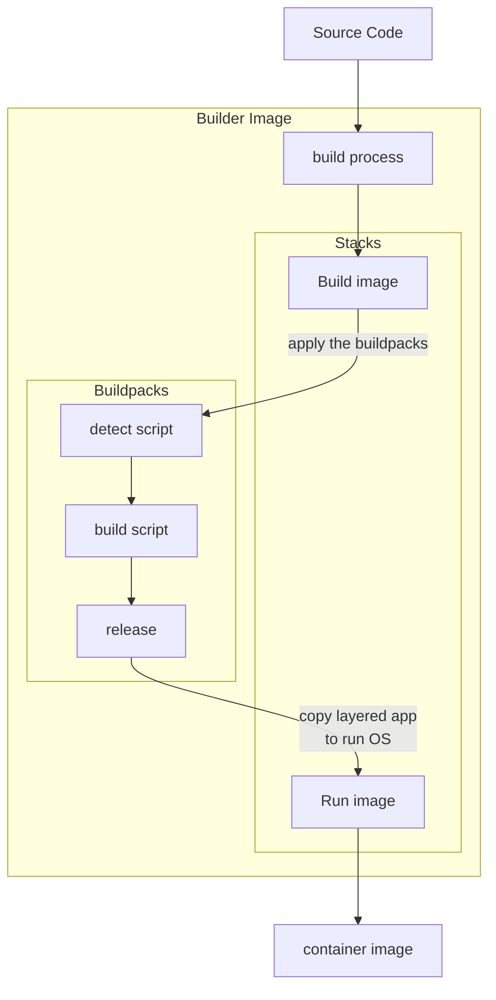

### A bit of history

[Buildpacks][1] were created by [Heroku][7] in **2011** and then adopted by [Cloud Foundry][2],
[Google App Engine][3] and other Platforms as a Service (PaaS).
In **2018**, the _Cloud Native Buildpacks_ (CNB) project was started to maintain specifications and tooling system to use the buildpacks
in Kubernetes and other container platforms.

Cloud Native Buildpacks uses the modern container standards, such as the [Open Container Initiative][5] (OCI) image format.

Buildpacks and Cloud Native buildpacks are similar, and nowadays, the term buildpacks is used to refer to both.
(At least, that's what I do... 🤓)

### Buildpacks

#### What are buildpacks?

The buildpacks are scripts that transform the source code into a runnable application image.
There are usually 3 scripts:

- **Detect**: The source code is inspected by the `detect` scripts of the buildpacks.
    - Each buildpack checks if it is applicable to the source code. If it is, it will be used in the next steps.
- **Build**: The build scripts of the applicable buildpacks transform the source code into a runnable application.
    - This can involve compiling the code, installing dependencies, and setting up the runtime environment.
- **Release**: The release script provides metadata to the platform, such as the process types that can be used to start the application.
    - The result is an executable artifact, such as a container image, that includes the application and its dependencies.

Some buildpacks are language-specific while others might be more generic and can be used across different languages.
They replace the need to write Dockerfiles and handle tasks like downloading dependencies,
compiling code, and setting up the runtime environment.

Rather than replacing docker, buildpacks are a way to abstract the complexity of creating a container image.

#### Example of a custom buildpack

Here is an example for a straightforward NodeJS buildpack.
What you would get when trying it out from the [documentation][6].

1. The `detect` script
    - This script checks if the application uses Node.js by looking for a `package.json` file.

```shell
#!/usr/bin/env bash

# Check if the application uses Node.js
if [ -f package.json ]; then
  echo "Node.js Buildpack"
  exit 0
else
  echo "No package.json file found"
  exit 1
fi
```

2. The `build` script
    - This script installs the Node.js dependencies using npm.

```shell
#!/usr/bin/env bash

# Set the build directory and dependencies layer directory
BUILD_DIR=$1
DEPS_DIR=$2

# Install Node.js dependencies
echo "-----> Installing dependencies"
npm install --prefix $BUILD_DIR --production

# Copy the dependencies to the dependencies layer directory
cp -r $BUILD_DIR/node_modules $DEPS_DIR
```

3. The `release` script
    - This script provides metadata to the platform as yaml, such as the process types that can be used to start the application.

```shell
#!/usr/bin/env bash

cat << EOF
---
config_vars:
  PATH: $PATH:/app/node_modules/.bin
default_process_types:
  web: npm start
EOF
```

These scripts are run sequentially, so that if in this case we're not using NodeJS, the buildpack won't be applied and
the rest of the scripts won't be run.

#### Official buildpacks

There are multiple buildpacks available for different languages and frameworks.
They are usually maintained by the community and are open-source.

You can find the most famous ones:

- [Paketo Buildpacks][4]: It is a [Cloud Foundry][8] project sponsored by VMware.
- [Google Cloud Buildpacks][9]: Buildpacks design for [Google Cloud][20] Platform.
- [Heroku Buildpacks][7]: Registry of heroku based and existing open-source buildpacks.

They often come with builder images (docker images with the buildpacks pre-installed),
that you can use to build your application image locally or in a CI/CD pipeline.

### Using pack

#### Introduction

The `pack` CLI is a tool to build images using buildpacks.
Buildpacks are designed to be used in the cloud, but you can also use and test them locally with this tool.

Here is an example of how to use it:

```shell
pack build my-app --path /path/to/source-code --builder my-builder
```

For the builder, you can use the official ones or create your own with the `pack create-builder` command.
If you are using [paketo][4], you can find a list of available builder on their [website][10].

#### Pack build process

Here is a diagram of how it looks like when you run the `pack build` command:



It looks similar to a multistage docker build,
but buildpacks are more flexible and reusable whereas you need a dockerfile per app.
The run image is a minimal image with only the runtime dependencies to avoid vulnerabilities.

#### Example

In this example, we are not going to user our custom buildpack, nor create a custom builder.
Let's just try to run it on a using the `paketobuildpacks/builder:base` builder image, on a NodeJS application.

```shell
===> DETECTING
[detector] 3 of 4 buildpacks participating
[detector] paketo-buildpacks/node-engine 0.0.1
[detector] paketo-buildpacks/npm-install 0.0.1
[detector] paketo-buildpacks/npm-start 0.0.1

===> ANALYZING
[analyzer] Previous image with name "my-app" not found

===> RESTORING
[restorer] No cached data found

===> BUILDING
[builder] -----> Node.js Buildpack
[builder] -----> Installing Node.js
[builder] -----> Installing dependencies
[builder] -----> Build completed

===> EXPORTING
[exporter] Adding layer 'paketo-buildpacks/node-engine:node'
[exporter] Adding layer 'paketo-buildpacks/npm-install:modules'
[exporter] Adding 1/1 app layer(s)
[exporter] Reusing layer 'launcher'
[exporter] Reusing layer 'config'
[exporter] Reusing layer 'process-types'
[exporter] Reusing layer 'slice'
[exporter] *** Images (sha256:abc123) were created:
[exporter]       my-app:latest
```

As you can see, the Cloud Native Buildpacks lifecycle steps (detecting, analyzing, ...) are run within the builder image.    
We can see that the output is a containerised image named `my-app:latest`.

```shell
docker tag my-app:latest username/my-app:latest
docker push username/my-app:latest
```

This means you can, as shown above, push the image to a registry like dockerhub.
Then you can use that image in any platform you want.


[1]: https://buildpacks.io/
[2]: https://www.cloudfoundry.org/
[3]: https://cloud.google.com/docs/buildpacks/overview
[4]: https://paketo.io/
[5]: https://opencontainers.org/
[6]: https://buildpacks.io/docs/for-app-developers/tutorials/basic-app/
[7]: https://elements.heroku.com/buildpacks
[8]: https://docs.cloudfoundry.org/buildpacks/
[9]: https://github.com/GoogleCloudPlatform/buildpacks
[10]: https://paketo.io/docs/reference/builders-reference/
[20]: 