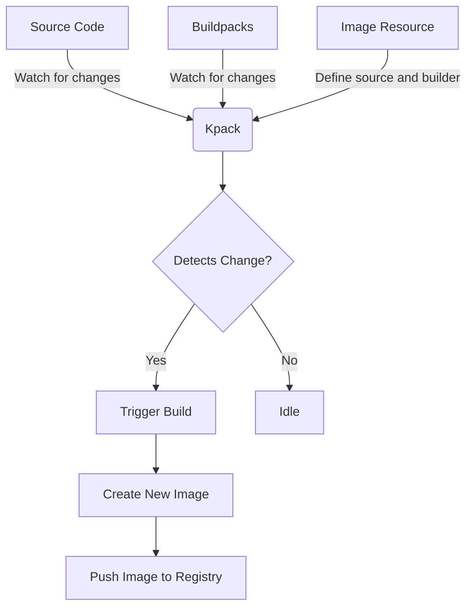
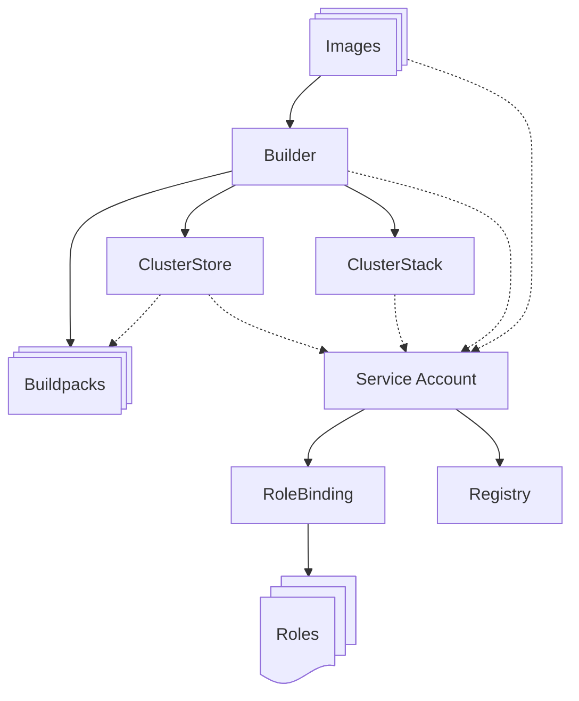

## Essentials

### What is Kpack❓  

[Kpack][2] is a Kubernetes-native build service that utilises the [Cloud Native Buildpacks][2] project to transform your source code into container images. 
It's designed to automate the process of creating runnable application images from source code, without the need for Dockerfiles.

In the end, the star of the show is not really Kpack, but the cloud native buildpacks themselves.
Kpack is part of the tooling that is maintained by the Cloud Native Buildpacks (CNB) project.

To know more about buildpacks check this article [_introduction to buildpacks_][10], 
it explains what they are, how to create one and how they work. 
Understanding _Kpack_ is easier once you know _buildpacks_. 😉

### Why would you need Kpack❓

Kpack offers several benefits:  
1. **Native Integration**: Being a Kubernetes-native tool, it integrates well with existing Kubernetes workflows and tools.
2. **Automated Builds**: Kpack automatically builds images when it detects changes to your app's source code or buildpacks.  
3. **Image Updates**: It can update images with the latest runtimes and packages, ensuring that your applications stay secure and up-to-date.  

If you were using buildpacks before, it comes with the benefit of automating the process and integrating it with Kubernetes.
There are existing tools that can be used to build images, but Kpack is the officially supported tool by the [buildpacks community][2]. 

### How does Kpack work❓

Kpack works by watching for changes in your application's source code or the buildpacks.
When it detects a change, it triggers a build and produces a new artefact then push it to the registry.



Kpack works in a Kubernetes environment and is designed to simplify the process of building container images from source code.
So it uses its own set of resources and controllers.

We'll dig more into the build process toward the end of this article.

## Kpack components

### 🗺️ Overview

To add Kpack to your Kubernetes cluster, you need to install it first. 
Apply it to your cluster using the following command:  

```shell
kubectl apply -f https://github.com/pivotal/kpack/releases/download/v0.4.1/release-0.4.1.yaml
```

The installation consists of several components that are defined in the release YAML file.



This is a simplified diagram of the components involved in the Kpack installation.
Find the community indepth [documentation][7] for more details.
I am abstracting config maps or secrets that could intervene during the build process as well as some other minor components.

The Cluster components are cluster-scoped in Kubernetes, while the other are namespace specific.

### 🛂 Service Account

The service account is used by pretty much all Kpack components and is an abstraction for the necessary roles and permissions.
It is used to access the registry, push the image but also to create the build pods and more.

A _Kpack_ `Role` should be created then bound via a `RoleBinding` resource to the `ServiceAccount` giving it the
[necessary permissions][7] that we talked about.
Those are using the rbac (role-based access control) default kubernetes authorization api, and not a specific Kpack one.

The service account is namespace-scoped, 
so make sure the namespace of the service account (roles and rolebindings) matches the one of your other Kpack resources.

### 📋 Kpack Image

The container's _image_ and the custom resource definition (CRD) _Image_ are two different things.

Kpack uses Image resources to define the source code location, the desired builder for an application 
and the location in the container registry where the container image originated from that configuration will be pushed.

Find the image resources in Kubernetes with:

```shell
kubectl get Image -A 
```

Here's an example of an Image resource:

```yaml
apiVersion: kpack.io/v1alpha2
kind: Image
metadata:
  name: sample-image
  namespace: default
spec:
  tag: gcr.io/my-project/sample-image
  serviceAccount: service-account
  builder:
    name: sample-builder
    kind: Builder
  source:
    git:
      url: https://github.com/my-user/my-repo
      revision: master
```

The Image resource specifies the source code location and the builder to be used.
In this example, Kpack will watch the Git repository specified under `source.git.url` for changes.

When a change is detected, it will use the `sample-builder` to build a new image and push it to `gcr.io/my-project/sample-image`.

### 🗃️ Kpack ClusterStore and ClusterStack

The `ClusterStore` contains the buildpacks that are used in the build process,
while the `ClusterStack` defines the stack (base image) used by the buildpacks.

```yaml
apiVersion: kpack.io/v1alpha2
kind: ClusterStack
metadata:
  name: base
spec:
  id: "io.buildpacks.stacks.jammy"
  buildImage:
    image: "paketobuildpacks/build-jammy-base"
  runImage:
    image: "paketobuildpacks/run-jammy-base"

---
apiVersion: kpack.io/v1alpha2
kind: ClusterStore
metadata:
  name: default
spec:
  sources:
    - image: gcr.io/paketo-buildpacks/builder:base
    - image: gcr.io/paketo-buildpacks/nodejs
    - image: gcr.io/paketo-buildpacks/java
```

They are cluster-scoped resources. The buildpacks are also specified in the builder so make sure they match.
For the Cluster stack, you can define which image you want to use for the build process (running buildpacks, installing dependencies, ...) 
and the run image (lighter image to run the built application).

### 👷 Kpack Builder

After installing Kpack, you can create a Builder resource. 
A [Builder][10] is a packaged set of buildpacks and a stack that Kpack uses to build container images. 
Here's a simple example of a Builder resource:

```yaml
apiVersion: kpack.io/v1alpha2
kind: Builder
metadata:
  name: sample-builder
  namespace: default
spec:
  tag: gcr.io/my-project/sample-builder
  serviceAccount: service-account
  stack:
    name: bionic-stack
    kind: ClusterStack
  store:
    name: default
    kind: ClusterStore
  order:
  - group:
    - id: org.cloudfoundry.openjdk
    - id: org.cloudfoundry.buildsystem
      version: 1.0.156
```

The builder is defined in a Builder or ClusterBuilder resource and contains a set of buildpacks, a store and a stack.
The stack provides the runtime environment for the buildpacks and the application.

Now we should have all the pieces ready to build our first image.

## Build process summary

### Workflow

Now that we have looked at all the component, let's detail the build process more.

When an **Image** resource is created or updated (or a buildpack is modified),
the Kpack controller triggers a build for that image's **Builder**.
The build process is managed by the builder specified on that image.

- A build pod based on the **Builder**'s **ClusterStack** is created.
- That build pod will be used to execute the buildpack scripts.
  - The buildpack scripts (stored in the **ClusterStore**) are specified in the builder.
  - The buildpack scripts are executed in order and according to applicability based on the builder.
- The output of the buildpack scripts is used to create the final Docker image.
- The image is pushed to the **registry** with the appropriate tag.
- The Kpack controller updates the Image resource status with the latest build information, 
  including the Docker image reference and the build logs.

### Building the container image

The build pod follows a 7-step process, it matches the steps from a traditional [buildpack lifecycle][10],
applying the buildpacks in the order specified in the builder:

1. **Prepare**: This step prepares the environment for the build. 
    - It includes setting up the necessary directories and permissions.  
2. **Analyze**: This step analyzes the previous image and its metadata. 
    - It helps in optimising the build process by reusing layers from the previous build that haven't changed.  
3. **Detect**: This is the first step of the buildpack lifecycle. 
    - The `detect` scripts of the buildpacks inspect the source code to determine which buildpacks are applicable.  
4. **Restore**: This step restores previously cached layers. 
    - Caching can help speed up the build process by reusing unchanged layers.  
5. **Build**: This is the second step of the buildpack lifecycle. 
    - The `build` scripts of the applicable buildpacks transform the source code into a runnable application.  
6. **Export**: This step exports the final application image. 
    - It includes the application layer and any additional layers created by the buildpacks.  
7. **Completion**: This is the final step that signifies the end of the build process. 
    - It doesn't make changes to the image but is used to indicate that the build process has completed successfully.

Once the process is completed, the image will be available in the _registry_ specified in the Image resource.
If you have a pod running with that image, it will be replaced with the new one.

### Failure scenario

In case of a build failure, the build pod will be marked as failed.
It won't be deleted though leaving you the opportunity to read the log for debugging.

A failure doesn't impact the previously running image as this are not replaced until a new image is built and deployed.
Also, when failed, you can't restart the build process.
Manually you can generate a new image by updating the source code revision in the Image resource.

```shell
kubectl patch image sample-image -p '{"spec":{"source":{"git":{"revision":"new-commit-hash"}}}}'
```

This will trigger a new build using that commit hash to pull the source code.
But that's totally optional, since Kpack monitors the source code, buildpacks, even the build images for changes.
So if you push a fix a new build will be triggered automatically.


[1]: https://buildpacks.io/
[2]: https://github.com/buildpacks-community/kpack
[3]: https://buildpacks.io/docs/for-app-developers/tutorials/basic-app/
[4]: https://paketo.io/
[5]: https://opencontainers.org/
[6]: https://www.cloudfoundry.org/
[7]: https://github.com/buildpacks-community/kpack/tree/main/docs
[10]: 
