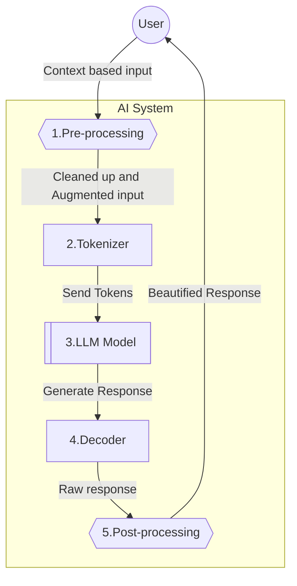

### Introduction

AI (artificial intelligence) is trending, expected to be the new industrial revolution; there's a lot to wonder about it.
Each big company developing their own AIs or tools to play with like Open AI's [chatGPT][2], [IBM watson X][3]
or [Google's Gemini][1] plus all the open-source ones, it can be overwhelming!

As there are multiple type of "AI" based tool, I wanted to explore and focus on the application of LLM (large language model).
What is it, how they are designed and architected and how to interact with them.

### What is LLM (Large Language Model) ?

The AI models in LLM are built with huge dataset, a collection of information that is used to train the AI model.
A bit like a reference for it to compose its answers. If what you are asking is within the dataset the AI has been trained
on, there is a high probability that it will give an answer that is similar to that reference, hence _"good"_.

But what's _"good"_? For the AI during training, the AI is tested and there are some criteria to measure the AI's answer
by giving them a grade between _0_ and _1_:
- closer to `1` means it matches the dataset continue in that direction
- towards `0` means that it's wrong and should try something else.

But it's not an absolute value, it is evaluated based on what's expected from the dataset. In hindsight,
this means that the AI's _"good"_ is to emulate what would come out if somebody were to look in that dataset.
Which can lead to some weaknesses, because if there are flaws or missing information, then the answer can either be wrong
or harmful (similar to the famous [2015 racist photo recognition algorithm][13]).

> A LLM generates responses based on the best statistical match from the dataset it was trained on.

That's why the dataset's size has been increasing as a mean to make sure it's not flawed. 
And unfortunately, while a bigger dataset makes for more complete and articulated answers, it doesn't solve the problem entirely.
We have seen some models with a smaller dataset are more or as much accurate as others with bigger ones. Which one could
assume could be thanks to the quality of the dataset or the algorithm behind the model's creation.

And following that line of thought, if we feed the algorithms data from available sources, 
we may miss on whoever is not able to contribute as much to those available sources. 
Because they are from minorities or due to language barriers or even because they are lacking the proper tools.
(...or because bad input could be louder than rightful ones).

### Creating LLM services

#### LLM based app's Architecture

A LLM app's architecture, you pass a question to the _AI_, and it will generate an answer.
However, it's not as straightforward as it seems, because the LLM model will not always behave as expected,
and often can provide crazy answers to simple questions.

To improve that we can add additional steps to improve the answer:
- With _fine-tuning_ which is additional training on a specific dataset on an existing model to make it more accurate for a specific task.
- With _retrieval augmented generation_ (RAG) which adds relevant context or fetch information to the input to get a better answer.

Both can be used, but _fine-tuning_ is usually more expensive whereas _RAG_ is more flexible and can be used on the fly.
With LLM models accepting more tokens (i.e. bigger input), it's easier to add more context automatically to the user's input.



Usually LLM based apps are built with a _pre-processing_ step to clean up the input and add context.
The more pre-processing there is, the more chance the model will generate a useful answer.
(that's how GitHub co-pilot can give you _half_ of a good answer when just asking "_Why doesn't it work?_").
Then the input is tokenized, sent to the LLM model, which generates a response that is decoded and post-processed,
so that it can be sent back to the user.

In the Post-processing step, the response can be beautified, or screened for any harmful content. 
To make it harder to hack the LLM into revealing secrets 😉
After social engineering, there's a new type of hacking with AI, the _prompt engineering_!

#### Prompt engineering

A new component coming in with using LLM is building prompts that will make sure the end user gets a useful response to the user.
Since, when chatting with an AI, your question won't go directly to the model.
It will be pre-processed and wrapped around with prompts to the AI giving more context, so you'd get a better answer.

That context may include:
- the role of the AI
- the context of the conversation (for example, helping a developer write code)
- the code or files being opened or looked at (as well as the language based on those files)
- the history of questions asked and response given
- some more directive to keep the suggestion relevant.

Though, it's not yet bulletproof, hence the feature to restart a new conversation with the Chatbot resetting
some context (like conversation history, when it's running in circle or the user wants to change the subject).

> My takeaway: For coding example, I often play with the `refactor ...` prompt to get some better code suggestions,
removing made up variables, duplication or implying which pattern or example to follow.

Next time you chat with a bot like [copilot][20] or [Jetbrains AI][21], 
think about the prompt that was used to get the answer you received.

### Interacting with LLM

#### Hugging Face

[Hugging Face][6] is an AI research lab and model hub, so it's more than just LLM models.

In a short span of time, Hugging Face has gained substantial presence in the AI space.
Tech giants including Google, Amazon, and Nvidia have invested significantly in Hugging Face,
making its valuation fly to $4.5 billion (as of [August 2023][8]).

To get started with LLM using Hugging face, you'll need python and download the `transformers` library,
which [proivdes API and tools][5] to use models.

```shell
pip install transformers
```

Then load a model and start using it by [generating][7] some text using the open source [Mistral-7B][4] model:

```python
from transformers import AutoTokenizer, AutoModelForCausalLM

# Load the model and tokenizer
model = AutoModelForCausalLM.from_pretrained("mistralai/Mistral-7B-v0.1", device_map="auto", load_in_4bit=True)
tokenizer = AutoTokenizer.from_pretrained("mistralai/Mistral-7B-v0.1", padding_side="left")

# Tokenize the input
model_inputs = tokenizer(["A list of colors: red, blue"], return_tensors="pt").to("cuda")

# Generate and decode text
generated_ids = model.generate(**model_inputs)
generated_text = tokenizer.batch_decode(generated_ids, skip_special_tokens=True)[0]
```

Now, as you can see, the model doesn't take the input directly, it's tokenized.
That means the input is transformed into a format the model can understand, which is a list of numbers.
(A `pyTorch` [tensor][12] to be more precise which is a multi-dimensional matrix)
Since we encoded the input, the input needs as well to be decoded to get the text back.

```shell
>>> print(generated_text)
'A list of colors: red, blue, green, yellow, orange, purple, pink,'
```

And we can see that the model has generated a list of colors.
However in my case, it went on and on and did not quite give me the same nice prompt as the [documentation][7].

#### Ollama

[Ollama][9] is both a hub for LLM models and a tool that allows you to modify and create models.

Installing Ollama on Mac:

```shell
brew install --cask ollama
```

Once install you can run the `ollama` command, for example:

```shell
ollama run llama3.2
# >>> Send a message (/? for help)
```

This will proceed with installing the [llama3.2][10] model and running it.
As one can see, it looks similar to using `docker` pulling and running images.

You will be able to interact with the model by sending messages in the CLI.
You can also use the `ollama list` command to list the available models and more.

> LLaMA (Large Language Model Meta AI) model is developed by Meta and is **not** affiliated with Ollama.

When running, the model is available on the CLI where you can interact with it.
However, you can also use the API when starting ollama with `ollama serve`.
It will be available at [http://localhost:11434][11].


[1]: https://ai.google/discover/palm2/
[2]: https://openai.com/blog/chatgpt
[3]: https://www.ibm.com/watsonx
[4]: https://mistral.ai/news/announcing-mistral-7b/
[5]: https://huggingface.co/docs/transformers/index
[6]: https://huggingface.co/
[7]: https://huggingface.co/docs/transformers/llm_tutorial
[8]: https://www.reuters.com/technology/ai-startup-hugging-face-valued-45-bln-latest-round-funding-2023-08-24/
[9]: https://ollama.com/
[10]: https://ollama.com/library/llama3.2
[11]: https://github.com/ollama/ollama/blob/9d71bcc3e2a97c8e62d758450f43aa212346410e/docs/api.md
[12]: https://pytorch.org/docs/stable/tensors.html
[13]: https://www.theverge.com/2018/1/12/16882408/google-racist-gorillas-photo-recognition-algorithm-ai
[20]: 
[21]: 