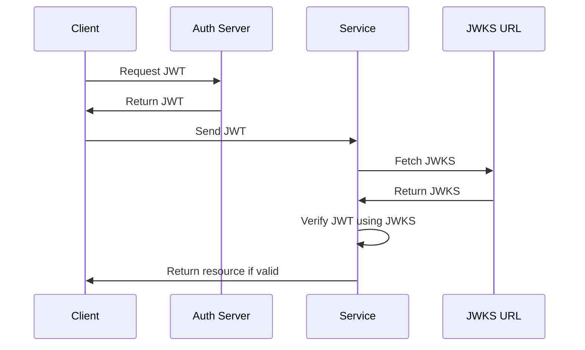
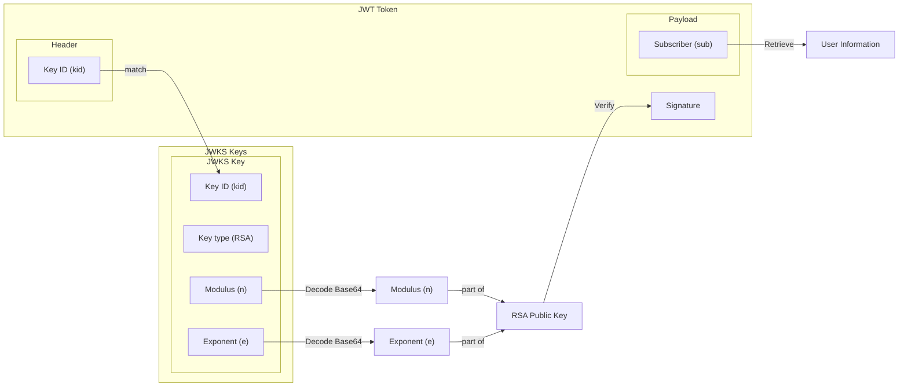

We talk about JSON Web Tokens (JWT) [before][10] to explain the [OAuth][10] flow.
At the time the example was about a JWT that was signed using a symmetric key (HMAC - _Hash-based Message Authentication Code_),
which can be used for both encoding and decoding the token (e.g. using HS256 algorithm).

This time we'll talk about using an asymmetric key (e.g. using RS256) to sign the JWT,
I have also kept a part about the RS256 as I found the principle interesting. 🤓

### JWKS (JSON Web Key Set)

#### Overview of the payload

Check out a [real JWKS][5] from Google's OAuth2 service.
For an RSA key, 
the JWKS should have a key of type `RSA` containing the RSA key's modulus (n) and exponent (e) encoded in Base64.

```json
{
  "keys": [
    {
      "alg": "RS256",
      "kid": "key-id",
      "kty": "RSA",
      "use": "sig",
      "n": "modulus in base64 like ooBSFGS8kUau7u4c-iJYZ7MjowpDsphywxoL",
      "e": "exponent in base64 like AQAB"
    }
  ]
}
```

Apart from the RSA key we also have:
- `alg` (Algorithm) which is the key's algorithm.
- `kid` (Key ID) which is a unique identifier for the key, that's also present in the JWT header.
- `use` (Usage) which is the intended use of the key, here it's `sig` for signature.

Using JWKS and an asymmetric key is usually more secure, since you never need to share the private key.
This makes it easier to manage the keys (only one place to rotate the key) and more secure (less risk of key leak).

#### Authentication flow

The authentication flow using the JWKS and a JWT token signed with an RSA key is similar to the one using a symmetric key.
The only difference is that we'll need to fetch the JWKS from the JWKS URL (this can be cached) and use it to verify the JWT token.



The service provides the resources to the user if the used JWT is valid 
(e.i. the signature is valid, the token is not expired, the permission required are present).

#### Example of JWT token

A RSA signed JWT token should have the same structure as any other [JWT token][10],
with the header, payload and signature separated by a dot `.`:

```shell
eyJhbGciOiJSUzI1NiIsImtpZCI6ImtleS1pZCIsInR5cCI6IkpXVCJ9
.eyJzdWIiOiIxMjM0NTY3ODkwIiwibmFtZSI6IkpvaG4gRG9lIiwiYWRtaW4iOnRydWUsImlhdCI6MTUxNjIzOTAyMn0
.RV_2n5w8T2RpWQnvAwWNvcoMFE5ja4qK7_K6lgX3zMlzZBPzsSP1txOckBUaiPIxxLL42vI3hzvpky8DmeI1furZ06qB1vuXziYZLGAdX2R0NFJD3bnp1pI3Jr4nGERnIkMTWZ4bUoZTbRQ5gcZ4H6R7HpczxwXK7qMqpDcWMEo3yG-_q4c1qzYNPMcE7Id01FNy8mO8eRxpVe6Sw8w6VB4geNo2RlC2Qg1-I0MQn-JTXILPX_hmYbJd1b4a8G8mKwuffNW8632KNmrFMB94eHx9oCS9BKB5hEga0MYv-S5ev4K4edtXWKvwwmtaJcokh7JIrZH7vE7gLtFM7Mm8hw
```

You can decode the JWT token to get the header and payload using [jwt.io][1] for troubleshooting.
Here is how one would look like using RSA and JWKS as an example.

⚠️ Don't share real JWT online, as they are credentials and could be used to impersonate the user 
(I am using here a dummy token).

```json
[
  {
    "alg": "RS256",
    "kid": "key-id",
    "typ": "JWT"
  },
  {
    "sub": "1234567890",
    "name": "John Doe",
    "admin": true,
    "iat": 1516239022
  }
]
```

Some of the value can be inserted directly by the auth server, _admin_ or _name_ might not exist in favor of a
_roles_ for role based access or _permissions_ field for the [fine-grained access control][3] through attributes (e.i resource:read, resource:write).
The important parts we want to look at are:
- `alg` which is the algorithm used to sign the token.
- `kid` which is the key ID used to match the key in the JWKS.
- `sub` which is the subject of the token, usually the user ID.
- `iat` which is the issued at time, to check if the token is still valid.

The fields that are used in both the token and key are named the same. 💡
So if the JWT's key id matches one of the keys in the JWKS but not its algorithm then the validation should fail.

#### Validating the JWT with the JWKS

Now that we have all parts, let's review in a diagram how the JWT token is [validated][10] using the JWKS.
If you are familiar with the [OAuth2 flow][10], you won't be lost!
I find it easier to understand with a visual representation.



We can see that while the jwt can always be decoded,
only the signature is encrypted with the RSA key.

The signature can only be verified if the key matching the jwt's kid is available in the JWKS.
The RSA public key is stored in the jwks as its simplest form (n, e) and is used to verify the signature.

### RS256
#### Usage with JWT

The RS is for RSA, the Rivest-Shamir-Adleman algorithm which is an asymmetric cryptographic algorithm.
(Poor Adleman didn't make the cut this time!)
The 256 in _RS256_ refers to the key size, which is 256 bits.

The RSA algorithm uses two keys: a public key and a private key.
With [JWT][1] token,
- The private key is stored securely by the auth server and is used to sign the token.
- The public key is in the JWKS (JSON Web Key Set) available to the service and used to verify the token.

Though the RSA key is not _straight up_ available in the JWKS, it is encoded in base64 format.

#### RSA key

Let's refresh ourselves a bit about RSA keys, and how it works between the jwt and the jwks.
First how it looks and how you might have encountered it before.
Since it's an asymmetric algorithm, we have the two keys, public and private.

Does `rsa.pub` ring a bell?
You have probably generated a pair yourself if you ever used SSL to connect to a git repository.

Remember the old [git setup] doing `ssh-keygen -t rsa -b 4096 -C "me@mail.com"` well that was to create RSA keys.
However, now GitHub have switched to [Ed25519][11] keys which are more secure.
(wait, are jwt unsecure then? 🤔 ... well yeas and no, they are just easier to break than they use to with newer hardware).

```shell
-----BEGIN PUBLIC KEY-----
MIIBIjANBgkqhkiG9w0BAQEFAAOCAQ8AMIIBCgKCAQEAu1SU1LfVLPHCozMxH2Mo
4lgOEePzNm0tRgeLezV6ffAt0gunVTLw7onLRnrq0/IzW7yWR7QkrmBL7jTKEn5u
+qKhbwKfBstIs+bMY2Zkp18gnTxKLxoS2tFczGkPLPgizskuemMghRniWaoLcyeh
kd3qqGElvW/VDL5AaWTg0nLVkjRo9z+40RQzuVaE8AkAFmxZzow3x+VJYKdjykkJ
0iT9wCS0DRTXu269V264Vf/3jvredZiKRkgwlL9xNAwxXFg0x/XFw005UWVRIkdg
cKWTjpBP2dPwVZ4WWC+9aGVd+Gyn1o0CLelf4rEjGoXbAAEgAqeGUxrcIlbjXfbc
mwIDAQAB
-----END PUBLIC KEY-----
```

This is the [jwt.io][1] public key example to test out RS256 jwt token.
If you decode it (transform to `.pem` then parsing the bytes) you will get the modulus (n) and the exponent (e).
The exponent is usually 65537, and is usually base64 encoded (removing leading 0 bytes) to `AQAB` in the jwks key.

#### Math around RSA encryption

For more math on the algorithm, you can find some [demonstration online][2], here is the relevant part:

For RSA to work we need to have two large primes $$p$$ and $$q$$:
- A modulus $$n$$ is calculated as $$n= pq$$,
- Two exponents, $$e$$ for encryption and $$d$$ for decryption can be found if they satisfy $$ed = 1 \mod (p - 1)(q - 1)$$.

Now we can encrypt a message $$M$$ using the public key $$(n, e)$$:

$$C = M^e \mod n$$.

To decrypt $$C$$ and retrieve the message we use the private key $$(n, d)$$:

$$M = C^d \mod n$$.

The public key is ($$n$$, $$e$$) and the private key is ($$n$$, $$d$$).
The weakness of the algorithm is the key generation, if the primes are not large enough, the key can be brute-forced.

[1]: https://jwt.io/
[2]: https://www.cs.sjsu.edu/~stamp/CS265/SecurityEngineering/chapter5_SE/RSAmath.html
[3]: https://workos.com/blog/what-is-fine-grained-access-control
[4]: https://www.sjsu.edu/cs/
[5]: https://www.googleapis.com/oauth2/v3/certs
[10]: 
[11]: (% post_url 2017/2017-04-19-Get-started-with-GitHub %}
