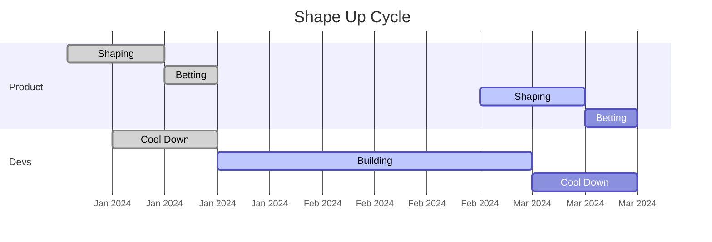
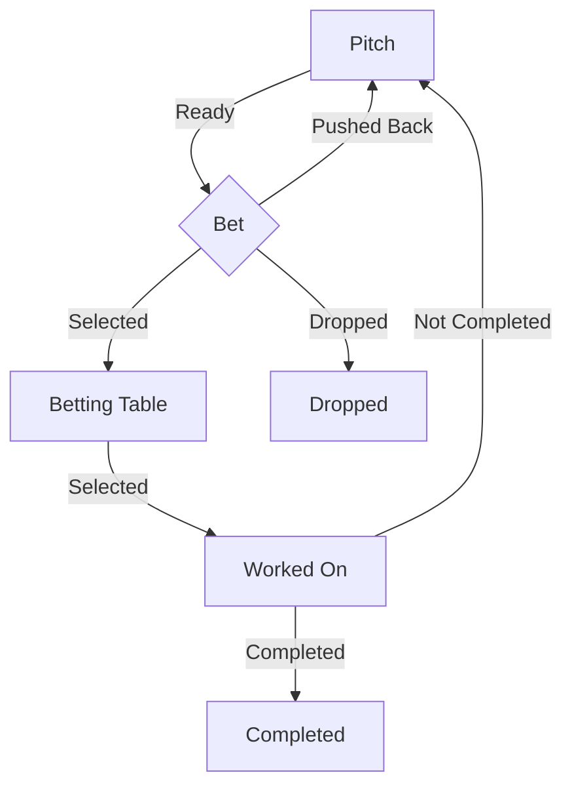

[_Shape Up_][1] is a development methodology by Ryan Singer and used by the [Basecamp][2] company
and probably enabled by its eponymous software for [project management][3]. Rian Singer was the VP of Product Strategy at
Basecamp.

When presented that way, agile coach may be grinding their teeth, as it is similar to [atlassian][4]'s business model:
promoting [JIRA software][5] as a mean to be _Agile_.

It is a common misconception to confuse the tool with the methodology itself.

While the tool may enable you to perform following a given methodology,
it won't prevent its pitfalls when relying blindly on it. In fact: you can do Waterfall with JIRA 🤯

But enough of that, as we talked about it at length [earlier][20].
Instead, we are going to take a look at the "_Shape Up_" methodology, and a short summary of how to run it as
a product manager or a shape up master? 😛

## Shape Up Introduction

### Why use it?

This method was designed for the software development process. 
You can buy the [printed edition][7] or read it [online][6].
It is presented as a mean to solve some growing pains when dealing with engineering and product management.

### What problems does it promise to solve?

1. Endless project with no visible deadline or hard commitment
    - When the scope is unclear or kills the team's motivation, making it seem impossible to overcome.
    - Unforeseen scope creep added without regard to the team.
    - Working and delivery with no feedback from the customer.
2. Loss of focus in the completed work.
    - Delivery is high, but none of what is delivered is functional or ready to be demonstrated to the customer.
    - Urgent day-to-day takes over, no time to plan ahead the work.
3. Delivery process is not scalable
    - Ramping up a new hire on a project takes a lot of knowledge transfers.
    - Key people become bottlenecks that we are waiting on for approvals/reviews.

While it promise to solve some of the growing pains, it is not a silver bullet.

### How will shape up fix those issues?

The goal is to take the critical early on by having the stakeholders actively participating,
while empowering the team to deal with the implementation autonomously.

Each cycle target to deliver a complete set of features from start to finish at the end of it. Design and spiking for
the next cycle is included as a separate phase to make it sustainable.

With shape up, there's consideration for both aspect, the product and the engineering side of the project.
In this article, I will focus on the product side of the methodology. 
If you are a developer or a designer, you can find more information on the development side in my [next article][21].

## Shape Up methodology

### Approach

Shape up can is traditionally a 6 weeks cycle of development followed by a 2 weeks cooldown period.

There's no backlog, instead it has a betting pool which is a high-level view of projects.
Instead, there's a shaping phase where the project is defined and scoped,
and a betting phase where the project is selected and prioritized:

The features are usually well-defined during the shaping phase (like an epic in scrum), and then broken down by the team.
There's usually no daily, and the team is responsible to implement the feature autonomously.

The cool down at the end allow for preparation of the next cycle and gives some buffer to deal with the unexpected.
Though, the cycle is fixed, the scope is variable, meaning that the team will adjust the scope to fit the time frame.

Let's look into details each phases.

### 1. Shaping Phase

Shaping is about understanding the problems and defining a solution for it.
If there are unknown or risky parts related to the solution it should be mitigated during this phase.

_Shaping_ is not done by the dev team to avoid noise during the implementation.
It is usually shared between product people refining the scope and some senior engineers/ tech leads.

#### 1.1 Shape the idea

With Shape up, there's a fixed time and a variable scope.
This means we can fit in a full-blown new user experience in a 6 weeks cycle, 
instead we gauge the _appetite_ of the team to tackle the problem and focus on a quick win.
With the right _appetite_, the team is more likely to be invested and motivated to deliver.

It's all about delivering a MVP _Minimum Viable  Product_,
that gives a new end-to-end but smaller functionality to the customer.

Be careful with project definition that are too vague and which scope will creep out. 
New features need to be tied down to its functionality otherwise it becomes a "_grab bag_" of ideas,
where everyone pours in their _what if ..._ to the list of task to complete it.

#### 1.2 Pitching the project

Once you have proceeded with the shaping, you can pitch the idea to the team.
The pitch is a document that is shared with the team to explain the problem and the solution.
It includes:

- Problem: what we're trying to solve, why we're doing this
- Appetite: how much time we want to spend and how that constrains the solution
- Solution: 
  - It is explained using diagrams so that it's visual and easy to catch
  - it contains the results of the de-risking, and made decision that is shaping the solution
- What's not in scope and won't be part of the project. 
  - Either too complex or less relevant, dropping initially considered items of scope will help deliver the pitch as a whole.

Once the pitch is ready, we can present it! 
You can do it asynchronously, so that everyone can read and comment on it before the betting phase.

### 2. Betting Phase

In Shape Up, there's a hard 6 weeks commitment to deliver a project.
A project is a bet that the team will commit to deliver during the cycle.

However, it's a bet on the team's capacity to deliver the pitched project,
because even though we like our odds, there's always a chance that it won't be delivered.

#### 2.1 The bets

The bets are full transversal feature that are described in a pitch.
That means they are well refined and ready to be worked on.
And a bet is considered done once the described feature is deployed / in production.
(It has an inherent definition of ready/done like in scrum).

The bets are not saved in a backlog as it creates clutter and possible duplication.
Instead, since the pitch is usually a formal document containing all the necessary information,
the bets refers to it.

Each cycle, the bets are _refreshed_, if the work is important it should surface back eventually.
The team will bring up the ones they want to commit to the betting table.

#### 2.2 The betting table

The betting table, it is composed of all the bets that teams want to work on during the next cycle.
So it's purely a product based decision at this point, 
as only bets that the team wants to work on or that's needed should be on the betting table.

Not all bets will be selected, since there's a fixed capacity based on the number of engineering teams.
For bets that are not selected, they can be re-bet next cycle, dropped or re-shaped from scratch.
If a bet wasn't properly shaped, it's no use to expand more time in it. 
It's better to go back to the pitch and adjust what's required before committing to it.

Bugs are not part of the betting table unless exception for major bug that would be presenting a critical issue to solve.
(Losing customer data, major security issue, etc.). Otherwise, they should be part of a pitch and bet on next cycle.
When we talk about bugs, buggy features shouldn't be considered done.
But bugs can be discovered afterward, pitching them help prioritize them, 
and protects the team capacity to deliver new features.

Once before each cycle, there is a meeting where it is decided which bets to commit to.
Then the cycle begin and it's time to build the project.

### 3. Building Phase

Finally! The building phase is when the team will be implementing the bet which is now a project.
It should be one team committed per project. There's no official requirement on the team size.
It's up to the team to decompose the project into tasks and to implement it.

We'll go in more details over this part in the [next article][21].

Some part of the project may be unknown or risky. So, depending on the team's advancement, 
a project can get a reduced scope or dropped altogether.
For the latter, it can be re-shape and re-bet in the next cycle.

If there's too many bug at hand or the features delivered drops in quality, 
then the team should be encouraged to shape solutions to those issues and bet on them next cycle.
So they don't ignore the bug (which are usually the symptoms) and target the deeper issue for continuous improvement,
all while being transparent with the stakeholders.

Also, feedback or polishing requests once the feature is delivered should not be part of the initial project.
Instead, they should be grouped and shaped to bring the most relevant ones to the next cycle.

## Conclusion

The [Shape Up methodology][1] has an interesting stake on managing project!
It's heavily focused on the product side, but has some good nuggets on project management,
which some I mentioned in this and other I saved for the [next][21].

If you haven't read it, you'll find concrete examples for each phase.
I suggest skipping the first few chapters which are more of an overview (if you've read this article),
and jump straight into the dedicated chapter.

Comparing with scrum, it incorporates more officially the concept of _sprint 0_ which is the shaping phase,
where you need to first define the project before starting it.
Shape up makes it a part of its process, 
I find that it gets better incorporates than what you would have with the subsequent scrum refining and planning.

There's a lot of good ideas here and I feel like it's worth trying some of them out.

### The Drama

While learning about the methodology, I also learned about the drama surrounding the company that created it.
You can find the full story via [the verge][8] or [the guardian][9].
It is independent of the Shape Up methodology itself, but involving the author of the book.

But to sum it up, sorry for gossiping 🤭 here is what I understood:

> The [Basecamp][2] company had a meltdown in 2021, where a third of the employees (20 out of 57) accepted a [buy-out offer][8] to leave.

> The issue was leaning on [questionable internal behaviour][9] and deflecting diversity and equity questions as non-existent
during internal discussions. The leadership reacted _poorly_ to the concerns raised by employees, which led to the _author
resigning_ from the company after being suspended for investigation regarding his comment.

Don't let the drama overshadow the methodology, as one has nothing to do with the other.
And you can always let me know what you think in the comments!

[1]: https://basecamp.com/shapeup
[2]: https://basecamp.com/
[3]: https://basecamp.com/features
[4]: https://www.atlassian.com/agile
[5]: https://www.atlassian.com/software/jira
[6]: https://basecamp.com/shapeup/0.3-chapter-01
[7]: https://basecamp-goods.com/products/shapeup
[8]: https://www.theverge.com/2021/5/3/22418208/basecamp-all-hands-meeting-employee-resignations-buyouts-implosion
[9]: https://www.theguardian.com/commentisfree/2021/may/08/the-meltdown-at-basecamp-shows-even-small-tech-firms-are-sociopathic
[20]: 
[21]: 