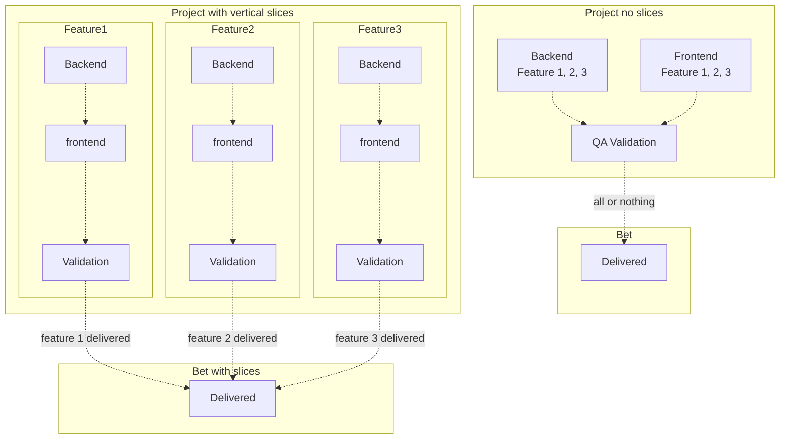

In the [previous article][10] we talked about Shape UP but more in the product perspective.
Meaning, that most of the action are either done by a [product owner][11] (who manages the product),
rather than the actual developers.

Although it's product oriented, developers do have their say and can influence the product,
but also which project is selected and how it's delivered.
Like the previous article I am heavily relying on the [Basecamp][1] book available online or paper.

In this article we'll look at the role of tech lead type of role in [Shape Up][1],
and the guidelines given to actual make the [bet][1] successful.

## From idea to project

There are no backlog in Shape Up, and so the ideas and feedback are collected in document,
they can live as feedback or previous idea's pitch that were delivered or as a separate pitch.
The pitch can be entirely _product_ focused (like a new feature) or _engineering driven_ (like hardening, tooling, bug
fixing).

The transition from an idea to a pitch is called _shaping_.

### Shaping

The shaping process is time-boxed to 2 weeks.
If some items need more time de-risking, then that de-risking can become a pitch to bet on so we can come back to this one.
The goal is to refine the idea into a 6-week deliverable project and unknowns can turn into _rabbit holes_ (scope creep),
which can dent the allocated time for the project (putting the bet at risk).

Like in [software architecture][12], you want to answer and write down the critical questions and decisions, 
what's kept, what's the trade off so that people down the road don't waste time wondering while implementing it.

In this phase, you find where and how the new pieces will fit in the system. You brainstorm and bounce idea.
It's important to de-risk and investigate any potential hiccups.
Although some work is done, it doesn't mean the project is committed.

The outcome should contain a rough draft of the flows. 
It needs to be rough so that it leaves creativity lee way to the designer/developers to adjust the vision
to the actual of the solution.

### Betting

The bets are then put into a _betting table_, here only consolidated pitch targeted for the next cycle are present.
The team's _appetite_ (larger sense) is a big driver whether a project is considered or dropped from the betting table.
The appetite can come from the team willingness to implement a feature like:
- an improvement to facilitate future releases
- customer pressure to get a feature
- subjective criteria boosting the team's interest (like adding new tech .e.g. AI)

Unlike a backlog where ideas, product tasks and engineering tasks may mix.
A betting table represents an accurate view of the projects that can be tackled and are much more meaningful and
manageable.

As for bets, if they don't ship at the end of the cycle, they usually don't get extended amount of time to be delivered.
If it wasn't properly shaped, it's no use to expand more time in it. It's better to go back to the pitch and adjust
what's required before. The work may or not continue once the expectations and pitch are clarified.
This serve to clear the betting table and make sure it doesn't impact other works.

### Delivery

That's the main part where the developers come in.

### Engineering guidelines

As the design and pre-work were done during the pitch phase, the development work should start right away.
Shape Up encourage team to start building fully functional increment piece of the bet during the project.
This is called a _vertical slice_.

That way the project can be deployed and tested throughout its development. It limits integration issues. 
Developer are accountable for the quality of the feature, 
and there will be no extra time at the end of the cycle to fix feature-breaking bugs. 
A buggy non-functioning feature is not considered a feature delivered.

The results doesn't need to be pixel-perfect, more so with UI work. 
Following the _pareto rule_ to deliver enough;
doing 80% of the work in 20% of the time, since the last remaining 20% usually takes up 80% of the time.

This also mean that towards the end of cycle trade-offs will happen. 
Those concerns new aspects to add, or to cut off scope. 
Like any project scope creep may prevent the bet's success. 
It's important to hold off on some item and have the courage to reduce scope so the feature can be delivered.

### Communicate progress

As the project goes on, new tasks may be discovered.
Following the progress through the amount of tasks will not reflect the current advancement of the project as not all
tasks are created.
But they give you an idea of the work that has been done.

Estimating tasks is tricky, the more so when there are unknowns.
If the estimate is wrong which will likely happen the time spent estimating becomes waste.

To avoid the dilemma, Shape Up recommend showing progress through a [bell curve][2]:



At the beginning of the curve, we're in the unknown phase, but we go up as work advances.
We're at the top of the curve once we know all that needs to be done (all tasks are created).
And we go down the slope as tasks are getting done.

This gives an easy rough but usually accurate estimate of the project's progress.

If an item is stuck before the top of the hill, it's best to try and decompose it to identify exactly what's the
blocking item for better progress accuracy. It's important to show progress when work is being done.

### Delivery and cool down

Toward the end of the cycle, when there's less unknown, 
the senior engineers can start spending some of their time for the next cycle shaping.
This is of course if the project is on track to be delivered.

At the end of the 6-weeks cycle, the project (from the bet) should be delivered.
On delivery, some feedback will be sparked. 
Customer or teammates will have different ideas or new features they'll want to add.
At this time those raw requests must not be taken on right away, to take the appropriate time to shape them up properly.

A gentle "_no for now_" allows you to look into it in the future and concentrate on the next highest priorities. 
It prevents any hijacking of the process.
Also often raw feedback may reflect the view of one customer or might come from a misunderstanding of the feature. It's
better to let it soak and avoid re-work (and re-rework possibly thereafter 😱)

There's always a cool down period after cycle, 
because deploying new version may be challenging with unexpected bugs or issues.
This time is also used by the developer to go in training, improve documentation,
or implement some small fixes or whatever they have _appetite_ for. 
(Add some _nice to have_ features from a previous bet, tooling or training). 
It's at the developer's discretion and should be used to prepare for the next cycle.

## Conclusion

As tech leader or senior developer, there's a higher chance to be involved in the shaping phase.
This is where expertise is important to make a bet successful.

Being the building phase there are some major takeaways:
- There's focused dedicated time to shape the project before it's committed.
  - Less wasteful meetings for developers, and better alignment between engineering and product.
- Following the progress is not done via estimation but through placing tasks on a bell curve.
  - Give a rough, quick but more accurate estimate of the project's progress.
- Parts of the feature is delivered incrementally, to avoid integration issues.
  - This is a bit like having multiple informal [agile iteration][11] of different time length that fits the 6weeks cycle.
- Commitment is on the bet but not all the features of the bet.
  - This allows for trade-offs to be made and ensure that the main features of the bet can be delivered.

The day to day of the developer during the cycle is not explicitly detailed in the book,
but like other agile methodologies, I believe it's important to have mechanism like daily/weekly sync up to ensure
that the project is on track.

[Shape Up][1] comes with good ideas, however, while a badly applied scrum framework won't help you deliver faster,
a badly applied Shape Up won't help you deliver either.

[1]: https://basecamp.com/shapeup
[2]: https://basecamp.com/shapeup/3.4-chapter-13
[10]: 
[11]: 
[12]: 
