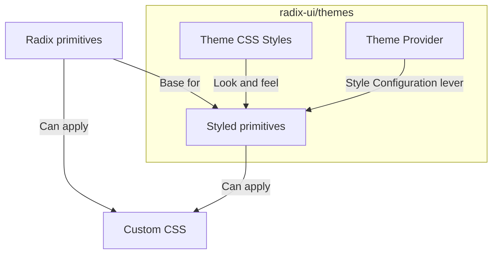

## What is Radix UI?

### Introduction

[Radix UI][1] is a library of _unstyled_, accessible components for building react applications.
It provides the building blocks for creating custom-styled components.

However similarly to some other UI frameworks like [Chakra UI][10], which come with predefined styles, 
an official Radix UI theme is available to provide a consistent look and feel across your application.
 
This makes it highly flexible and suitable for projects where you need full control over the design while giving you the
opportunity to start with a based theme that's easily customizable.

Radix UI is relatively new but has gained popularity quickly.
It is actively [maintained and supported][2] as of 2025 by the [Workos team][9].

### Radix ecosystem

While there are many component specific packages, browsing through the doc may become confusing:
- You can find the primitives and documentation in [primitives/docs][3]
- The theme and documentation in [themes/docs][4]
Radix primitives which are not styled and provide the basic building blocks for your components.

here is a small diagram of how it all connects:



We'll look into details on how to set up Radix UI in your project later on.
But before we start let's look at the available theme customization.

### Theme customization

While Radix has an official theme, customization does not allow you to build an entirely new one.
However, it provides some levers to slightly adjust the theme to your needs.

Check out the [theme customization][5] page to experiment with it,
which will provide you with the theme snippet to add to your project:

```tsx
<Theme accentColor="tomato" grayColor="slate" radius="small" scaling="95%">
```

You can also create your own [color palette][6] thanks to a tool available on the Radix UI website. 
It can then be imported into the theme provider.

Radix comes with its dedicated [icons][8] available in Figma as well for your UX teams to play with.
However, they don't use the same `size` like the rest of the Radix components, 
but `width` `heights` to be resized which is one prop too much in my opinion. 🤓 
Fortunately, you can use whichever icon library you prefer with Radix UI.

## How to Set Up Radix?

### Basic setup

To get started with Radix UI, you can follow the radix [documentation][7].
To test it out, I am going with the themed components as I don't want to think about the design at the moment:

```bash
yarn add @radix-ui/themes
```

Assuming I have a React app correctly setup (you can check this article to [get started with React][11]),
I can then set the theme in your `App.tsx`.

```tsx
import '@radix-ui/themes/styles.css';
import { Theme } from '@radix-ui/themes';

export default function App() {
  return (
    <Theme>
      <YourApp />
    </Theme>
  );
}
```

The Theme provider will then provide the default theme to your components.
- This is the scaling, the primary color (called accent in Radix world), the gray color, and the radius.
The `styles.css` file will provide the default styles for the components.
- This is the base CSS for the components which uses the theme's variables.

### Example component

Let's create an example component using Radix UI using the themed components.
For the theme to be applied we assume that this component is in `YourApp.tsx` from the previous snippet.

```tsx
import { Button, Flex, Heading, Text, TextField } from '@radix-ui/themes';
import { MagnifyingGlassIcon } from '@radix-ui/react-icons';

export const ExampleComponent = () => (
  <Flex direction="column" gap="4" mt="4" align="center">
    <Heading as="h1">Radix UI <Text color="amber">Colorful</Text> Example</Heading>
    <Text size="3" color="gray" weight="medium">This is a line of text</Text>
    <TextField.Root placeholder="Search the docs…">
      <TextField.Slot>
        <MagnifyingGlassIcon height="16" width="16"/>
      </TextField.Slot>
    </TextField.Root>
    <Button size="2">Submit</Button>
  </Flex>
);
```

This will create a simple component with a title, a line of text, a search input, and a submit button.
Let's unpack the component:
- The `Flex` component is a _flexbox_ container
  - The **direction** props is set to column to stack the children vertically.
  - The **align** props is the equivalent of `align-items: center` in CSS.
  - The **mt** props is for the margin-top in pixel
  - The **gap** props is a radix specific value to add some spacing between the children.
- The `Heading` component is a title.
  - The **as** specifies the tag of the component (`h1` in this case).
- The `Text` component is a line of text.
  - The **size** is radix specific for the font size.
  - The **color** is a choice of radix color to override the default one.
  - The **weight** is radix specific for the font weight.
- The `TextField` component is an input with a placeholder, 
  - it is composed of a `Root` that allows adding a `Slot` to add the icon,
  inherited from the primitive's flexible design.
- The `Button` component is a primary button with the default style and accent color applied to it.

There are many more props you can pass to fine-tune the components, as well as injecting css directly using `style`.
I have only shown here the one that you might see and use more often.

Good luck with your Radix UI adventure!

[1]: https://www.radix-ui.com/
[2]: https://github.com/radix-ui
[3]: https://www.radix-ui.com/primitives/docs/overview/introduction
[4]: https://www.radix-ui.com/themes/docs/overview/getting-started
[5]: https://www.radix-ui.com/themes/playground
[6]: https://www.radix-ui.com/colors/custom
[7]: https://www.radix-ui.com/themes/docs/overview/getting-started
[8]: https://www.radix-ui.com/icons
[9]: https://workos.com/
[10]: 
[11]: 