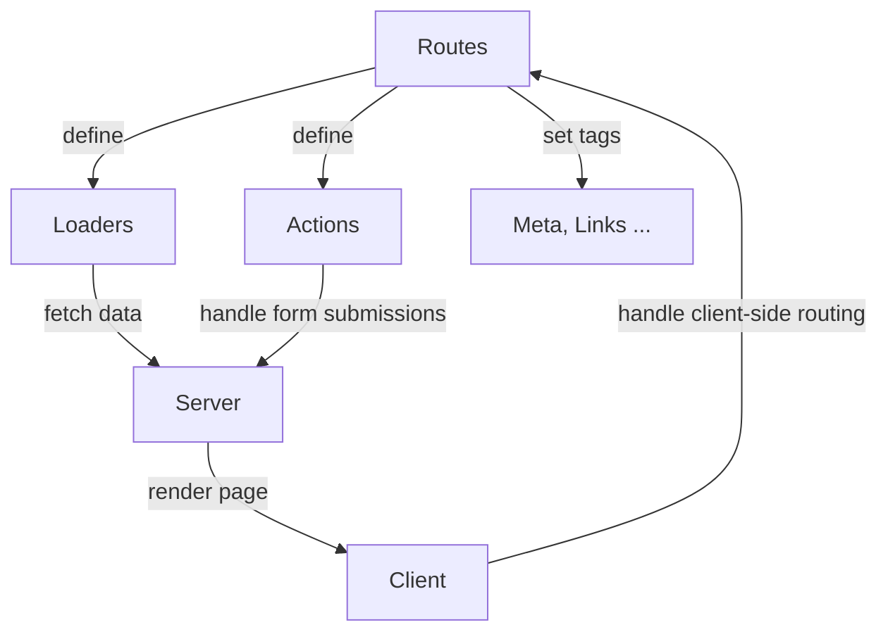
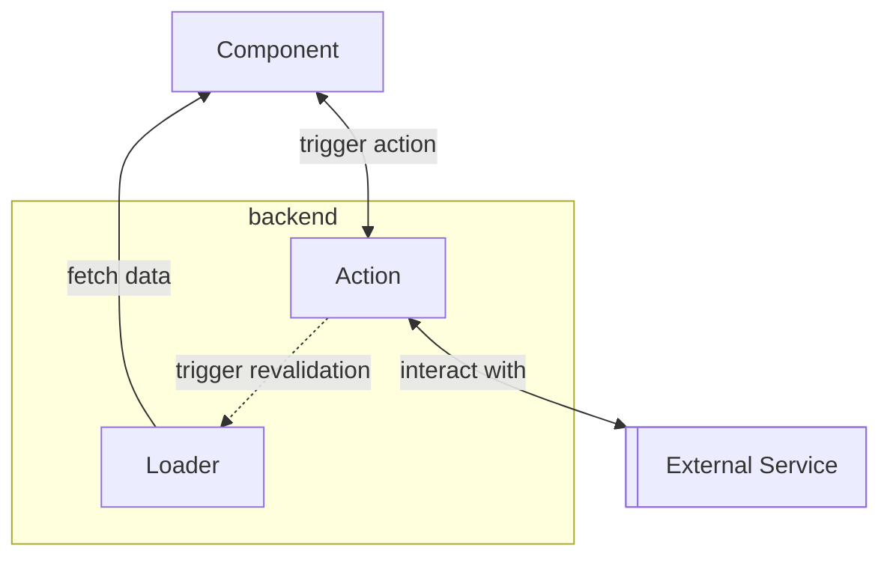

[Remix][1] is a full-stack web framework for React. 
TIt is promoted as a framework to build _modern web applications_ with server-side rendering and progressive enhancement. 
In this article, we'll look at how to create a web app with Remix and Vite, which is supposed to be a fast build tool! 

You got it, today we go superfast, super modern for a developer-friendly web app development combo! 🤞 
I'll guide you through the installation process, project setup, 
and key concepts to help you get started with building your own Remix app using Vite.

## Installation

First, you need to install the Remix CLI:

```bash
npm install -g remix
```

Then, create a new Remix project:

```bash
remix new my-app
```

This will create a new directory called `my-app` with the following structure:

```coffee
my-app/
├── app/
│   ├── routes/
│   │   └── _index.tsx
│   ├── components/
│   │   └── Layout.tsx
│   └── app.tsx
├── public/
│   ├── favicon.ico
│   └── robots.txt
├── package.json
└── tsconfig.json
```

Under the hood, remix is using React router to handle the client side routing.
The routes are defined in the `app/routes` directory and the components are defined in the `app/components` directory.
The `public` directory contains static assets like images, fonts, and other files.

### Vite

[Vite][2] is a build tool that provides a fast development server with hot module replacement (HMR) 
and a self-proclaimed _⚡️-fast production_ build.
HMR is a feature that allows you to update modules in a running application without a full reload.
This is useful for quickly seeing changes in your app without losing the current state, for a faster feedback loop.

To use Vite with Remix, you need to install the Vite plugin for Remix:

```bash
npm install @remix-run/vite
```

Then, add the Vite plugin to your Remix app:

```js
// app/vite.config.js
import { defineConfig } from 'vite'
import { remixPlugin } from '@remix-run/vite'

export default defineConfig({
  plugins: [remixPlugin()],
})
```

Now, you can start the development server:

```bash
yarn dev
# $ remix vite:dev
#   ➜  Local:   http://localhost:5173/
#   ➜  Network: use --host to expose
#   ➜  press h + enter to show help
#
# 6:34:09 PM [vite] hmr update /app/routes/_index.tsx (x8)
```

This will start the Remix development server with Vite.
You could start develop as is and see the change in real time in the browser as your save your files.


## Remix App

### Architecture

Let's dive into the different parts of the Remix app,
- The loaders are used to fetch data before rendering the page. They are defined in the `loaders` property of the route module.
- The actions are used to handle form submissions and other user interactions. They are defined in the `actions` property of the route module.
- The meta and links are used to set the title and meta tags of the page. They are defined in the `meta` and `title` properties of the route module.



It shall be clearer in the diagram above. A Remix app have both a server and a client side,
the server side is used to render the page and the client side is used to handle the client side routing.
That means that the page is rendered on the server and then the client side routing takes over.

### Implementation

Here is an example of a route module with a simple loader and the meta function:

```tsx
// app/routes/_index.tsx
import React from 'react';
import { json, LoaderFunction, MetaFunction } from '@remix-run/node';
import { useLoaderData } from '@remix-run/react';

export const loader: LoaderFunction = async () => {
    return json({ message: 'Hello, world!' })
}

export const meta: MetaFunction = () => {
    return [
        { title: 'About Us' },
        { name: 'description', content: 'Learn more about us' },
    ];
};

export default function Index(): React.ReactElement {
    const data = useLoaderData<{ message: string }>();
    return <div>{data.message}</div>;
}
```

The page will have a title and a meta tag named `description` with the meta function.
The loaders are executed before rendering the page on the server then the data is passed to the component,
in this case the message `Hello, world!` is displayed.

## Loaders and Actions

To summarize:
- Loaders handle **/GET** requests and are used to fetch data before rendering the page.
- Actions handle **/POST** requests and are used to handle form submissions and other user interactions.

> In the Remix Fullstack Data Flow, the loader fetches data from the backend and passes that data to your component. 
> The action passes your component data to the backend. After the action finishes, 
> loaders are revalidated and return the current state of the backend to the component.
> _source: [akoskm.com][3]_




This means you can use the remix backend to handle interaction without worrying about CORS, 
and have the result sent back to the client side.

### Form example

Let's have a simple example of a contact form that trigger an action on submit.
Action are only available on routes, if you look at the developer tools, 
you'll see that the form is submitted to the same route. 

(You can also find the get from the loader on the same route)


```tsx
// app/routes/contact.tsx
import React from 'react';
import { json, LoaderFunction } from '@remix-run/node';
import { Form, useActionData } from '@remix-run/react';

export const action: ActionFunction = async ({ request }) => {
    const formData = await request.formData();
    const name = formData.get('name');
    const email = formData.get('email');
    const message = formData.get('message');
    return json({ success: true, name, email, message });
};

export default function Contact() {
    const actionData = useActionData<{ success: boolean; name: string; email: string; message: string }>();

    return (
        <main className="container">
            <Form method="post">
                <div style={{ display: 'flex', flexDirection: 'column' }}>
                    <label>Name: <input type="text" name="name" required /></label>
                    <label>Email: <input type="email" name="email" required /></label>
                    <label>Message: <textarea name="message" required></textarea></label>
                </div>
                <button type="submit">Submit</button>
            </Form>
            {actionData && actionData.success && (
                <div>
                    <p>Form Submission Successful for <b>{actionData.name}</b></p>
                </div>
            )}
        </main>
    );
}
```


When the form is submitted, the action is triggered, 
once processed the return value of the action is available to the component with the `useActionData` hook.
It should show here the name from the input form.

### Unit test

Remix provides its own testing utilities to test the components `remix-testing` to better test routes and components.
While you could keep the routes to a minimum and test `components`, `actions` and `loaders` separately, 
having the tooling to test it all together is a great advantage.

```tsx
import { createRemixStub } from '@remix-run/testing';
import { render } from '@testing-library/react';
import Contact, { action } from '~/routes/contact';

const RemixStub = createRemixStub([
    {
        path: '/contact',
        Component: Contact,
        action,
    },
]);
render(<RemixStub initialEntries={['/contact']} />);
```

This will render the `Contact` component with the `action` on the `/contact` route.
Note that the `path` doesn't matter too much if the parameters are not used in the loader.
I could put my _contact_ page on the root path and my tests would still work.

Once rendered, I can write a test to check if the form is present and if the action is triggered correctly.

```tsx
import { screen, waitFor, fireEvent } from '@testing-library/react';

it('should handle form submission and display action data', async () => {
  await waitFor(() => screen.getByText('About Us'));
  fireEvent.change(screen.getByLabelText(/name/i), { target: { value: 'John Doe' } });
  fireEvent.change(screen.getByLabelText(/email/i), { target: { value: 'john@example.com' } });
  fireEvent.change(screen.getByLabelText(/message/i), { target: { value: 'Hello there!' } });

  fireEvent.click(screen.getByRole('button', { name: /submit/i }));

  await waitFor(() => expect(screen.getByText(/Form Submission Successful/i)).toBeInTheDocument());
});
```

The `waitFor` function is used to wait for the component to load or submit since we're dealing with http calls.
With that test you should be able to emulate filling and submitting the form, 
assuming you have rendered the component beforehand.

You could also test the action separately, but in this case, 
it was rather straightforward to test it through the component.


[1]: https://remix.run/
[2]: https://vitejs.dev/
[3]: https://akoskm.com/how-to-handle-multiple-form-actions-in-remix/