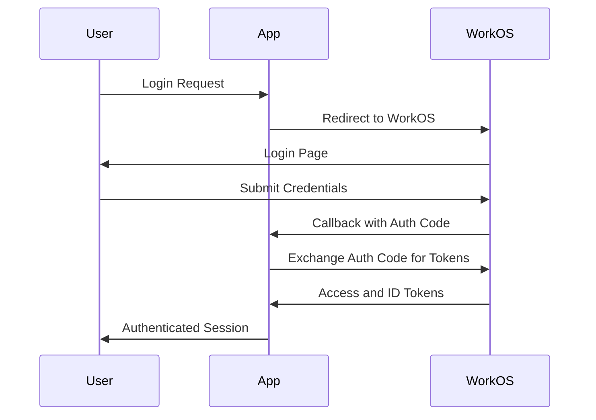
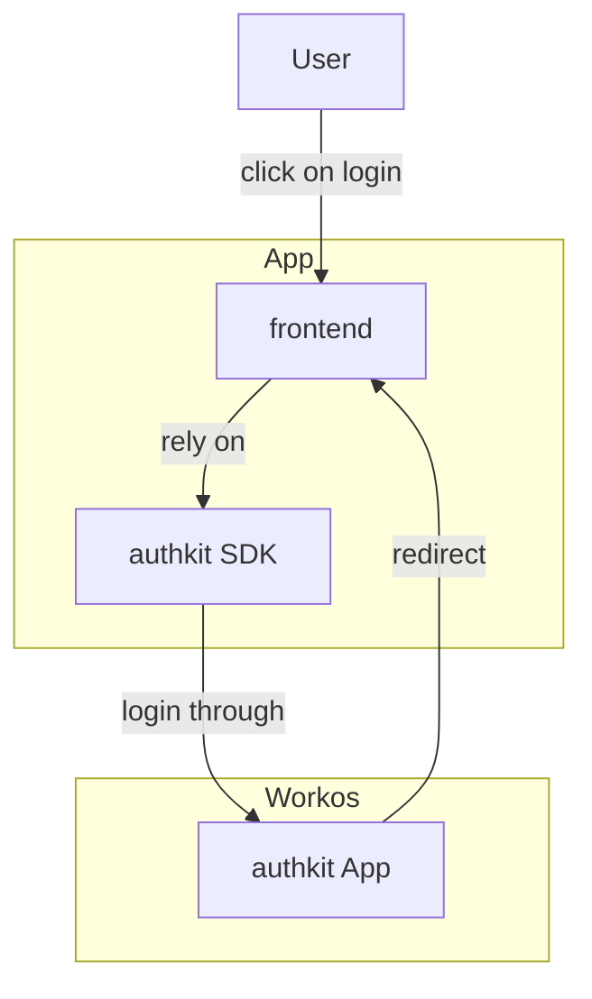



### What is WorkOS?

[WorkOS][1] is a platform that provides enterprise-ready features for your application, such as Single Sign-On (SSO), 
Directory Sync, and Audit Logs. 
It is known for its [open-source projects][3] like [Radix][22].
They have [SDKs][2] in several language (javascript, ruby, java, go, ...), so whichever stack you have, 
there should be and SDK for you.

If you want to know more, WorkOS also have an amazing [blog][5] with specific posts about their product, 
but also more generic ones about [OAuth][20], [Jwt tokens][20], integrations with other vendors, etc.

## Authentication Flow

Let's review how the authentication workflow would work using WorkOS as a third party authentication provider.
Below is a diagram illustrating the different calls that an app would make to authenticate a user in this situation:



The user logs in through the application, which redirects them to WorkOS for authentication. 
After the user submits their credentials, WorkOS returns access and ID tokens to the application, 
establishing an authenticated session.

### Implementation example

So your app needs to have two endpoints used for the authentication process:
- `/login` to redirect the user to the WorkOS login page
```js
app.get('/login', (req, res) => {
  const authorizationUrl = workos.sso.getAuthorizationURL({
    provider: 'authkit',  
    clientID: 'your_client_id',
    redirectURI: 'http://localhost:3000/callback',
  });
  res.redirect(authorizationUrl);
});
```
- `/callback` to handle the callback from WorkOS and exchange the auth code from the login for the user profile and token
```js
app.get('/callback', async (req, res) => {
  const { code } = req.query;
  const { profile } = await workos.sso.getProfileAndToken({
    code,
    clientID: 'your_client_id',
  });
  // Handle authenticated user profile
  res.json(profile);
});
```

The callback url is passed to workos when getting the authorization url (for the login page), 
which means, only valid callback set in the WorkOS dashboard can be used!

The callback can be a local address (e.g. `http://localhost:3000/callback`) for development or a public address for production.
But how is Workos calling it, since it's local? 🤔
That's because WorkOS is calling the callback from the user's browser (so it's the user's browser that is calling the local address).

You can find more info and different implementation in the [WorkOS documentation][4].

### More about AuthKit

If you have noticed, we're using the [authkit][4] to login in the implementation example,
which is the self-hosted WorkOS login page.

The WorkOS AuthKit allows you to abstract the authentication process, 
which removes the need for a backend server to handle the authentication process if using [Remix][21] or [Next.JS][7]!
Below is a diagram showing the interaction between a remix frontend and the AuthKit:



The session is encrypted and securely passed through a cookie 🍪 in the response as `wos-session`, 
ensuring that user data is protected during the authentication process (only the remix server side has the key to decrypt it).

The _authkit_ approach is recommended by the WorkOS team and provide a straightforward login experience.
They have developed the SDKs to make it easy to integrate with your frontend (for example the `@workos-inc/authkit-remix` for remix).
Plus you can easily add multiple SSO providers and more out of the box!

## Syncing Data with WorkOS

You can retrieve user information via the WorkOS webhook or WorkOS event api. 
This is important if you want to sync user data with your application or have event-based actions.

While the webhook is more immediate, the event queue is more reliable and can handle a higher volume of events.
- [Webhooks][9] events are signed and are coming from a set of IPs that you can whitelist. 
  - There is a retry mechanism in case your application fails to read the event.
  - You need to create a public endpoint to receive the events.
- [Events][10] are accessible via the WorkOS API and can be consumed at your own pace va the SDK.

For each option there are multiple event types you can subscribe to.

The preferred option pushed by WorkOS is to use the event API, as it is more reliable and can handle a higher volume of events.

```js
import { WorkOS } from '@workos-inc/node';

const workos = new WorkOS(process.env.WORKOS_API_KEY);

const listOfEvents = await workos.events.listEvents({
  events: [
    'dsync.activated',
    'dsync.deleted',
    'dsync.user.created',
    'dsync.user.updated',
    'dsync.user.deleted',
  ],
});
```

Here is the example to retrieve a some [events][12] using the workos javascript SDK from the [documentation][11].
We'd be only interested in the directory sync and user events in this case, but there are more events available to fit your needs.
All the events available via the API are also sent to the webhook (if configured).

The workos documentation is excellent and the team very approachable (they can make simple changes on the fly to help you out).
I'd recommend checking it out if you're looking for a third party authentication provider 👍.


[1]: https://workos.com/docs
[2]: https://workos.com/docs/sdks
[3]: https://workos.com/open-source
[4]: https://workos.com/docs/user-management/react/nodejs/2-add-authkit-to-your-app/redirect-users-to-authkit
[5]: https://workos.com/blog?category=All+posts
[6]: https://workos.com/docs/user-management/authkit/authentication-methods
[7]: https://nextjs.org/
[8]: https://workos.com/docs/events/data-syncing/sync-using-the-events-api
[9]: https://workos.com/docs/events/data-syncing/webhooks
[10]: https://workos.com/docs/events/data-syncing/events-api/2-start-consuming-events/avoid-overwriting-newer-data
[11]: https://workos.com/docs/events/data-syncing/events-api/3-select-event-types
[12]: https://workos.com/docs/events
[20]: 
[21]: 
[22]: 


