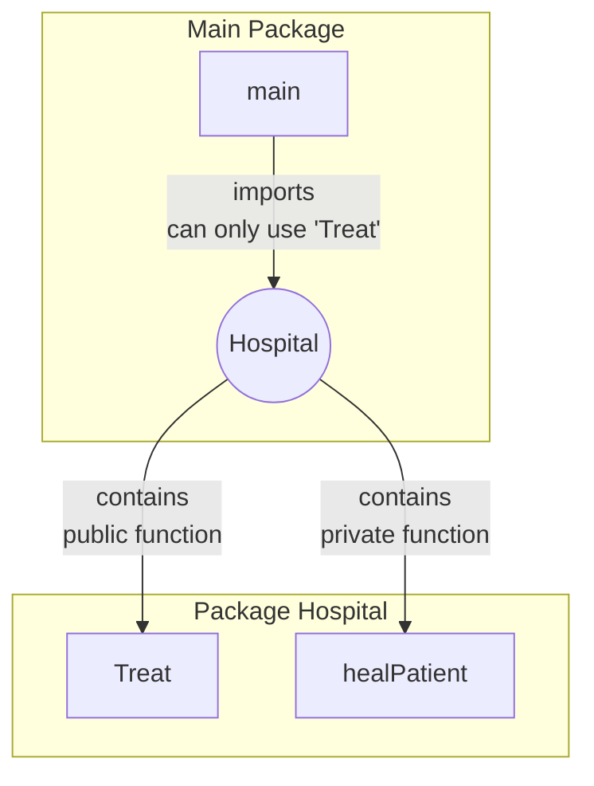
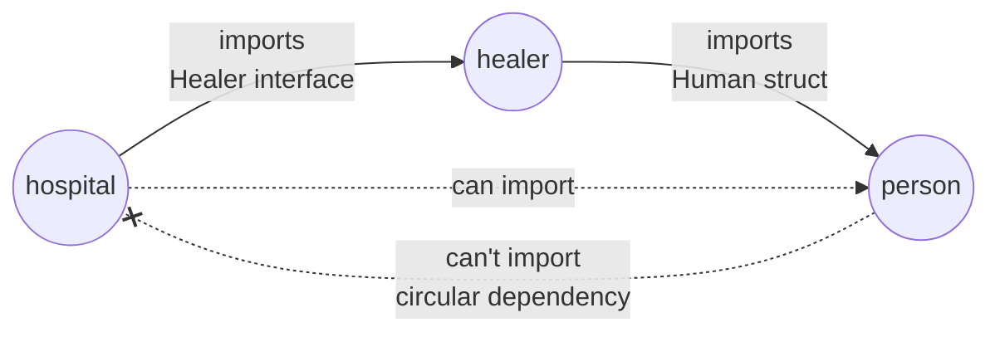

If you are familiar with object-oriented programming, you might have noticed that Go does not have classes. 
What you learned about object-oriented programming in Java, Typescript or other might not apply directly to Go.

Object-Oriented programming is possible in Go, but it is done differently following Go's unique vision of it. 
For this article, if you are not familiar with the basic syntax of go, 
you can check out this [article][10] for a quick refresher before jumping in. 😉

## Object-Oriented principles

Before we dive into how to do object-oriented programming in Go, let's review the core principles of this paradigm:

- Inheritance: Allows a class to inherit properties and methods from a parent.
- Polymorphism: Enables a single interface to represent different underlying forms.
- Encapsulation: Hides internal state and requires all interaction to be performed through an object's methods.

It's important that we have the same understanding around those three principles,
so that we can validate that the Go implementation matches that definition.

## Go Object-Oriented

### Inheritance

In Go, inheritance is achieved through composition (to add explicit access to another struct) or embedding (to allow implicit access to another struct)
within a structure.
Instead of extending a class, you embed a struct in another struct.

#### Example

Let's say I have a `Human` struct with:
- An `ID` field that is public because it starts with a capital letter.
- A `name` field that is private outside the package because it starts with a lowercase letter.
- A `Name` method that returns the name.

```go
type Human struct {
	ID   int    
	name string 
}

func (h Human) Name() string {
	return h.name
}
```

If `Human` is the parent structure, I can create a `Doctor` struct that embeds a `Human` struct.
It will have the same fields and methods as the _Human_ struct, and I can add more fields and methods to it.

```go
type Licence struct {
	Number string
}

type Doctor struct {
    Licence Licence // Composed with Licence struct
	Human           // Embedded with Human struct
}

// doctor.Name() will call Human.Name()
// doctor.ID will be accessible directly
// doctor.Licence.Number to access the licence Number.
```

Now let's say I want to override the `Name` method for the `Doctor` struct, 
I can do so by defining a new `Name` method in it, and I will even have access to the private fields of the parent struct:

```go
func (d Doctor) Name() string {
    return 	return "Dr. " + d.name
}
```

You don't see `class` of that the `Doctor extends Human` explicitly like in Java, but it provides the same functionality.

#### Advantages

It's more flexible than inheritance as you can embed more than one struct at a time.
We could have a Surgeon that's both a Doctor and a butcher 😬 
This is for the example, but there's no real limit to the number of embedded structs.

```go
type Butcher struct {
    Human
}

type Surgeon struct {
	Doctor
    Butcher
	// ...other surgeon specific fields
}
```

In languages like Java the only way to have one object inherit two others would be via interfaces where a third object
implements both interfaces. And that would be a bit more verbose than embedding the structs.

However as it is, creating a Surgeon would require creating a Doctor then a Butcher based on a Human.
Ideally we'd like that human to be the same 😅 to do that it'd be better to create a constructor method and return 
a public interface rather than a struct:

```go
type Surgeon interface {
    Name() string
    Heal() bool
    // ...other butcher/doctor or any function to expose 
}

type surgeon struct {
    Doctor
    Butcher
}

func NewSurgeon(human Human) Surgeon {
    return surgeon{
        Doctor: Doctor{Licence: Licence{Number: "1234"}, Human: human},
        Butcher: Butcher{Human: human},
    }
}
```

This way, we can create a Surgeon with the same Human object, and we can also expose only the methods we want to expose.
The `surgeon` struct is now private to the package and creating a `Surgeon` interface is only possible through the `NewSurgeon` 
method which requires a human. 
This goes a bit into the encapsulation part, and it is a bit of an edge case.
Most likely you won't need to embed multiple structs that have a common third structure into them. 
At least you now you see it wouldn't even be a blocker.


### Polymorphism

Polymorphism is achieved through interfaces.
An interface is a type that specifies a set of methods that a concrete type must have to implement that interface.

#### Example

Let's have an interface `Healer` with a `Heal` method, that our doctor can implement to save people.
We'll keep it relatively simple, heal could be called and return a boolean if the healing was successful.

```go
type Healer interface {
	Heal() bool
}

func (d Doctor) Heal() bool {
	return true
}
```

Let's have now a human `Sorcerer` 🧙‍♂️ which can also heal with his magic powers:

```go
type Sorcerer struct {
	Human
}

func (m Sorcerer) Heal() bool {
	return true
}
```

Now let's say we have a function that takes a `Healer` interface and calls the `Heal` method on it.
For the sake of simplicity,
it will be a simple function that would represent the healer nursing someone back to shape.

```go
func healPatient(h Healer) {
	if h.Heal() {
		fmt.Println("Patient healed. 💪")
	} else {
		fmt.Println("Failed. 😵")
	}
}

// healPatient(doctor)
// healPatient(Sorcerer{Human: Human{name: "Merlin"}})
```

Both structs can be called to heal the patient.

#### Limitation

There's no `Doctor implements Healer` or `Sorcerer implements Healer` like in Java. 🤔

That's because in Go, interfaces are satisfied implicitly. 
A struct implements an interface if it has all the methods of that interface, which is obvious but not explicit.
That also means that you can't have an interface extending another interface like in Java.

In order to make it [explicit][1], you can use for the Doctor an assignment to the zero value:

```go
var _ Healer = Doctor{}
// var _ Healer = (*Doctor)(nil) if the method is a pointer receiver: func (d *Doctor) Heal() bool
```

This way, at compile time, the compiler will check if the `Doctor` struct implements the `Healer` interface.
If I tried this with the `Human` struct it would prompt me with an error:

```go
var _ Healer = Human{}
// Cannot use Human{} (type Human) as the type Healer. Type does not implement Healer as some methods are missing: Heal() bool
```

Although if the struct is used in the same package but the interface is not respected, 
you would probably catch it during a test or a build, it is still safer to make it explicit. 
Think of it as documenting the code with useful code checks.

You can even embed multiple interfaces by listing them in the struct definition:

```go
type DoctorInterface interface {
	Healer
    Name() string
}

var _ DoctorInterface = Doctor{}
```

The `DoctorInterface` has now the `Healer` methods, and you can use it as a type for the _Doctor_ struct.
We can even add new methods to that interface that the doctor should implement, but not the healers.
However, you can't use struct in the interface definition (trying to add a `*Human` in there would prompt an error).

### Encapsulation

Encapsulation is achieved through the use of unexported fields.
In Go, fields that start with a lowercase letter are unexported and can only be accessed by methods of the same package.



So in the main, following this example, we would only be able to use `hospital.Treat`, but not `hospital.healPatient`.
But encapsulation is not just about hiding fields, it's also about hiding the implementation details.
Let's refactor the objects we have created previously in packages:

```go
package hospital

import (
	"fmt"
	"src/internal/healer"
)


type Hospital struct {
	healers []healer.Healer
}

type Patient interface {
	Name() string
}

func (h Hospital) Treat(patient Patient) {
	fmt.Printf("Treating patient %s...\n", patient.Name())
	// loop through healers and treat the person with `healPatient` from before
}
```

In this hospital package, we'd have a Hospital struct where you would find healers that can heal the patient coming to
get treated. I skipped the implementation details.

This means that the hospital package is now dependent on the healer package:

```go
package healer

import (
	"src/internal/person"
)

type Healer interface {
	Heal() bool
}

type Doctor struct {
	License string
	person.Human
}

func New(name string) Doctor {
    return Doctor{
        License: "1234",
        Human:   person.New(name),
    }
}

func (d Doctor) Name() string {   
	return "Dr. " + d.Human.Name()     // d.name is only exposed if in the same package as Human
}

func (d Doctor) Heal() bool {
	return true
}
```

The Healer is like we have defined before minus a difference:
- The `Name` function has to be changed because the `name` field is private and in another package named `persone`
  - To reproduce the previous behaviour, we had to use the `d.Human.Name()` to access the `name` field. 
  - Calling `d.Name()` inside `(d Doctor) Name() string` will cause a _stack overflow_ error because it will call itself and not the `person.Human` one.

This means that the Healer function is dependent on the person package.
The person package is the same as before, there's just one function now necessary: 

```go
package person

import (
	"math/rand"
)

/* ...same Human struct and function definition */

func New(name string) Human { // name is private, so we need a "constructor" to initialize it
	return Human{
		ID:   rand.New(rand.NewSource(2)).Int(),
		name: name,
	}
}
```

With the `name` private, we now have the `New` method that can be used to create a Human struct with a name.
Without it, it would be impossible to create a `Doctor` struct because the `name` field is private.

Each package is now responsible for its own implementation, 
and the hospital package can only use the `Heal` method from the healer package.

Unlike in java the concept of package is stronger in Go, each package is highly encapsulated similarly to a module in Java.
So coupling between package happens more often than in Java, where you can import any package in any other same module package.

#### Limitation

The first limitation obviously is that, with the current design, to avoid dependencies, 
the validation that the Human struct implements the `Patient` interface is only possible from within the `hospital` package.
Otherwise, a circular dependency would be created.



We do want Patient to be Human as well, and it would not to leave it to an implicit interface implementation.
So in this design (which is intended for the example) we could have two choices:

```go
// var _ hospital.Patient = Human{} // creates a circular dependency in person package
var _ Patient = person.Human{} // works in hospital package
```

This optional interface validation is easy to circumvent, however, when you start including data objects in your interfaces,
it can become a headache.
Here is an example, if we were to update or Patient interface:

```go
type HealthProfile struct {
	Age    int
	Weight int
}

type Patient interface {
	Name() string
	Profile() HealthProfile
}
```

Now, the human doesn't implement the `Profile` method, and we can't import the `HealthProfile` in the human package, 
as we have seen it would cause a circular dependency.

Creating your own `HealthProfile` in the `person` package won't do, because Go is strict about it, 
they don't have the same type (even if they have the same members).
To solve the riddle, either you need to redesign your software to get rid of the circular dependency, 
or have the common interface in a separate package layer.

```go
package health

type Profile struct {
  Age    int
  Weight int
}

type Patient interface {
  Name() string
  Profile() Profile
}
```

With a new package `health` that can be both imported by the `hospital` and `person` packages, 
you can define common structures and interfaces. You are free to use:

```go
package person

var _ health.Patient = Human{}
```

However, this type of approach can often lead put-it-all package where you find all sorts of interfaces and structure in
one place. Over time this can become the exact problem you were trying to solve.
But it's far more manageable than dealing with interfaces and common structures that are _coupled_ with the logic of the package.

Go forces you to add explicit bounded layers between packages.
When compared to other typed language this pattern using DTO (Data Transfer Object) exists, 
but they also offer the flexibility to work without it.

I suppose it helps fail earlier in the development process,
but may also have the effect of having all the logic in one file or one package to avoid the issue altogether.


## Conclusion

From my perspective, Go has everything needed to offer object-oriented capabilities,
while less flexible than other typed language, if you are used to code with several layers of abstraction between your module,
then working with multiple packages shouldn't be a bother.

With encapsulation, I personally find that conversion between objects can be a pain because it's not always necessary (if it's just data object). 
But I suppose forcing it in Go will allow you to fail earlier in the process by making the coupling clear from the start,
instead of allowing you to carry on with the problem until it's spread everywhere. 
The tech debt becomes less massive to tackle.
To tame down the argument, one could also argue that Go could also favor [bigger files][2] all in one package in order to 
avoid the problem altogether, which in my opinion becomes hard to follow or maintain too.

For interfaces, it is pretty similar, and while the interface extension is implicit, you can easily make it more explicit.
As for inheritance, composition and embedding does a great job at it and offer the possibility of multiple inheritance with more ease
than most typed languages.
The only downside is that [generics][3] embedding is not actually supported yet (to reproduce similar patterns observed in [typescript][11] or [java][12]), 
we might go back on generics in another article.

I find Go sometime overly verbose, but in regard to object-oriented pattern, 
it is surprisingly implicit and easy to miss. So let me know in the comment if I did miss something myself 😅


[1]: https://go.dev/doc/faq#guarantee_satisfies_interface
[2]: https://go.dev/blog/organizing-go-code
[3]: https://go.dev/blog/intro-generics
[10]: 
[11]: 
[12]: 
