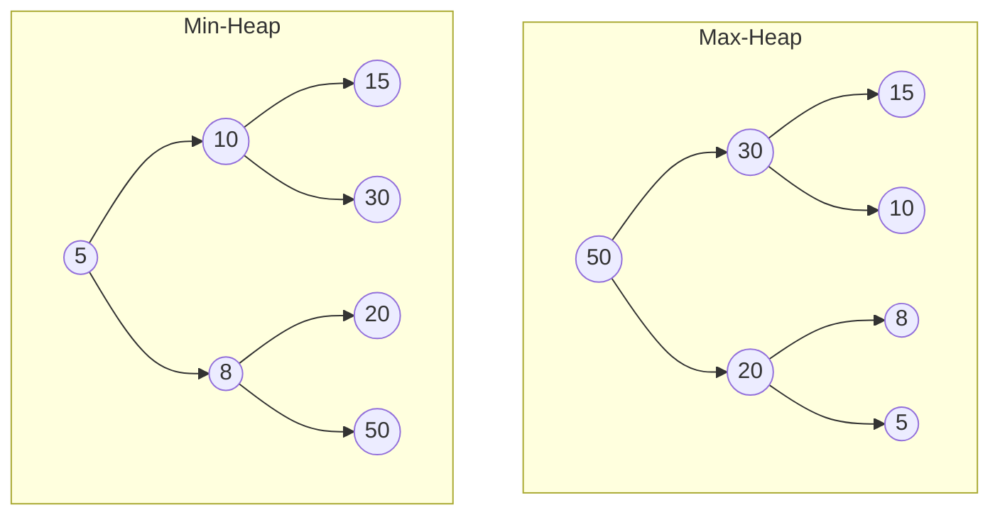
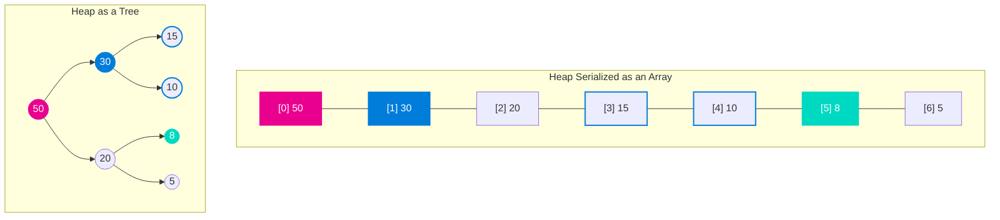
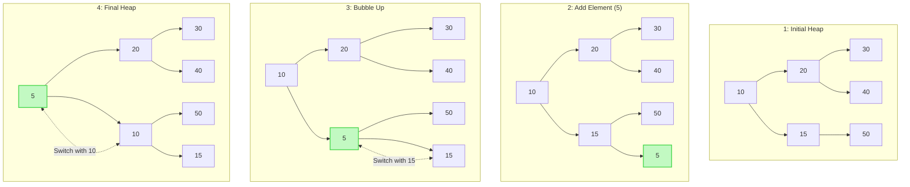
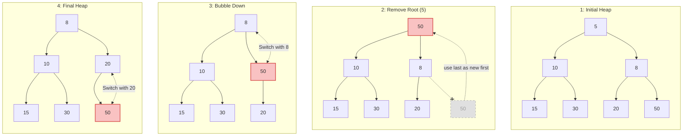

## Priority Queue

### What is it?

A **priority queue** is a specialized data structure that operates like a regular queue but with an added feature: each
element has a priority associated with it.
So a priority queue is sorted by the priority of its elements, not by their order of insertion.

Elements with higher priority are dequeued before those with lower priority.
If two elements have the same priority, they are typically dequeued in the order they were enqueued (FIFO - First In,
First Out).

### Which data structure?

A priority queue can be implemented using various data structures:

- **Array**: Simple but inefficient for large datasets as insertion and removal require sorting or searching.
- **Heap**: Efficient for priority queues, especially binary heaps, as they provide O(log n) insertion and removal.
- **Balanced Binary Search Tree**: Provides ordered traversal but is more complex than a heap.
- **Linked List**: Can be used but is less efficient compared to heaps for priority-based operations.
  **Best Choice**: A heap is generally the best choice for implementing a priority queue due to
  its efficiency in maintaining the priority order.

A priority queue can be implemented using various data structures:

| **Data Structure**              | **Description**                                                                                              | **Insertion Time Complexity**         | **Removal Time Complexity**                                |
|---------------------------------|--------------------------------------------------------------------------------------------------------------|---------------------------------------|------------------------------------------------------------|
| **Array**                       | Simple but inefficient for large datasets as insertion and removal require sorting or searching.             | $$O(n)$$ (requires maintaining order) | $$O(1)$$ (if the highest priority element is at the start) |
| **(Binary) Heap**               | Efficient for priority queues, especially binary heaps, as they provide $$O(\log n)$$ insertion and removal. | $$O(\log n)$$                         | $$O(\log n)$$                                              |
| **Balanced Binary Search Tree** | Provides ordered traversal but is more complex than a heap.                                                  | $$O(\log n)$$                         | $$O(\log n)$$                                              |
| **Linked List**                 | Can be used but is less efficient compared to heaps for priority-based operations.                           | $$O(n)$$ (requires maintaining order) | $$O(1)$$ (if the highest priority element is at the head)  |

Using a heap is generally the best choice for implementing a priority queue due to its efficiency.

## Heap Priority Queue

### What is a Heap?

A **heap** is a specialized tree-based data structure, there's two main types of heaps:

- **Max-Heap**: The key of each node is greater than or equal to the keys of its children, ensuring that the largest
  element is at the root.
- **Min-Heap**: The key of each node is less than or equal to the keys of its children, ensuring that the smallest
  element is at the root.



In this example we've shown a specific type of heap, the _binary heap_, which is a complete binary tree.
This means:

- Each node has at most two children
- The tree is complete (filled level by level from left to right)
- Can be efficiently represented as an array

This works great as a priority queue because it allows for efficient retrieval of the highest (or lowest) priority
element.

### Implementation

#### Storing the heap

Since we are using a complete binary tree, we can represent the heap as an array.
The root element is at index 0, and for any element at index $$i$$:

- The left child is at index $$2i + 1$$
- The right child is at index $$2i + 2$$
- The parent is at index $$(i - 1) / 2$$

This allows us to efficiently navigate the heap without needing pointers or references.



Examples from the diagram:

- We have root **node 50** at index $$\textcolor{#ea008e}{0}$$, the first element in the array.
- For **node 30** at index $$\textcolor{#007cdb}{1}$$:
    - Parent: $$(\textcolor{#007cdb}{1}-1) \div 2 = \textcolor{#ea008e}{0}$$ → node 50 (root)
    - Left child: $$2 \times \textcolor{#007cdb}{1} + 1 = 3$$ → node 15
    - Right child: $$2 \times \textcolor{#007cdb}{1} + 2 = 4$$ → node 10
- For **node 8** at index $$\textcolor{#00d9c2}{5}$$:
    - Parent: $$(\textcolor{#00d9c2}{5}-1) \div 2 = 2$$ → node 20

#### Adding an element to the heap

An example implementation of how to add an element to a min-heap:

```ts
function add(heap: number[], value: number): void {
  heap.push(value);
  let current = heap.length - 1;

  while (current > 0) {
    const parent = Math.floor((current - 1) / 2);

    if (heap[parent] <= heap[current]) break;

    [heap[current], heap[parent]] = [heap[parent], heap[current]];
    current = parent;
  }
}
```

Let's describe what's happening:

- Add the element to the end of the heap
- Bubble up:
    - If parent is smaller or equal, heap property is satisfied, exit.
    - Otherwise, swap with parent and continue bubbling up.

You can see an example of the bubbling up process when adding an element to the min-heap below:



After completing the addition process:

1. The new element ($$5$$) is correctly positioned as the root of the min-heap
2. The heap property is maintained where each parent is smaller than its children:

- 5 < 20 and 5 < 10 ✓
- 20 < 30 and 20 < 40 ✓
- 10 < 50 and 10 < 15 ✓

You can see that the child of ($$10$$) is ($$15$$) which is lower than its sibling ($$20$$).
This is not a problem for the heap property because we just need children to be smaller than parent.

A heap as a binary tree is different from a _binary search tree_,
where left children must be less than their parents and right children must be greater.

#### Removing an element of the heap

An example implementation of how to remove the root element from a min-heap:

```ts
function removeRoot(heap: number[]): number | null {
  if (heap.length === 0) return null;
  const root = heap[0];
  heap[0] = heap[heap.length - 1];
  heap.pop();

  let current = 0;
  while (2 * current + 1 < heap.length) { // Check if the left child exists
    let smallest = current;
    const left = 2 * current + 1;
    const right = 2 * current + 2;

    if (left < heap.length && heap[left] < heap[smallest]) smallest = left;
    if (right < heap.length && heap[right] < heap[smallest]) smallest = right;
    if (smallest === current) break;

    [heap[current], heap[smallest]] = [heap[smallest], heap[current]];
    current = smallest;
  }

  return root;
}
```

Let's describe what is happening:

1. Check if the heap is empty, return null if it is.
2. Remove root

- Store the root element to return later.
- Replace the root with the last element in the heap.
- Remove the last element from the heap.

3. Bubble Down

- Check if left child exists and is smaller than current smallest, if yes update smallest to left child index.
- Check if right child exists and is smaller than current smallest, if yes update smallest to right child index.
- If the smallest is still the current node, we are done.
- Otherwise, swap current with the smallest child and continue bubbling down.

To remove the root element from a min binary heap, we follow these steps:



After completing the removal process, the tree is correctly restructured.
The heap property is maintained where each parent is smaller than its children:

- 8 < 10 and 8 < 20 ✓
- 10 < 15 and 10 < 30 ✓
- 20 < 50 ✓

The child of ($$10$$) is ($$15$$) which is lower than its sibling ($$20$$).
But this is not a problem for the heap property because we just need children to be smaller than parent.

## Conclusion

### Summary

Now that we've seen in details what are priority queues and how they are implemented using heaps,
we can summarize the key points:

- A **priority queue** is a data structure where each element has a priority, and elements are dequeued based on their
  priority.
- A **heap** is a specialized tree-based data structure that can efficiently implement a priority queue.
    - Heaps can be either **max-heaps** or **min-heaps**, depending on whether the highest or lowest priority element is
      at the root.
    - Heaps are typically implemented as binary heaps, which are complete binary trees stored in an array.
    - Heaps provide efficient $$O(\log n)$$ time complexity for both insertion and removal operations, making them suitable
      for implementing priority queues.

And if you are wondering what it is for,
I have compiled a list of common problems where priority queues are used to optimize performance and efficiency.

### What problems does it solve?

Priority queues are particularly effective for solving problems, so I have compiled a list of common problems
where priority queues are used to optimize performance and efficiency.
We talk about _heap_ here as a synonym to _priority queue_ since heaps are the most common implementation of priority
queues.

1. **Sorting Problems**:

- **Kth Largest Element in an Array**: Efficiently finding the k-th largest element using a min-heap.
    - Use a min-heap of size $$k$$ to track the $$k$$ largest elements.
    - The root of the heap gives the $$k$$-th largest element.
    - Smaller elements are removed to maintain the heap size.

- **Top K Frequent Elements**: Maintaining the k most frequent elements in a dataset.
    - Use a min-heap to store elements by frequency.
    - The heap keeps track of the top $$k$$ frequent items, and less frequent elements are removed as new ones are
      added.

2. **Graph Algorithms**:

- **Dijkstra's Algorithm**: Finding the shortest path in a weighted graph.
    - Use a min-heap to prioritize nodes with the smallest tentative distance.
    - The heap keeps track of unvisited nodes, and nodes with smaller distances are added/updated.

- **Prim's Algorithm**: Finding the minimum spanning tree.
    - Use a min-heap to select the edge with the smallest weight.
    - The heap keeps track of edges connecting visited and unvisited nodes, removing edges once they are processed.

3. **Scheduling Problems**:

- **Task Scheduler**: Scheduling tasks with priorities and cooldowns.
    - Use a max-heap to prioritize tasks by frequency and cooldown.
    - The heap keeps track of tasks with the highest frequency, removing tasks once their cooldown expires.
    - High frequency tasks are processed first, ensuring efficient scheduling.

- **Meeting Rooms**: Finding the minimum number of meeting rooms required.
    - Use a min-heap to track meeting end times.
    - The heap keeps track of the earliest ending meeting, removing meetings that have ended.
    - The heap size gives the number of rooms needed.

4. **Stream Processing**:

- **Find Median from Data Stream**: Dynamically finding the median as new numbers are added.
    - Use a max-heap for the smaller half and a min-heap for the larger half of numbers.
    - The heaps keep track of the two halves of the dataset, balancing elements between them as needed.
    - The median is either the root of the max-heap (odd elements) or the average of the roots of both heaps (even
      elements).

- **Sliding Window Maximum**: Finding the maximum value in each sliding window.
    - Use a max-heap or deque to track the maximum value within the current sliding window.
    - The heap keeps track of indices of elements in the window, removing indices outside the window.
    - The root of the heap gives the maximum value in the current window.

5. **Data Compression**:

- **Huffman Coding**: Building prefix codes for data compression.
    - Use a min-heap to build a prefix tree by repeatedly merging nodes with the smallest frequencies.
    - The heap keeps track of nodes representing characters and their frequencies, removing merged nodes.
    - The resulting tree gives the optimal prefix codes for characters based on their frequencies.
