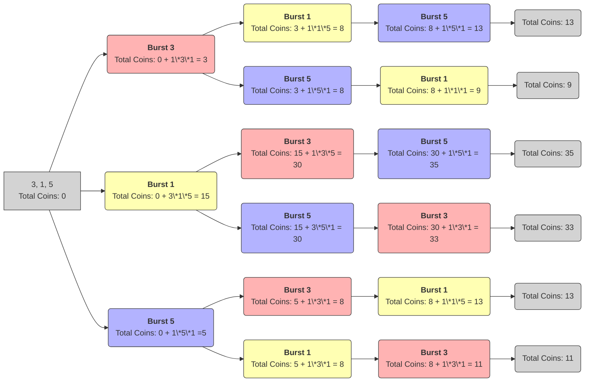
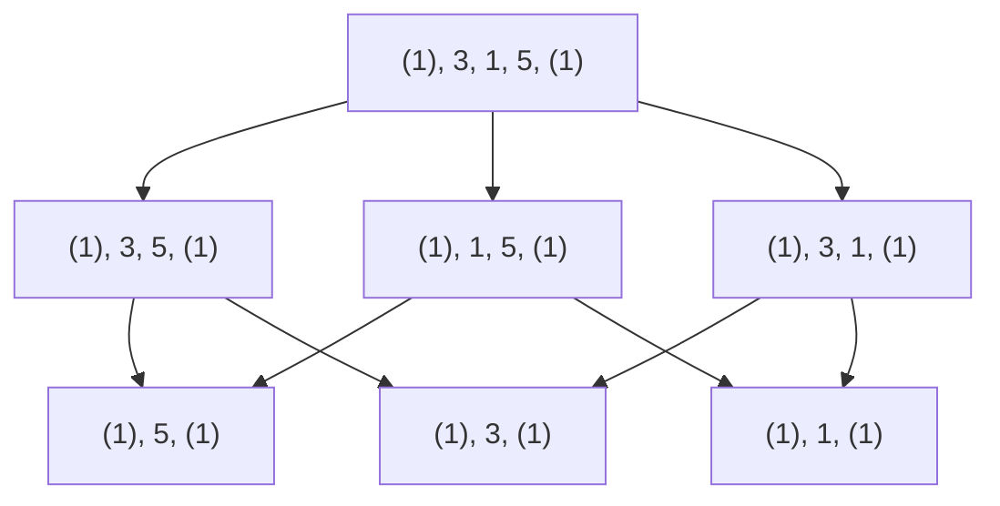
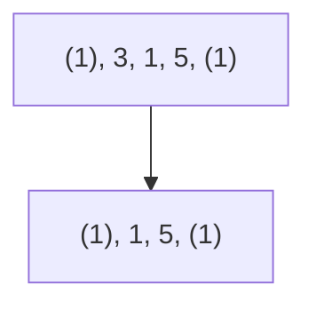
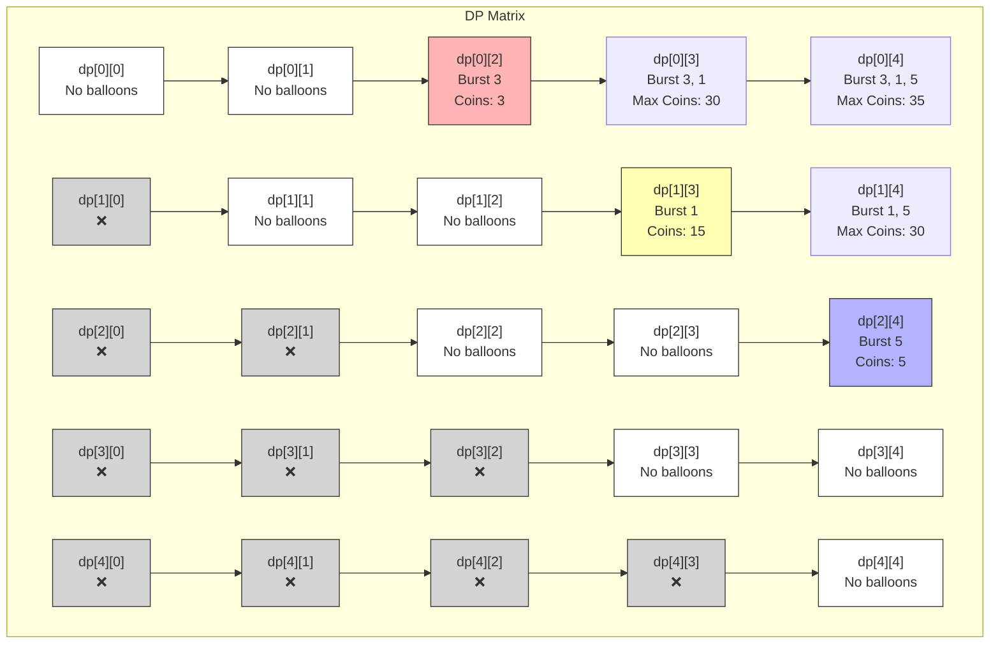
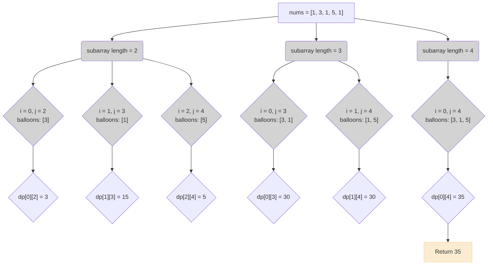

Let's use an example of a dynamic programming problem to illustrate the concept.
I didn't choose an easy example, since it would fit more in the 2D Dynamic Programming category.

## Introduction

### Problem Statement

You are given an array of $$n$$ integers representing the coins in balloons 🎈
When you burst a balloon 💥, you gain coins 🪙 equal to the product of the coins in the balloon and the ones adjacent.
If there are no adjacent balloons, we consider _virtual balloon_ with a value of $$1$$.

For a range of balloons from $$3, 1, 5$$:

- Bursting $$1$$ first gives you $$3 \times 1 \times 5 = 15$$ coins.
- Bursting $$3$$ first gives you $$1 \times 3 \times 1 = 1$$ coins. (using left _virtual balloon_)
- A possibility would be bursting $$1$$, then $$5$$, then $$3$$, which gives you a total of $$3 \times 1 \times 5 + 3 \times 5 \times 1 + 1 \times 3 \times 1 = 33$$ coins.

But that possibility wouldn't be the solution as the goal is to maximize the total coins 💰 you can collect by bursting all the balloons.

### Understanding the problem

We can visualize the problem as a tree of choices,
where each node represents a state of the balloons and the edges represent the choices made by bursting a balloon.

The leaves of the tree represent the final states where all balloons have been burst.



We want to be able to identify the optimal path through this tree that maximizes the coins collected.
In here for example, we can see that the optimal path is to burst the balloons in the order of `1`, `3`, `5` which gives
us a total of `35` coins.

But building this tree explicitly would be inefficient, especially for larger arrays of balloons.
Instead, we can use dynamic programming to efficiently compute the maximum coins for any subarray of balloons.

## Dynamic Programming Approach

### How do we know it's a dynamic programming problem?

The problem of bursting balloons can be classified as a dynamic programming problem due to the following
characteristics:

- Asking for optimization
  - Multiple valid possibilities
  - Only one is optimal (the one that maximizes the coins)
- Sequential decision-making 
  - There is choice to make at each step (which balloon to burst)
  - Future decisions depend on past choices (available balloons change)

There's no greedy choice that guarantees the optimal solution, as the order of bursting balloons matters.
As greedy is about choosing the best option at each step, without considering the overall problem.

Here, popping a balloon that gives the max coin first won't always yield the best result.
(ex in `3, 1, 2, 1, 5`, bursting 5 gives more coins at first but bursting `2`,
then all the `1` first will yield more coins overall).

### What is Dynamic Programming

This problem cannot be solved using a greedy approach, as the optimal solution requires considering all possible orders
of bursting balloons.

We can solve this problem using dynamic programming, for that we need to understand these concepts:

- **State**: A state represents a unique configuration of the problem that encapsulates all the necessary information,
  to make decisions and compute results for that specific sub-problem.

- **Base Case**: The base case is the simplest, smallest instance of the problem that can be solved directly without
  further recursion or iteration, serving as the foundation for building up the solution.

- **Transition**: The transition defines the relationship between the current state and smaller sub-problems,
  specifying how to compute the result for a larger problem using the results of its sub-problems.

We can implement this solution either iteratively (building the state bottom-up from the base case to get the next until the optimal one),
or recursively (solving problem by applying getting the optimal solution through recursively building top-down the state).

We store the state in a table or array in an iterative solution, but in a recursive solution we use _memoization_,
where you store previously computed sub-problems (similar yet different).


### Decomposing the problem

To identify the sub-problems in dynamic programming,
we need to find a way to break down the original problem into smaller,
self-contained pieces that can be solved independently.
Solving those problems independently allows us to build up the optimal solution.

> Sub-problems in a dynamic programming problem are often identified by what decisions can be made at each step

Here we want to _calculate the maximum coins_ which depends on the neighbours of the balloon we burst,
and so on until there's no balloon.

In order to better visualize the issue, we should represent the problem as a tree. 
The virtual balloon at the beginning and end of the array will be represented as $$1$$ (as they don't contribute to the coins).

We start with $$n + 2$$ balloons (including the virtual ones, but we can only burst the actual ones).



Looking at this tree we can draw some conclusions:
  - cases where it's only $$1$$ balloon left are simple to calculate, but not easy to reach
    - If there's only one balloon left, the value gained is equal to the balloon's value since virtual balloons are treated as $$1$$.
    - but a simple cases is when you know the left and right balloons (either real or virtual).
  - there are multiple paths leading to the same sub-problem.
    - Multiple arrows point to the same sub-problem $$[5]$$ or $$[1]$$ or $$[3]$$, indicating that different sequences of bursting balloons can lead to the same configuration.

So let's look at the sub-problem $$[1, 5]$$, which can also be represented by a new choice, which balloon was burst before?



Independently of the order of bursting the balloons, when we arrive at the problem the maximum coins will depend on
the current amount of coins plus the coins obtained from bursting the last balloon in this range.

Here it is simple, there's only one path going to the sub-problem $$[\textcolor{#6897bb}{1}, \textcolor{#6897bb}{5}]$$, we know that only $$\textcolor{#6897bb}{3}$$ was burst before.
Considering the known previous step (bursting $$\textcolor{#6897bb}{3}$$ gave $$3$$ coins), we can calculate the maximum coins obtainable for the range $$[\textcolor{#6897bb}{1}, \textcolor{#6897bb}{5}]$$.

- Bursting $$\textcolor{#6897bb}{1}$$ last gives us:
$$ 
\begin{aligned}
  total &= (\text{coins from bursting \textcolor{#6897bb}{3} first}) + (\text{coins from bursting \textcolor{#6897bb}{5} next}) + (\text{coins from bursting \textcolor{#6897bb}{1} last})\\
  &= 3 + 1 \textcolor{#6897bb}{1} \times \textcolor{#6897bb}{5} \times 1 + 1 \times \textcolor{#6897bb}{1} \times 1 \\
  &= 3 + 5 + 1 \\
  &= 9
  \end{aligned}
$$
- Bursting $$\textcolor{#6897bb}{1}$$ last gives us:
$$
  \begin{aligned}
  total &= (\text{coins from bursting \textcolor{#6897bb}{3} first}) + (\text{coins from bursting \textcolor{#6897bb}{1} next}) + (\text{coins from bursting \textcolor{#6897bb}{5} last})\\
  &= 3 + 1 \times \textcolor{#6897bb}{1} \times \textcolor{#6897bb}{5} + 1 \times \textcolor{#6897bb}{5} \times 1 \\
  &= 3 + 5 + 5 \\
  &= 13
  \end{aligned}
$$

The coins obtainable in the range $$\max(\text{bursting 5 last}, \text{bursting 1 last})$$ when $$3$$ is burst first,
is $$13$$ coins.

> But if $$3$$ was burst last, the coins obtained would be $$30$$ coins!
> So the maximum for the range $$[1, 5]$$ is $$30$$ coins 😵‍💫

That maximum is what we want to store in our state. 
And the how to get there, is what the transition function will help us with.
Let's define them formally to solve this problem.

## Solving the problem

### Defining the state

For the state we care about storing the best outcome based on the popped balloons.
We can pop them in any order from the start to the end or randomly.
Since I want to try every combination, I also want to know which combination gives the best outcome.

So I will represent the state as a 2D array, 
where each cell `dp[i][j]` represents the maximum coins obtainable for that range.
The maximum coin will be in `dp[0][n-1]` which represent the range with every balloon popped.

Bursting some balloon within a range, means I would need to consider the balloon to the left and right of the range as well.
The bigger the balloon next to my range, the more chance I'll get the max amount of coins.
To find that out, we'll be using the transition function, that uses the best from the previous ranges to calculate the next one.
Basically what are the best balloon's value around the range that will give me the most coins.

### Formulating the transition function

#### Finding the transition function
We can formulate the sub-problems as follows:

For any range $$[\textcolor{#E6B800}{i}, \textcolor{#E6B800}{j}]$$, we consider each balloon $$\textcolor{#FFA500}{k}$$ between $$\textcolor{#E6B800}{i}$$ and $$\textcolor{#E6B800}{j}$$ as potentially the last one to burst:

1. **When $$\textcolor{#FFA500}{k}$$ is the last balloon to burst**:
    - Its adjacent balloons are the ones at the boundaries of the current range.
    - For the range $$[i, j]$$, the adjacent balloons are $$nums[i]$$ and $$nums[j]$$.

2. **Calculating the coins for the bursting balloon at index $$\textcolor{#FFA500}{k}$$ in the range $$[\textcolor{#E6B800}{i}, \textcolor{#E6B800}{j}]$$**:
    - The coins obtained are:
      $$ nums[i] \times nums[k] \times nums[j] $$
    - If $$nums[i]$$ or $$nums[j]$$ are out of range, they are treated as $$1$$ (virtual balloons).

3. **Total coins for the range $$[\textcolor{#E6B800}{i}, \textcolor{#E6B800}{j}]$$**:
    - $$dp[i][k−1]$$: is the maximum coins obtainable by bursting all the balloons in the range $$[i, k-1]$$ (the left subarray before $$k$$).
    - $$dp[k+1][j]$$: is the maximum coins obtainable by bursting all the balloons in the range $$[k+1, j]$$ (the right subarray after $$k$$).

    
Now we can assemble that into our _transition function_, 
that can be used to fill the state $$dp$$ for all sub-arrays of $$nums$$, the padded balloon array:

$$ dp[\textcolor{#E6B800}{i}][\textcolor{#E6B800}{j}] = \underset{i \lt k \lt j}{\max}(dp[\textcolor{#E6B800}{i}][\textcolor{#FFA500}{k}-1] + nums[\textcolor{#E6B800}{i}] \times nums[\textcolor{#FFA500}{k}] \times nums[\textcolor{#E6B800}{j}] + dp[\textcolor{#FFA500}{k}+1][\textcolor{#E6B800}{j}]) $$

#### Example

The formula calculates the maximum coins for the range `[i, j]` by considering every possible balloon at index k as the last one to burst, 
adding the coins from bursting `k` last to the maximum coins from the left and right sub-arrays, and then taking the best (maximum) result.

We can now use this transition function to fill our DP table iteratively or recursively.
For example, if we want to calculate the maximum coins for the range `[3, 1, 5]` if we were to consider the range `[1, 5]`,
meaning the state at `dp[2][4]` we would have:

```ts
// balloons with padded ones
const nums = [1, 3, 1, 5, 1]
// indexes    0  1  2  3  4
// Between index [1, 4] we have nums[2] = 1, nums[3] = 5 and nums[4] = 1
const subbarray = [1, 5, 1]
```

Here is the calculation for `dp[2][4]` for the range `[1, 5, 1]` and remember,
we padded the initial balloon array with the virtual ones (hence the `1` after the `5`):

$$
\begin{aligned}
dp[2][4] &= \max_{k=3} \left(dp[2][k-1] + nums[2] \times nums[k] \times nums[4] + dp[k+1][4]\right) \\
         &= dp[2][3-1] + nums[2] \times nums[3] \times nums[4] + dp[3+1][4] \\
         &= dp[2][2] + nums[2] \times nums[3] \times nums[4] + dp[4][4] \\
         &= 0 + 1 \times 5 \times 1 + 0 \\
         &= 5
\end{aligned}
$$

For this range, there's only one possible `k` which is `3`, so it directly gives `dp[2][4] = 5`, 
with more `k` we would have taken the maximum of all the possible values.

### Applying the transition

Applying the formula for all possible ranges of balloons will allow us to fill the DP table iteratively.<br>
Here is what it would give us for `[3, 1, 5]`:

```ts
// State for (1) [3, 1, 5] (1)
// 3 elements, so we need a 5x5 table to account for all ranges including virtual boundaries
const dp = [
// 0  1  2  3   4  
  [0, 0, 3, 30, 35], // dp[0][3] = 30
  [0, 0, 0, 15, 30],
  [0, 0, 0, 0, 5],
  [0, 0, 0, 0, 0],
  [0, 0, 0, 0, 0]
];
```
The DP table is filled based on the transition function, 
where each cell `dp[i][j]` represents the maximum coins obtainable by bursting all balloons in the range `[i, j]`.

If we were to represent in a diagram with a bit more information:



There are two cases why we have `0` in the table:

- When $$\textcolor{#E6B800}{i} > \textcolor{#E6B800}{j}$$: Marked as "❌" in the table,
    - this means that this range is invalid since it starts after it ends.

- When $$\textcolor{#E6B800}{i} = \textcolor{#E6B800}{j}$$ or $$\textcolor{#E6B800}{i} + 1 = \textcolor{#E6B800}{j}$$: Marked as _No balloons_ in the table,
    - there's no balloon $$\textcolor{#FFA500}{k}$$  to burst in this range, so we cannot gain any coins.

The rest correspond at the maximum obtained when bursting the balloons in the range $$[\textcolor{#E6B800}{i}, \textcolor{#E6B800}{j}]$$.
You can find that it matches the result we had found in the first diagram when calculating the maximum coins for each
path through the tree.

### Implementation

For the implementation, let's list the step based on our above analysis:

1. **Add virtual balloons**: Create a new array `nums` that includes `1` at both ends of the input array, filtering out
   any non-positive integers.
2. **Initialize the DP table**: Create a 2D array `dp` of size `n²` initialized to `0`.
3. **Iterate over subarray lengths**: Loop through all possible subarray lengths from `2` to `n`. 
   - below 2, there's no balloon to burst in the subarray
4. **Iterate over starting indices**: For each subarray length, 
   - loop through all possible starting positions `i` for the subarray. 
   - The ending index `j` is calculated as `i + subarrayLength`.
5. **Iterate over possible last balloons to burst**: For each subarray `[i,j]`, 
   - loop through all possible indices `k` (where `i < k < j`) to consider as the last balloon to burst.
6. **Apply the transition function**: Update `dp[i][j]` using the _transition function_ based on previous states.
   - Calculate the coins obtained by bursting balloon `k` last, and add the maximum coins from the left and right sub-arrays.
   - Saving or updating the max with `dp[i][j] = max(dp[i][j], dp[i][k] + nums[i] * nums[k] * nums[j] + dp[k][j])`
   - This ensures that we consider all possible last balloons to burst in the current subarray and only keep the max possible value.
7. **Return the final result**: The maximum coins obtainable by bursting all balloons is stored in `dp[0][n-1]`.

Here's the TypeScript implementation of the `maxCoins` function:

```typescript
// Iterative solution
export function maxCoins(iNums: number[]): number {
  const nums: number[] = [1, ...iNums.filter(i => i > 0), 1];
  const n: number = nums.length;
  const dp: number[][] = Array(n).fill(null).map(() => Array(n).fill(0));

  for (let subarrayLength = 2; subarrayLength < n; subarrayLength++) {
    for (let i = 0; i < n - subarrayLength; i++) {
      const j = i + subarrayLength;
      for (let k = i + 1; k < j; k++) {
        dp[i][j] = Math.max(
          dp[i][j],
          dp[i][k] + nums[i] * nums[k] * nums[j] + dp[k][j]
        );
      }
    }
  }
  return dp[0][n - 1];
}
```

<details>
  <summary>Recursive Solution</summary>


export function maxCoins(iNums: number[]): number {
  const nums: number[] = [1, ...iNums.filter(i => i > 0), 1];
  const n: number = nums.length;
  const dp: number[][] = Array(n).fill(null).map(() => Array(n).fill(-1));

  function helper(i: number, j: number): number {
    if (i >= j - 1) return 0; // Base case: no balloons to burst
    if (dp[i][j] !== -1) return dp[i][j]; // Return cached result if available

    let maxCoins = 0;
    for (let k = i + 1; k < j; k++) {
      const coins = nums[i] * nums[k] * nums[j] + helper(i, k) + helper(k, j);
      maxCoins = Math.max(maxCoins, coins);
    }

    dp[i][j] = maxCoins; // Cache the result
    return maxCoins;
  }

  return helper(0, n - 1); // Solve for the entire range
}

</details>


The algorithm works by iterating through all possible arrays and calculating the maximum coins obtainable
for each subarray using the transition function defined earlier.

Here is a visual representation of how the DP table is filled for the input array `[3, 1, 5]`, 
I didn't add the padded virtual balloons in the diagram, 
but they are implicitly considered in the DP table and the results represented here.



Now for how efficient our algorithm is, we have:

- **Time Complexity**: $$O(n^3)$$ where $$n$$ is the number of balloons
    - Because there are $$3$$ nested loops
- **Space Complexity**: $$O(n^2)$$ for the DP table
    - Because we store results for all sub-arrays in a $$2D$$ array