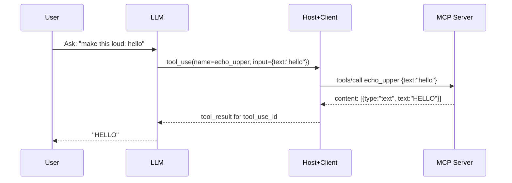

### TL;DR

- [MCP][1] is an open protocol that lets AI apps/LLMs talk to external tools and data through _MCP servers_.
- Think of it as a _USB‑C for AI_: one standard plug, many devices (filesystems, GitHub, Slack, DBs, you name it).
- LLMs use MCP via a host/client to discover tools, call them, and stream results back into the conversation.

### What is MCP, really?

[MCP][1] (Model Context Protocol) is a standard way for AI assistants to say,
“hey server, what can you do?” and then safely do it.

- **MCP Server**: a small program that exposes capabilities: tools (_actions_), resources (_readables_), prompts, etc.
- **MCP Client/Host**: the runtime that connects LLMs to servers, brokers permissions, and routes messages.
- **AI assistant aka LLM (Large Language Model)**: consumes the exposed tools/resources to get work done.

If this sounds like the _Language Server Protocol ([LSP][7])_ but for AI tools and data, you’re not wrong.
Find available MCP servers in the [MCP Store][4] or the [Model Context Protocol Directory][5].

### Implementation

We'll build a tiny Python MCP skeleton server.

Below, our minimal server exposing a single tool `echo_upper`.
It’s intentionally small so you can see the moving parts.

```python
from mcp.server.fastmcp import FastMCP

mcp = FastMCP("echo-server")

@mcp.tool()
def echo_upper(text: str) -> str:
    """
    Echo input text in UPPERCASE.
    
    Args:
        text: Text to echo
        
    Returns:
        The input text converted to uppercase
    """
    return text.upper()

if __name__ == "__main__":
    # Run the server
    mcp.run()
```

> Note on naming: server-side Python uses `input_schema` (snake_case) when defining tools;
> the protocol advertises it to clients as `inputSchema` (camelCase).

How to run it locally:

```bash
pip install "mcp>=0.3"
python mcp_echo_server.py
# Then connect with your MCP host (CLI/inspector/Claude Desktop) via stdio
```

### Common pitfalls

When building MCP servers, keep these in mind:
- Keep the schema in sync with documentation
- Avoid tool name collisions across servers via namespacing (ex: `github.echo_upper`)
- Handle long‑running jobs gracefully; provide progress updates or cancellation options.
- Handle large payloads carefully; prefer streaming or pagination.

## Example

Let's dive onto a simple interaction where an LLM talks to the MCP via a host to use the `echo_upper` tool 
and transforms text.

### Sequence view



Transport JSON payload you might see,
these payloads map to the tool_use → tool execution → tool_result lifecycle the host orchestrates.

- HTTP server transport (example mapping, varies by server implementation):
    - `GET /tools` → list available tools
    - `POST /tools/call` → invoke a tool with JSON arguments
    - `POST /messages` → submit/stream chat turns that may include tool_use/tool_result content

> Note: HTTP mapping here is illustrative; JSON‑RPC over stdio/WebSocket is most common.
> See the spec’s Transports section in the [MCP specification and docs][1].

### Capabilities

With the client being the AI agent (LLM), the host acts as a mediator to connect it to various MCP servers.

- **discovery (client → server)**: The host asks the server for its capabilities, which tools it exposes, and their
  schemas.
    - The returned schemas are passed to the LLM so it can plan tool calls with the correct
      fields and constraints.

```json
{
  "method": "tools/list",
  "id": "req-1"
}
```

- **listing (server → client)**: The server responds with a list of tools it supports, including their names,
  descriptions, and JSON Schemas.
  - Immediately after discovery; hosts typically cache this for the session. 
  - The LLM receives these schemas as a tool palette, enabling structured, validated
    tool_use outputs. 

```json
{
  "id": "req-1",
  "result": {
    "tools": [
      {
        "name": "echo_upper",
        "description": "Echo input text in UPPERCASE",
        "inputSchema": {
          "type": "object",
          "properties": {
            "text": {
              "type": "string"
            }
          },
          "required": [
            "text"
          ],
          "additionalProperties": false
        }
      }
    ]
  }
}
```

### Tool usage

- **Tool call (client → server)**: The LLM decides to use a tool and sends a _use_ message to the host.
  - The host translates this into a protocol call, ensuring the LLM’s intent is executed exactly as specified by the
    schema (no prompt ambiguity).

```json
{
  "method": "tools/call",
  "id": "req-2",
  "params": {
    "name": "echo_upper",
    "arguments": {
      "text": "hello, mcp!"
    }
  }
}
```

- **Tool result (server → client)**: After executing the tool, the server returns a _result_ message with the output.
  - The host injects this back into the conversation as a new user turn, allowing the LLM to continue reasoning with
    concrete data.

```json
{
  "id": "req-2",
  "result": {
    "content": [
      {
        "type": "text",
        "text": "HELLO, MCP!"
      }
    ]
  }
}
```

## MCP strength 

Aside from being a standard protocol used by many popular providers like GitHub, Slack, and Google Drive, 
MCP offers many benefits for AI assistants and LLMs.

### Benefits of using MCP

- **Schema‑first inputs**: JSON Schemas prevent ambiguous prompts. The LLM knows exactly which keys to send. No more
  hallucination.
- **Typed outputs**: `text`, `image`, `blob`, etc. help the host and LLM route/display results correctly.
- **Deterministic tool names**: Let the model plan, it can chain `search → open → summarize` by names.
- **Separation of concerns**: Hosts enforce auth, rate limits, and permissions. The host store tokens so that it's not exposed tokens to the LLM. 
  The servers focus on capability and the LLM focuses on reasoning.
- **Composability**: Multiple servers can be mounted, the LLM sees a merged tool palette.

## Footnotes and further reading

- [MCP specification and docs][1] — Architecture, messages, server/client features
- [GitHub blog: What the heck is MCP?][6] — Intro to MCP, its goals, and how it works
- [Quickstart guides][3] — How to build your first MCP server and client

Spin up the echo server, connect with an MCP inspector, and extend it with a second tool (for example,
`reverse(text: string)`) to see the flow end-to-end.

[1]: https://modelcontextprotocol.info/
[2]: https://modelcontextprotocol.info/docs/introduction
[3]: https://modelcontextprotocol.info/docs/quickstart
[4]: https://www.mcpstore.org/
[5]: https://model-context-protocol.com/
[6]: https://github.blog/tag/model-context-protocol/
[7]: https://microsoft.github.io/language-server-protocol/