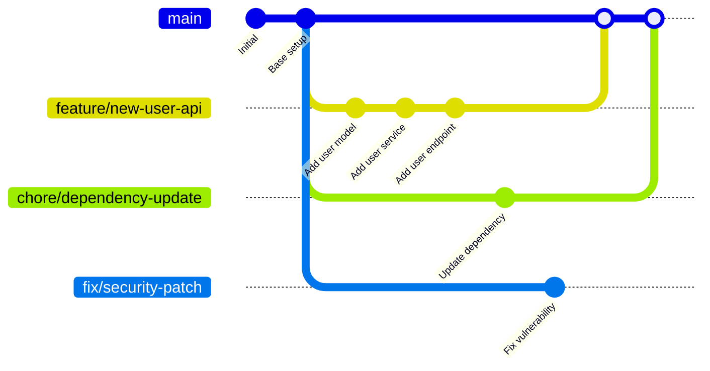
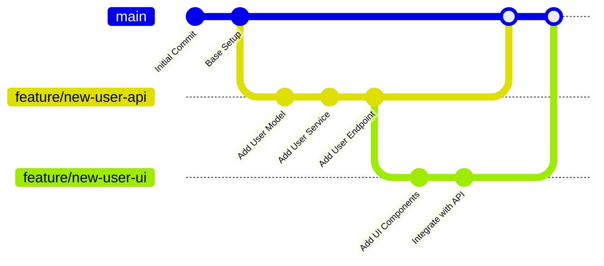

## Git Worktree: Managing Multiple Working Directories

### What is a Git Worktree?

A [Git worktree][2] is a powerful Git feature that allows you to have multiple working directories associated with a single Git repository. 
Instead of cloning the same repository multiple times, 
you can check out different branches in separate directories while sharing the same `.git` directory.

This makes it easy to work on multiple features, bug fixes, or code reviews simultaneously without the overhead of multiple clones.

And it is also great for spinning some [LLM processes][1] to experiment with different branches without messing up your main working directory.

### Folder structure

Here is how you would structure your worktrees for different branches.
This example shows three worktrees for different branches: `feature/new-user-api`, `chore/dependency-update`, and `fix/security-patch`.



Each worktree has its own working directory, index (for staged changes), and HEAD (current branch reference),
but they all share the same object database (stores the actual data like commits, files, and history, same stashes),
refs (pointers to branches and tags), and configuration (repository settings like remotes and hooks).

It would look like this in the filesystem:

```coffee
./my-project/
├── my-projec.git/               # Bare repository (Git data only)
├── new-user-api/              # Worktree for the `new-user-api` branch
│   ├── .git                   
│   ├── <project files>        
├── dependency-update/         # Worktree for the `dependency-update` branch
│   ├── .git                   
│   ├── <project files>        
└── security-patch/            # Worktree for the `security-patch` branch
    ├── .git                   
    └── <project files>        
```

When you fetch origin/main, all worktrees see the updated commits because they share the same object database.

### Setup and Usage

#### Initial Setup with Bare Repository

First make a _bare_ clone of your project.

```bash
# Clone as bare repository (recommended for worktrees)
git clone --bare git@github.com:user/my-project.git my-project
cd my-project
```

This creates a bare repository that contains only Git data without any working files.

While worktrees work with normal repository you _want_ to use a bare repository because it offers better separation.
It's just a pure Git data storage while the worktrees handle file operations.
But most importantly,
it prevents conflicts since you can't accidentally work in the "_main_" directory since it has no files.

The bare repository serves as the central storage for all branches and commits.

```bash
# Configure remote tracking and fetch all branches
git config --add remote.origin.fetch "+refs/heads/*:refs/remotes/origin/*"
git fetch origin
```

This configuration ensures that all remote branches are fetched and available in your bare repository,
allowing you to create worktrees based on these branches.
It is done automatically when you clone normally, but not with a bare repository.

#### Creating Worktrees

Now that you have your repository set up, you can create worktrees for different branches.

```bash
# Create worktrees for different tasks
git worktree add ../new-user-api -b feature/new-user-api
git worktree add ../dependency-update -b chore/dependency-update
git worktree add ../security-patch -b fix/security-patch
```

This will create three separate directories outside the bare repository, each checked out to the specified branch.
Exactly like the diagram above.
Each worktree will have its own copy of the project files for that specific branch.
We used the `-b` to create the branch if it didn't exist.

#### Development Workflow Example

Let's say you're working on three different tasks simultaneously: implementing a new user API,
updating project dependencies, and addressing a critical security vulnerability.
Here's how you'd manage this with worktrees:

```bash
cd ../new-user-api
git add .
git commit -m "Add user model"
git push origin feature/new-user-api
```

But you could do the same in parallel on the other branches:

```bash
# Work on dependency update in parallel
cd ../dependency-update
git add .
git commit -m "Update dependencies"
git push origin chore/dependency-update

# Handle urgent security patch
cd ../security-patch
git add .
git commit -m "Fix security vulnerability"
git push origin fix/security-patch
```

### Management Commands

Now that you have worked with multiple worktree, you might want to manage them.

```bash
# List all worktrees
git worktree list

# /my-project/my-project.git     1a2b3c4 (bare)
# /my-project/new-user-api       a1b2c3d [feature/new-user-api]
# /my-project/dependency-update  b1c2d3e [chore/dependency-update]
# /my-project/security-patch     c1d2e3f [fix/security-patch]
```

You can also remove a worktree when you're done with it.
Cleaning up the not only the directory but also the references in the main repository.

```bash
# Remove completed worktrees
git worktree remove ./my-project/new-user-api
```

If that doesn't work you could try `--force` or delete the folder directly.
But in that case with just folder deleted, the worktree still exists and becomes stale,
and you should prune it to remove the references.

```bash
# Clean up stale worktrees
git worktree prune
```

#### Alias

To make it easier to work with worktrees, you can set up some Git aliases.

```bash
# Add these to your global git config
[alias]
        bare = "!f() { d=\"${2:-$(basename \"$1\" .git)}\"; git clone --bare \"$1\" \"$d\" && (cd \"$d\" && git --git-dir=. config remote.origin.fetch \"+refs/heads/*:refs/remotes/origin/*\" && git --git-dir=. fetch); }; f"
        tree = "!f() { git worktree add -b \"$1\" \"$1\"; }; f"
```

The first one will create a new bare repository from a remote URL, and set the fetch config.
The second one will create a new worktree for the specified branch name in a folder with the same name.

Remember to push your branch to origin after creating it in the worktree or have the aut remote setup enabled
with `git config --global push.autoSetupRemote true`.

### Stacked Diff with Git Worktrees

Git worktrees are particularly useful when working with [stacked diffs][3],
where multiple dependent changes are developed in sequence.

For example, if we are working on some new API feature, and we have a new UI that'll depend on it,
we could create a new worktree for the UI branch that is based on the API branch.

```bash
# Create a stacked branch for additional changes
git worktree add -b feature/new-user-ui ../new-user-ui feature/new-user-api
```

With the start point of the worktree set as `feature/new-user-api`,
the `feature/new-user-ui` branch will be stacked on top of the `feature/new-user-api` branch.
Its worktree is located at `/my-project/new-user-ui`.

This allows you to work on `new-user-ui` while keeping it dependent on the changes in `new-user-api`.
Once the base branch is ready, you can merge it and rebase the stacked branch as needed.



However, you should not abuse stacked diffs as breaking refactorings in the base branch can cause significant headaches when rebasing.
Depending on the type of changes, the rebase complexity will compound with each stacked branch.

Due to the nature of stacked diff, squashing commits is not recommended as it will force a complex rebasing.
As the commit history will be rewritten, you will rebase the final state of the branch with each previous commit.
It becomes tedious very quickly, for a 10 commit branch times 3 stacked branches, you will have to do 30 rebase instead of 3 normally.


[1]: https://docs.claude.com/en/docs/claude-code/common-workflows#run-parallel-claude-code-sessions-with-git-worktrees
[2]: https://git-scm.com/docs/git-worktree
[3]: https://newsletter.pragmaticengineer.com/p/stacked-diffs