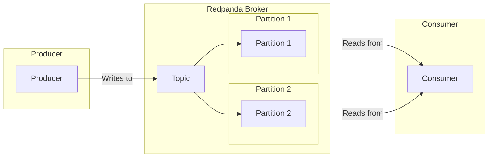

## What is Redpanda?

[Redpanda][1] is a streaming data platform that is API-compatible with [Apache Kafka][11] but built from the ground up in C++
as opposed to Kafka which is written in Java/Scala.

Redpanda is a streaming platform designed for high performance, low latency, and ease of use. 
It is often used for real-time data processing, event streaming, and building data pipelines.



At a high level, Redpanda consists of the following components:
- Producer: An application or service that sends data (messages) to Redpanda topics.
- Consumer: An application or service that reads data from Redpanda topics.
- Topic: A logical channel to which messages are sent. 
  - topics are divided into partitions for scalability and parallelism.
  - partitions are replicated and distributed across multiple brokers.

Redpanda brokers uses a built-in consensus algorithm called [Raft][5] to manage data replication and ensure consistency across brokers.


### Redpanda vs Kafka

While Redpanda maintains Kafka API compatibility, 
allowing you to use existing Kafka clients (kafka.js, confluent-kafka-python, etc.) without code changes.

- **No ZooKeeper Required**: You don't need multiple components, Redpanda is a single binary that handles everything.
  - Zookeeper is used to manage brokers which is replaced by the built-in Raft consensus in Redpanda.
- For some [specific workloads][4] and usage Redpanda can be more performant than Kafka.
- Redpanda doesn't include **Kafka Streams** or **Kafka Connect**.

Redpanda is usually a simpler choice to get started for standard produce/consume patterns and message brokering, 
but Kafka has a more mature ecosystem and additional features.

## Running with Redpanda

To run Redpanda locally with Docker Compose, create a `docker-compose.yml` file:

```yaml
version: '3.8'
services:
  redpanda:
    image: vectorized/redpanda:latest
    container_name: redpanda
    command:
      - redpanda start
      - --overprovisioned
      - --smp 1
      - --memory 1G
      - --reserve-memory 0M
      - --node-id 0
      - --check=false
    ports:
      - '9092:9092'
    volumes:
      - redpanda-data:/var/lib/redpanda/data

volumes:
  redpanda-data:
```

Start Redpanda with:

```bash
docker-compose up -d
```

Redpanda uses port 9092 by default, the same as Kafka's default port. 
For applications that use the standard Kafka producer and consumer APIs, 
you can often just point them to Redpanda without changing connection strings or client code.

Beyond the Kafka protocol, Redpanda also provides a built-in schema registry for managing Avro, Protobuf, and JSON schemas. 
You can set it in the docker compose using `-schema-registry-addr 0.0.0.0:8081` and mapping port `8081`

## Redpanda CLI (rpk)

The `rpk` (Redpanda Keeper) command-line tool is your main interface for managing Redpanda clusters, topics, and consumer groups.

You can install it on MacOS with:
```bash
brew install redpanda-data/tap/redpanda
```

For other platforms and installation methods, check the [official installation guide][3].

### Common rpk Commands

#### Create a Topic

Create a new topic with default settings:

```bash
rpk topic create my-topic
```

Expected output:

```
TOPIC     STATUS
my-topic  OK
```

Create a topic with custom partitions and replication:

```bash
rpk topic create my-topic --partitions 3 --replicas 1
```

Each partition can be consumed by one consumer in a consumer group, 
that means you can have up to 3 consumers in a group consuming from this topic in parallel.

The number of replicas doesn't affect the number of consumers, it only affects data redundancy.
If one broker goes down, the consumer can still read from the replicas.
With one you have no redundancy.

#### List Topics

To list the topics, you can use:

```bash
rpk topic list
```

Expected output:

```
NAME      PARTITIONS  REPLICAS
my-topic  1           1
```

#### Describe Consumer Group

Get the state of a consumer group with lag information:

```bash
rpk group describe nodejs-consumer
```

Expected output:

```shell
GROUP             TOPIC           PARTITION  CURRENT-OFFSET  LOG-END-OFFSET  LAG             MEMBER-ID                          CLIENT-ID  HOST
nodejs-consumer   my-topic        0          1234            1250            16              consumer-1-1234                    client-1   /127.0.0.1
nodejs-consumer   my-topic        1          5678            5700            22              consumer-2-5678                    client-2   /127.0.0.1
```

The `LAG` column shows how many messages the consumer is behind, which is crucial for monitoring performance.

#### Consume Messages

Consume messages from a topic starting from the beginning:

```bash
rpk topic consume my-topic --offset start
```

The offset represents the position of a message in a partition.
You can specify different specific ones, for example to consume messages from the last minute:

```bash
rpk topic consume my-topic --offset @-1m:end
```

#### Produce Messages

Send a message to a topic directly via the command line:

```bash
echo "Hello Redpanda" | rpk topic produce my-topic
```

Obviously in a real life system you would have a producer taking care of sending messages programmatically.

### Helper Functions

For Kubernetes deployments, you can create helper functions:

```bash
# Use with `rpk_consume my-topic`
rpk_consume() {
  echo "Consuming topic $1"
  topic=$1
  kubectl exec -ti redpanda-0 -n default -- rpk topic consume "$topic"
}
```

This command allows you to consume messages from a topic running in a Kubernetes pod.
It should log the messages directly in the terminal.

## Interaction with Redpanda

Implementation of a typescript consumer/producer to interact with redpanda.
It uses the same as kafka, so you can use kafka.js.

Luckily I already have an article about [how to use kafka.js][10] in typescript, 
so you only need to use the same implementation and spawn the redpanda
container instead of the kafka one.

[1]:https://docs.redpanda.com/
[2]:https://redpanda.com/blog/homebrew
[3]:https://docs.redpanda.com/current/get-started/rpk-install/
[4]:https://docs.redpanda.com/current/reference/redpanda-vs-kafka/
[5]:https://raft.github.io/
[10]:
[11]: