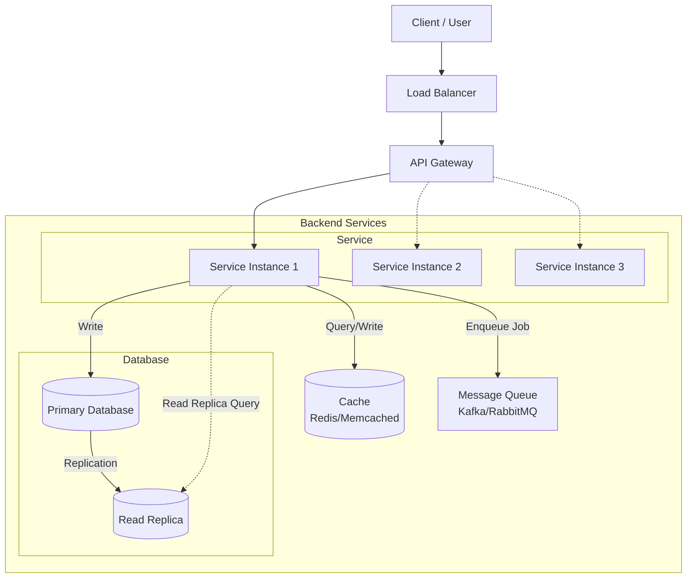

In this article we are going to talk about the system design interview,
It's a common interview format for software engineering roles, especially for mid to senior-level positions.
Often the goal is to design a scalable system and there's usually no coding involved.

## References

While you may not have practical knowledge on all existing concept, 
you can still perform on designing on unknown problem a viable architecture solution.
And for that methodology is key as it helps keeps yourself focus and moving on.
It is very easy to stay in an _analyse-paralysed_ state or start doubting every decision. 
A clear process during the interview avoids you spiraling out.

But like everything, practice makes perfect, and the more you practice the better you get at it.
There are multiple references out there and there's no one way to perform, here are some of the best ones:

- [Hello System Design][1] - To learn and train on the concept like a _FAANG_ engineer.
- [Donne Martin's System Design Primer][2] - A comprehensive guide to system design concepts and best practices.

Also make sure to practice on whiteboard tools like [Excalidraw][3] or [Miro][4], 
as removing potential tool usage blockers will help you focus on the design itself.

## Methodology

This is meant to be more of a cheat sheet of a rough process you can remember and follow during the interview.
Not the one to rule them all 💍 and it derived from the references above.

| Phase | Name              | Time      | Goal                            |
|-------|-------------------|-----------|---------------------------------|
| 1     | Requirements      | 5 min     | Clarify scope and constraints   |
| 2     | Core Entities     | 2 min     | Define the data model           |
| 3     | API Design        | 5 min     | Design the interface            |
| 4     | High-Level Design | 10-15 min | Draw the architecture           |
| 5     | Deep Dives        | 10-15 min | Address bottlenecks & tradeoffs |

Let's dive deeper into each phase with some pointers as what to look for.

### 1. Requirements Gathering

For the functional requirements, they are usually provided by the interviewer.
Focus on asking clarifying questions to ensure you understand the problem.

Then you will want to clarify the constraints of the system.
(find a [gauging reference](#estimation) for quick on the thumb estimations)

It is important to set the scope of the design so it's not under or over engineered.
Here are the main points to cover:

| Requirement      | Question to Ask                                                                 |
|------------------|---------------------------------------------------------------------------------|
| **Scale**        | "How many DAU[^1]/MAU[^2]? How many requests per second?"                       |
| **Latency**      | "What's the acceptable latency? p99[^3] targets?"                               |
| **Availability** | "What's our uptime target? 99.9%? 99.99%?"                                      |
| **Consistency**  | "Is eventual consistency acceptable[^4], or do we need strong consistency[^5]?" |
| **Durability**   | "Can we afford to lose data? What's the backup strategy?"                       |

It's fine not to go too depp or go through other non-functional requirements 
(like security, observability or compliance) as they can be covered later in the deep dive phase.

### 2. Core Entities Identification

That's where you identify the main data entities of the system.
You will likely need to illustrate the database schema or model and relationships between entities.

Not everything in the system is a new entity, if both data use the same key and are always used together,
then they can be modelled as one entity (like having user profile and user settings as one _user_ entity).

There are some things to consider when defining the entities:
  - Identify primary keys and relationships (one-to-one, one-to-many, many-to-many).
  - Consider indexing strategies for efficient querying.
  - Data constraints and validation rules.

### 3. API Design

That's the part where you define the interface of the system.
It doesn't have to be RESTful, but you should define the main endpoints when what's their purpose.

This will help you think in terms of service and how the different components will interact with each other.

No need to go too deep into implementation concerns (pagination, filtering) unless prompted by the interviewer.
For [authentication][13], you can just mention using OAuth[^6] or JWT[^7] without going into details.
> The JWT token can be passed in the `Authorization` header as a Bearer token, and that's how you identify the user.

Rate limiting and throttling strategies may be relevant as deep dive topics or during the next phase.

### 4. High-Level System Design

This is where you draw the architecture of the system.
You should start with a high-level overview of the main components and their interactions.
Stay vocal about your thought process as you add components to the diagram.

Find below a table of common components and their purpose:

| Component               | Purpose                                 |
|-------------------------|-----------------------------------------|
| **Load Balancer**       | Distribute traffic across servers       |
| **API Gateway**         | Rate limiting, auth, routing            |
| **Application Servers** | Business logic                          |
| **Cache**               | Reduce database load (Redis, Memcached) |
| **Database**            | Persistent storage                      |
| **Message Queue**       | Async processing (Kafka, RabbitMQ)      |
| **CDN**                 | Serve static content globally           |
| **Object Storage**      | Store media files (S3)                  |

Here is a generic example:



Some flow are not shown for clarity.

### 5. Deep Dive into Components

This one is the most crunchy one and will depend on the interviewer's questions.
If possible you should steer your answer towards your strengths and experience.

You need to address potential bottlenecks and trade-offs in your design.
Here are some common topics to consider:
- Scaling for `X` more users or requests.
  - **Database Scaling**: Vertical vs horizontal scaling[^8], sharding[^9], replication[^10].
  - **Caching Strategies**: Cache invalidation[^11], cache-aside[^12] vs write-through[^13].
- System Performance
  - **Latency Reduction**: CDNs[^14], edge computing[^15].
  - **Fault Tolerance**: Redundancy, failover mechanisms, circuit breakers[^16], rate limiter.
- Data Management
  - **Data Consistency**: Handling eventual consistency[^4], conflict resolution[^17].
  - **Locks**: Ensure data integrity in concurrent environments (optimistic/pessimistic locking[^18], distributed locks like Redis[^19] or Zookeeper[^20]).
  - **Deduplication**: Prevent duplicate processing (idempotency keys[^21], unique constraints[^22], request IDs[^23])

Every design decision has trade-offs, so be prepared to discuss the pros and cons of your choices.

## Key concepts

Here are some key article you may want to read to refresh on some of the key concepts:

- [Software Architecture][10]: Overview of common architectural patterns and principles.
- [Database quick reference][11]: Common database types, concepts and their use cases.
- [Circuit Breaker Pattern][12]: Design pattern for fault tolerance in distributed systems.
- [OAuth and JWT][13]: Overview of authentication and authorization mechanisms.
- [What is Kafka?][14]: Introduction to Apache Kafka and its use cases.

### Estimation

Often you have to make estimation to assess latency, scalability needs, and other parameters.
Here are some common numbers to keep in mind:

```
Latency:
────────────────────────────────────────
L1 cache reference                   1 ns
L2 cache reference                   4 ns
Main memory reference              100 ns
SSD random read                     16 μs
HDD seek                             2 ms
Send packet US→Europe              150 ms

Throughput:
────────────────────────────────────────
Read 1 MB from memory              250 μs
Read 1 MB from SSD                   1 ms
Read 1 MB from HDD                  20 ms
Send 1 MB over 1 Gbps network       10 ms

Scale:
────────────────────────────────────────
1 million = 10^6
1 billion = 10^9
1 trillion = 10^12

Time:
────────────────────────────────────────
1 day   = 86,400 sec        ≈ 10^5 sec
1 month = 2,592,000 sec     ≈ 2.5 × 10^6 sec
1 year  = 31,536,000 sec    ≈ 3 × 10^7 sec
```

### Glossary

All the terms and acronyms used in this article:

[^1]: DAU = Daily Active Users
[^2]: MAU = Monthly Active Users
[^3]: p99 = 99th percentile, i.e., the maximum latency for 99% of requests
[^4]: Eventual consistency = Data eventually becomes consistent, but not instantly
[^5]: Strong consistency = Data is always consistent after each write
[^6]: OAuth = Open Authorization, an open standard for access delegation commonly used for token-based authentication.
[^7]: JWT = JSON Web Token, a compact, URL-safe means of representing claims to be transferred between two parties, often used for authentication.
[^8]: Vertical scaling means adding more resources (CPU, RAM) to a single server; horizontal scaling means adding more servers to distribute the load.
[^9]: Sharding is splitting a database into smaller, more manageable pieces (shards), each holding a subset of the data.
[^10]: Replication is copying data across multiple servers to increase availability and fault tolerance.
[^11]: Cache invalidation is the process of removing or updating stale data from a cache to ensure consistency with the source of truth.
[^12]: Cache-aside is a caching pattern where the application loads data into the cache only on demand.
[^13]: Write-through is a caching pattern where data is written to both the cache and the database at the same time.
[^14]: A CDN (Content Delivery Network) is a distributed network of servers that delivers content to users based on their geographic location, reducing latency.
[^15]: Edge computing processes data closer to the user or data source, reducing latency and bandwidth usage.
[^16]: A circuit breaker is a design pattern that prevents a system from repeatedly trying to execute an operation likely to fail, improving fault tolerance.
[^17]: Conflict resolution is the process of handling data inconsistencies that arise when multiple sources update the same data concurrently.
[^18]: Optimistic locking allows multiple transactions to proceed without locking resources, checking for conflicts before committing; pessimistic locking locks resources to prevent conflicts.
[^19]: Redis is an in-memory data store that can be used for distributed locking to coordinate access across multiple systems.
[^20]: Zookeeper is a distributed coordination service often used for distributed locks and configuration management.
[^21]: An idempotency key is a unique value sent with a request to prevent duplicate processing of the same operation.
[^22]: A unique constraint is a database rule that ensures all values in a column or set of columns are unique, preventing duplicates.
[^23]: A request ID is a unique identifier for each request, used to track and deduplicate operations in distributed systems.

[1]: https://www.hellointerview.com/learn/system-design/in-a-hurry/introduction
[2]: https://github.com/donnemartin/system-design-primer
[3]: https://excalidraw.com/
[4]: https://miro.com/
[10]: 
[11]: 
[12]: 
[13]: 
[14]: 