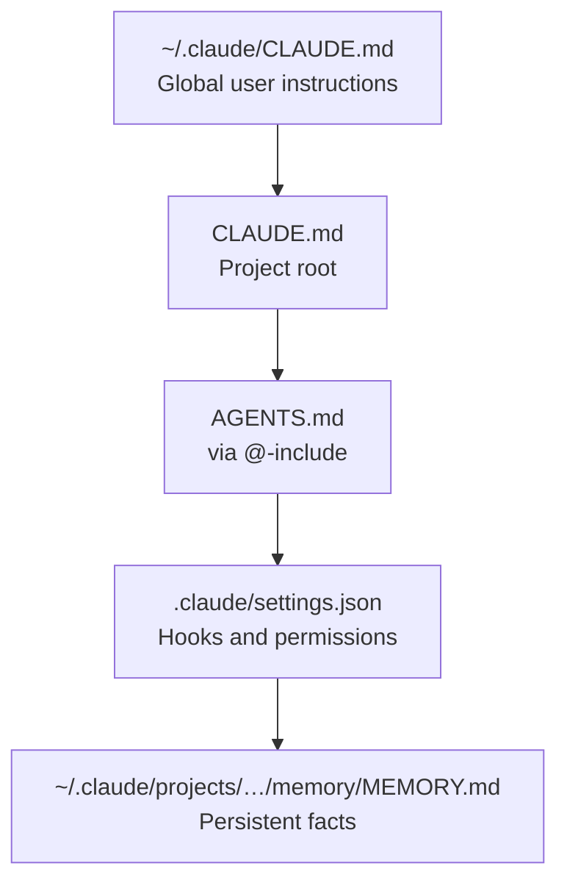

Claude Code starts every session without memory of the last one.
Instead of prompting harder, let's review the tools Claude and Claude Code gives us to make the LLM smarter.
This could save you sometimes and tokens.

I am relying on [Claude Code official documentation][6],
to explain some of the most useful feature to improve Claude Code performance and reliability.
I tried to use somewhat real examples for illustration.

<!--more-->

## How Claude Reads Your Repo

Claude Code loads context from files in a [fixed order][1] before it does anything else.
Understanding this order tells you exactly where to put your conventions so they land every time.



Everything in that chain is read before Claude touches your code.
Instructions closer to the top override those below.

### CLAUDE.md: The Entry Point

`CLAUDE.md` at the project root is [loaded automatically][27].
Keep it short and use `@`-includes to pull in focused documents without bloating the main file:

```markdown
<!-- CLAUDE.md -->
@AGENTS.md

<!-- Uncomment when mid-feature to give Claude live task state -->
<!-- @wip/current.md -->
```

The [`@filename` syntax][10] inlines the referenced file's content at that position.
Imports resolve relative to the file that references them and can nest up to four hops deep.
Use it to split instructions into focused documents that are easier to maintain independently.

[**Global instructions**][17] go in `~/.claude/CLAUDE.md`. 
Keep project-specific rules in the project's own `CLAUDE.md`.

The two are not mutually exclusive: Claude loads every `CLAUDE.md` from the filesystem root down
to your working directory and concatenates them, so the file closest to where you launched Claude
is read last and [wins on conflicts][1].

### The OpenCode standard: AGENTS.md as a cross-tool contract

`CLAUDE.md` is Claude-specific. `AGENTS.md` is not.

The [OpenCode][7] convention, used by OpenCode and a growing set of AI coding
tools, establishes `AGENTS.md` as the tool-agnostic layer for repo instructions.
Any assistant that follows the convention reads it,
which matters for teams that use multiple tools or might switch assistants over time.

Claude Code does **not** read `AGENTS.md` natively, it [reads `CLAUDE.md`][11],
so you need to add `@AGENTS.md` in it to bridge the gap.

```
CLAUDE.md       ← Claude Code only: @-includes, wip references
AGENTS.md       ← All tools: build commands, file map, gotchas
.claude/        ← Claude Code only: settings, hooks, commands
```

While it may add up noise in the repository, the separation is intentional.
Put everything that should work with *any* agent in `AGENTS.md`, and have `CLAUDE.md` for extra Claude instructions.
If your team is all in with Claude you can leverage the `.claude/` directory to [share projects skills and commands][24],
or create your own harness which will feed it.

## Reflexes via AGENTS.md

While `CLAUDE.md` handles routing, `AGENTS.md` is where the real reflex-encoding lives.
A well-written AGENTS.md turns one-time corrections into rules Claude will break less often (depending on the model and context).
Opus tends to be more disciplined than it's fellow lower Claude model.

### Build commands

A build-commands list is one of the section that pay off fastest.

```markdown
## Build commands

    npm run build            # Build api + web + shared
    npm run dev              # Start api + web in watch mode
    npm test                 # Unit tests for all packages
    npm run test:e2e         # Playwright (requires dev server)
    npm run typecheck        # TypeScript check across all packages
    npm run lint             # ESLint across all packages
```

This is particularly useful for smaller model which might not get it right on the first try.

### File map

Similarly, a high-level file map can help Claude understand the project structure without spending token understanding it everytime.
But the more verbose it becomes the more likely it will rot or impact your sessions directing you to hallucinated paths.

```markdown
## Key file locations

- `src/backend` — API routes, business logic, database models
- `src/frontend` — React app, UI components, client-side logic
- `src/shared` — Types, utilities, and code shared between backend and frontend
- `db/` — Database schema, migrations, seeds
```

Also, if your `CONTRIBUTING.md` already mentions must know items and code structure,
you could `@` it so the LLM follows it. 
Depending on the model you might want the agent one to be smaller for token efficiency, though.
Be careful to not have stale duplicated information between files as it will most likely create confusion.

### Best practices and gotchas

You should set some clear project's best practices rules (like pattern used, or rules to refer to when in doubt) for a smoother experience.
The gotchas helps drive those by adding extra context when the LLM slips. Here you can set rules for common mistakes.
Each entry should be for one class of mistake:

```markdown
## Known gotchas

- **Generated files in packages/shared/src/generated/** — do not edit by hand.
  Run `npm run codegen` to regenerate from api/openapi.yaml.
- **Config via api/src/config.ts only** — never read process.env directly.
  Missing mandatory vars should fail loudly at startup, not at runtime.
- **Frontend uses the generated API client** — do not write raw fetch calls.
  Use the typed client in web/src/api/.
- **Shared types live in packages/shared** — do not duplicate type definitions
  between api/ and web/. If a type is needed on both sides, it belongs in shared.
- **React Query for server state** — do not store API response data in local
  component state or Redux. All server state goes through useQuery / useMutation.
```

Every time you correct Claude on something, ask yourself (or ask it 😅): *does this belong in AGENTS.md?*
The answer should not be always yes, as some of them could be one off setup or could be improvements items that are worth implementing / fix in the code.

Because this approach does not scale without limit, though, and that is the catch. `CLAUDE.md` and
anything it imports load in full at the start of *every* session, spending tokens before you type
a word, and the docs are explicit that longer files reduce how reliably Claude follows them.
The documentation recommends to keep it under [~200 lines][12] and give some gimmicks to expand it via:

- **Path-scoped rules** in `.claude/rules/` take YAML `paths:` frontmatter and only load when
  Claude touches [matching files][13]. A gotcha about the React client belongs in a rule scoped to
  `web/**`, not in the always-on root file.
- **Skills** hold multistep procedures that load only when invoked or when relevant, which can ["cost" almost nothing until it is needed][19].

## Persistent Memory

`AGENTS.md` is for conventions everyone knows upfront.
Memory is for things you had to learn the hard way. Without it, you re-teach them every session.

### Memory mechanism

Claude Code actually has [two memory systems][14], and it helps to keep them straight:

- **`CLAUDE.md` files** are what *you* write. Loaded in full every session, they are instructions
  and rules. Everything above this section is about them.
- **Auto memory** is what *Claude* writes. On by default (v2.1.59+, toggle with `/memory`), Claude
  decides what is worth remembering as it works, build commands it figured out, a debugging insight,
  a preference you corrected, and [saves it without you asking][15].

Auto memory files live at `~/.claude/projects/<project>/memory/`, indexed by `MEMORY.md`. The
`<project>` path is derived from the git repo, so every worktree and subdirectory of the same repo
shares one memory directory, and it is **machine-local**, [not shared across machines or teammates][16].

Memory also splits between per-project and general, much like `CLAUDE.md` does. Auto memory is
scoped *per repository*; there is no single global auto-memory store. The general half lives in the
user-level `CLAUDE.md` at `~/.claude/CLAUDE.md` (and user rules in `~/.claude/rules/`), which apply
to [every project on your machine][17]. Machine-wide habits therefore go in user-level `CLAUDE.md`,
while repo-specific learnings accumulate in that repo's auto memory on their own.

### Auto memory categories

Only the first 200 lines (or 25 KB) of `MEMORY.md` load at session start, so Claude keeps the index
lean and pushes detail into [topic files it reads on demand][18].
Here is a list of memory type categories it can store:

| Type        | What it stores                                          | Example                                                    |
|-------------|---------------------------------------------------------|------------------------------------------------------------|
| `user`      | Your role, expertise, preferences                       | "Software engineer, like concise syntax"                   |
| `feedback`  | Patterns Claude kept getting wrong                      | "Stop using `as X` casts to silence inference errors"      |
| `project`   | Technical constraints that aren't obvious from the code | "Two config.ts files (api/ and web/), not interchangeable" |
| `reference` | Where things live that you'll forget                    | "Local dev: Vite 5173, API 3001, WS 3002"                  |

The user one is very useful to tailor the code style and behaviour of the LLM to fit yours.
Less prompt fixing when the LLM knows how you like things.
A feedback memory is most valuable when it describes a specific recurring mistake and exactly
what to do instead. 
As with gotchas reviewing the feedback may help consolidate the `CLAUDE.md` or improving the codebase.

```markdown
---
name: no-as-cast-workarounds
description: Fix the actual TypeScript mismatch; do not use `as X` or `as unknown as X`
type: feedback
---

When TypeScript inference fails, do not reach for `as SomeType` to silence the error.
Find the root cause and fix the type.

**Why:** Three times in a month a cast like `result as User` was hiding a place where
the query was returning `null` or a partial object.
TypeScript was right — the type was wrong.
The cast silenced the compiler and the bug only appeared at runtime, in prod.
The `as unknown as X` double-cast pattern is a red flag every single time.

**How to apply:** If inference is failing, check whether the return type is actually
what you think, whether a generic constraint is too loose,
or whether the same type is defined separately in `api/` and `packages/shared/`.
If a cast is genuinely right, add a comment explaining why the runtime guarantee holds.
```

The `MEMORY.md` index loads first, one line per entry:

```markdown
# Project Memory

- [Invalidate after mutation](feedback_no_summaries.md) — call invalidateQueries in onSuccess or the UI shows stale data
- [No type assertion workarounds](feedback_type_assertions.md) — fix the type, don't cast around it
- [Two config files](project_two_configs.md) — api/src/config.ts and web/src/config.ts are not the same
- [Local dev ports](reference_dev_ports.md) — Vite 5173, API 3001, WebSocket 3002
```

Claude manages the memory and deletes them if duplicated or in contradiction with the current state of the repo,
it may also re-validate old memories before asserting with confidence on it.
However, it does not automatically update or prune them, so it doesn't forget older long-running rules.

## Commands and Skills

Both **commands** and **skills** become slash commands you invoke with `/name`, and both are
official Claude Code features ([commands][5], [skills][2]). They used to be two separate mechanisms; they have since
merged. Usually we call a command a simpler instruction, and a skill a more complex one that uses frontmatter.

### Commands: the simple form

A command is a plain `.md` file in `.claude/commands/` (project) or `~/.claude/commands/`
(personal). No frontmatter required; just write [the instructions][5]:

```markdown
<!-- .claude/commands/comment-pr.md -->
Review the pull request identified in the arguments and post review comments on it.

`$ARGUMENTS` is either a PR number (e.g. `1234`) or a full PR URL
(e.g. `https://github.com/owner/repo/pull/1234`).

1. Resolve the target: if `$ARGUMENTS` is a URL, extract the owner, repo, and number; otherwise
   assume the current repo and treat `$ARGUMENTS` as the PR number.
2. Fetch the diff and metadata with `gh pr view "$ARGUMENTS" --json title,body,files` and `gh pr
  diff "$ARGUMENTS"`.
3. Review the diff for correctness bugs, missing edge cases, and unclear naming. Note each
   finding with its `file:line`.
4. Summarize the findings before posting and confirm with me.
5. Post inline comments with `gh pr comment` / the GitHub review API, attaching each comment to
   its `file:line`.
6. Add one top-level summary comment covering the overall assessment.
```

Invoke it with `/comment-pr 1234`, [`$ARGUMENTS`][20] captures everything after the command name.

### Skills: the full-featured form

A skill is a `SKILL.md` in its own directory. The directory can hold supporting files, and the frontmatter
unlocks [the features a bare command lacks][21]:

```markdown
---
name: test-all
description: Run lint, typecheck, unit tests, and e2e tests in order
allowed-tools: Bash
---

- Package manager: !`node -p "(require('./package.json').packageManager||'npm@').split('@')[0]"
  2>/dev/null || echo npm`
  
Using the package manager detected above, run these steps in order, 
and suggest next steps if any of them fail at the end:

1. lint:fix (if the script exists)
2. lint
3. typecheck
4. test
5. test:e2e
```

The [frontmatter fields][21] that matter most, with their *actual* semantics:

| Frontmatter key            | Effect                                                                                        |
|----------------------------|-----------------------------------------------------------------------------------------------|
| `description`              | What the skill does; Claude uses it to decide when to auto-invoke. Recommended.               |
| `allowed-tools`            | **Pre-approves** these tools so the skill runs without permission prompts (not a restriction) |
| `disallowed-tools`         | Removes tools from the pool while the skill is active                                         |
| `disable-model-invocation` | `true` = only *you* can invoke it with `/name`; Claude won't trigger it automatically         |
| `user-invocable`           | `false` = only *Claude* invokes it; hidden from the `/` menu                                  |
| `context: fork`            | Runs the skill in a [forked subagent][4] with a fresh context window                          |
| `agent`                    | Which subagent type runs it when `context: fork` is set (e.g. `Explore`, `Plan`)              |

Two of these are easy to get backwards: `allowed-tools` *grants* permission, it does not restrict
(use `disallowed-tools` for that), and `disable-model-invocation` is about *who* can trigger the
skill, [not a read-only mode][22].

The `` !`command` `` prefix injects live command output before the skill content is sent, so the
skill [sees actual data rather than the command string][23].

### Auto-triggering and consent

By default, [both you and Claude can invoke a skill][22]. You type `/name`; Claude auto-invokes when
your request matches the skill's `description`. The mechanics here are what determine whether any of
this need your consent. 
Depending on the commands `!command` to run in the skill (known as command injection),
if it is not in the `allowed-tools` list, Claude should ask for permission.

Skill *descriptions* are always in context so Claude knows what exists, but the full body only loads
[when the skill is actually invoked][19]. Auto-invocation is simply Claude choosing to load a skill it
judges relevant.
So you should regularly prune skills you don't use so they don't bloat your context.

### Project vs personal skills

Skills are **not** global-only, they can be [project-scoped too][24]:

| Location                           | Scope         | Best for                                                     |
|------------------------------------|---------------|--------------------------------------------------------------|
| `.claude/skills/<name>/SKILL.md`   | Project only  | Team skills with frontmatter/tooling                         |
| `~/.claude/skills/<name>/SKILL.md` | All projects  | Personal quality gates, fork-context tools                   |
| `<plugin>/skills/<name>/SKILL.md`  | Where enabled | Enterprise, Shareable collections, namespaced `/plugin:name` |

The plugin ones usually don't collide as they are called via `/plugin:name`, 
but the project and personal ones share the same namespace and can step on each other.
In that case it's like the `CLAUDE.md` the personal one wins against the project one.

Project skills could be committed and shared with the team. 
Personal ones could be added to the [marketplace][8] to share the love or added to your team ai skill repo if one exists.

## Hooks

Commands and skills run on demand or when Claude feels like it. 
Hooks run *automatically* [when specific events fire][3].
Configure them in [`.claude/settings.json`][25]:

```json
{
  "hooks": {
    "PostToolUse": [
      {
        "matcher": "Edit|Write",
        "hooks": [
          {
            "type": "command",
            "command": "npm run typecheck 2>&1 | tail -5"
          }
        ]
      }
    ]
  }
}
```

This fires the typecheck after every file write.
If the typecheck fails, Claude sees the output and can fix the error before moving on, without you having to ask.

At each [lifecycle event][9] (`PreToolUse`, `PostToolUse`, `UserPromptSubmit`, `SessionStart`, `SessionEnd`, …), the runtime checks the matcher
itself and runs the command.
The [matcher][26] corresponds to the tool name (e.g. `Write` for file writes, `Edit` for code edits, `"""` for any tool) and supports regex.
The tool can be a built-in one or a custom one like a MCP tool.


[1]: https://code.claude.com/docs/en/memory#how-claude-md-files-load
[2]: https://code.claude.com/docs/en/skills
[3]: https://code.claude.com/docs/en/hooks-guide
[4]: https://code.claude.com/docs/en/sub-agents#fork-the-current-conversation
[5]: https://code.claude.com/docs/en/commands
[6]: https://code.claude.com/docs/
[7]: https://opencode.ai
[8]: https://code.claude.com/docs/en/plugin-marketplaces
[9]: https://code.claude.com/docs/en/hooks#hook-events
[10]: https://code.claude.com/docs/en/memory#import-additional-files
[11]: https://code.claude.com/docs/en/memory#agents-md
[12]: https://code.claude.com/docs/en/memory#write-effective-instructions
[13]: https://code.claude.com/docs/en/memory#path-specific-rules
[14]: https://code.claude.com/docs/en/memory#claude-md-vs-auto-memory
[15]: https://code.claude.com/docs/en/memory#auto-memory
[16]: https://code.claude.com/docs/en/memory#storage-location
[17]: https://code.claude.com/docs/en/memory#choose-where-to-put-claude-md-files
[18]: https://code.claude.com/docs/en/memory#how-it-works
[19]: https://code.claude.com/docs/en/skills#skill-content-lifecycle
[20]: https://code.claude.com/docs/en/skills#pass-arguments-to-skills
[21]: https://code.claude.com/docs/en/skills#frontmatter-reference
[22]: https://code.claude.com/docs/en/skills#control-who-invokes-a-skill
[23]: https://code.claude.com/docs/en/skills#inject-dynamic-context
[24]: https://code.claude.com/docs/en/skills#where-skills-live
[25]: https://code.claude.com/docs/en/hooks-guide#configure-hook-location
[26]: https://code.claude.com/docs/en/hooks#matcher-patterns
[27]: https://code.claude.com/docs/en/memory#claude-md-files