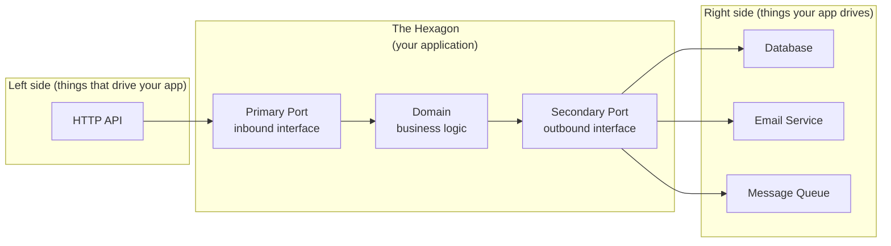

Hexagonal architecture (or Ports & Adapters, as [initially coined][1]) is the focus of this article,
The concept is pretty well known (ties in the [clean architecture][3]) and still used (see [Netflix blog][2]),
it focuses on the concept of separation of concerns.

I'll be using go code snippet so it's easier to follow. 
Why go? Because the pattern makes a lot of sense in that language and a mistake gets visible pretty quickly 
(with package import cycle).
The typical approach, most Go services start with the familiar Controller → Service → Repository stack.
It works fine until the boundaries start bleeding. The service imports the db package to manage a transaction.
The handler starts checking business rules because the service returns the wrong error type. Eventually,
swapping Postgres for DynamoDB means touching half the codebase, and testing a business rule requires a running database.

## Overview

Hexagonal architecture addresses this by placing business logic at the center with a hard boundary around it. 
HTTP, databases, email, queues, everything reaches the domain through interfaces. Dependencies always point inward.



The hexagon shape is just a visual metaphor for "multiple sides", there is nothing special about six.
What matters is the direction of dependencies.

Two directions of communication run through this boundary,
and the vocabulary sticks with you through the rest of the pattern:

| Direction    | Name               | Meaning                                          |
| ------------ | ------------------ | ------------------------------------------------ |
| **Inbound**  | Primary / Driving  | Something on the outside *calls into* your app   |
| **Outbound** | Secondary / Driven | Your app *calls out* to something on the outside |

This applies to both ports (the interfaces) and adapters (the implementations).
Let's review each component of this architecture.

## 1. The domain

Strip away all I/O and what remains is the domain. It holds:

- **Entities**: objects with identity and behaviour (`User`, `Order`)
- **Value objects**: immutable descriptors without identity (`Email`, `Money`)
- **Domain errors**: business rule violations as typed errors

Nothing in this layer imports `database/sql`, `net/http`, or any external SDK.
Which differs it from other database entities or model that can be used in the app.

Let's have the example of a `user` entity in our domain:

```go
// domain/user.go
package domain

import (
    "errors"
    "strings"
)

type User struct {
    ID    string
    Email string
}

func NewUser(id, email string) (User, error) {
    email = strings.TrimSpace(strings.ToLower(email))
    if email == "" {
        return User{}, errors.New("email is required")
    }
    return User{ID: id, Email: email}, nil
}
```

`NewUser` normalises the email and rejects invalid input before a `User` value can exist.
Whether this constructor gets called from an HTTP handler or another port, the same validation runs.
There is no way to hold an invalid `User`.

Domain Entities and value objects belong to the domain. 
A struct that has both a `Validate()` method and `json:"..."` tags is a sign that something leaked across the boundary.

## 2. Ports

Ports are Go interfaces that define contracts between the domain and everything else. 
They split into two kinds.

### 2.1 Primary ports (inbound)

A primary port describes what the application can do. 
External callers (HTTP handlers, ...) interact with the domain through these interfaces.

```go
// domain/ports.go

type RegisterUserUseCase interface {
    Execute(email, name string) (User, error)
}
```

Both an HTTP handler and a unit test call `Execute` on this interface. 
Neither knows what struct sits behind it.

### 2.2 Secondary ports (outbound)

A secondary port describes what the domain needs from the outside world: storage, email, payment gateways.
The domain calls out through these interfaces without knowing what is on the other side.

```go
// domain/ports.go

type UserRepository interface {
    Save(user User) error
    ExistsByEmail(email string) (bool, error)
}

type WelcomeMailer interface {
    SendWelcome(toEmail string) error
}
```

Both interfaces live in the `domain` package because the domain owns the contract.
Infrastructure conforms to the domain.
Switching to a new email provider means writing a struct that satisfies `WelcomeMailer`.
Nothing else changes.

## 3. Use cases

A use case implements a primary port.
It answers the question "what happens when someone asks to register a user?":
validate inputs, apply domain rules, call secondary ports, return a result.

```go
// domain/usecases/register_user.go

type RegisterUser struct {
    users  domain.UserRepository
    mailer domain.WelcomeMailer
}
```

The struct only holds interfaces. 
`RegisterUser` has no idea whether `users` talks to Postgres or a Go map.

```go
// domain/usecases/register_user.go

func NewRegisterUser(users domain.UserRepository, mailer domain.WelcomeMailer) *RegisterUser {
    return &RegisterUser{users: users, mailer: mailer}
}

func (uc *RegisterUser) Execute(email string) (domain.User, error) {
    exists, err := uc.users.ExistsByEmail(email)
    // ... already existing / error handling

    user, err := domain.NewUser(uuid.NewString(), email)
    // ... domain error handling

    if err := uc.users.Save(user); err != nil {
        return domain.User{}, fmt.Errorf("saving user: %w", err)
    }

    _ = uc.mailer.SendWelcome(user.Email)
    return user, nil
}
```

The error handlins has been tone down for the example.
That is a business decision expressed directly in the use case, not buried in retry configuration.

## 4. Adapters

Adapters are the concrete types that live outside the hexagon.
They either implement a secondary port (driven side: repositories, mailers) 
or call a primary port (driving side: HTTP handlers).

Multiple adapters can exist for the same port (e.g. Postgres in production, an in-memory map in tests).

### 4.1 Primary adapters (driving)

A primary adapter receives external input and forwards it to the domain through a primary port.
The most common example is an HTTP handler.

```go
// hosts/http/register_user_handler.go
type RegisterUserHandler struct {
    useCase domain.RegisterUserUseCase
}

func NewRegisterUserHandler(uc domain.RegisterUserUseCase) *RegisterUserHandler {
    return &RegisterUserHandler{useCase: uc}
}

func (h *RegisterUserHandler) ServeHTTP(w http.ResponseWriter, r *http.Request) {
    var req RegisterUserRequest
    if err := json.NewDecoder(r.Body).Decode(&req); err != nil {
        http.Error(w, "bad request", http.StatusBadRequest)
        return
    }

    user, err := h.useCase.Execute(req.Email)
    if err != nil {
        http.Error(w, err.Error(), http.StatusUnprocessableEntity)
        return
    }

    w.Header().Set("Content-Type", "application/json")
    json.NewEncoder(w).Encode(UserResponse{
        ID:    user.ID,
        Email: user.Email
    })
}
```

The handler translates between HTTP and the domain: decode JSON, call the use case, encode the response. 
Status codes, content types, body parsing, all HTTP-specific, all contained in this layer.

The handler accepts `domain.RegisterUserUseCase` (the interface), not `*usecases.RegisterUser` (the concrete struct).
That indirection makes it possible to test the handler with a stub use case.

#### 4.1.1 Request and response DTOs

The handler uses two structs that live in the adapter package, not in the domain.
These are DTOs (Data Transfer Objects):

```go
// hosts/http/dto.go

type RegisterUserRequest struct {
    Email string `json:"email"`
}

type UserResponse struct {
    ID    string `json:"id"`
    Email string `json:"email"`
}
```

Those DTOs carry `json` tags that do not belong on a domain entity.
If the API shape changes like a renamed field, a nested structure, pagination metadata, 
then only the DTO changes. 
The domain struct stays put.

### 4.2 Secondary adapters (driven)

Secondary adapters sit on the other side of the hexagon. The application calls them,
and each one implements a secondary port interface.

#### 4.2.1 PostgreSQL repository

```go
// adapters/postgres/user_repository.go

type UserRepository struct {
    db *sql.DB
}

func NewUserRepository(db *sql.DB) *UserRepository {
    return &UserRepository{db: db}
}

func (r *UserRepository) Save(user domain.User) error {
    _, err := r.db.Exec(
        `INSERT INTO users (id, email) VALUES ($1, $2)`,
        user.ID, user.Email,
    )
    return err
}

func (r *UserRepository) ExistsByEmail(email string) (bool, error) {
    var count int
    err := r.db.QueryRow(`SELECT COUNT(1) FROM users WHERE email = $1`, email).Scan(&count)
    return count > 0, err
}
```

No business logic here, just translation between domain types and SQL.

In the previous example the domain struct maps 1:1 to the table, 
so `User` fields can go directly into the query. 
In practice, domain entities and DB schemas drift apart. 
When that happens, a persistence model absorbs the difference:

```go
// adapters/postgres/model.go

type UserRow struct {
    ID    string `db:"id"`
    Email string `db:"email"`
}

func userRowFromDomain(u domain.User) UserRow { 
	return UserRow{ID: u.ID, Email: u.Email, Name: u.Name}
}

func (row UserRow) toDomain() domain.User {
	return domain.User{ID: row.ID, Email: row.Email, Name: row.Name}
}
```

The UserRow Database entity which maps to the database columns,
so that the domain does not get tainted by the secondary port consideration.
The `FromDomain`/`ToDomain` handling the mapping conversion.
DAO (Data Access Object) used to be the secondary adapter itself (repository),
but it is now more frequently used as an equivalent to the persistent entity (here `UserRow`).
Probably so it's sounds and look consistent with the DTO.

## 5. Wiring it all together

### 5.1 Dependency inversion

All the pieces exist (domain, ports, use cases, adapters),but nothing connects them yet.
That is the job of the *composition root*: a single place that builds every concrete type and injects dependencies.

```go
// main.go

func main() {
    db, _    := sql.Open("postgres", "postgres://localhost/myapp")
    userRepo := postgres.NewUserRepository(db)
    mailer   := smtpadapter.NewWelcomeMailer("smtp.example.com:587")

    registerUser := usecases.NewRegisterUser(userRepo, mailer)

    handler := httphost.NewRegisterUserHandler(registerUser)

    http.Handle("/users", handler)
    http.ListenAndServe(":8080", nil)
}
```

Adapters are built first because they depend on external resources (DB connection, SMTP server).
Use cases take those adapters as interface values. HTTP handlers take the use cases as interface values.
Replacing Postgres with DynamoDB means changing the adapter construction and nothing else.

The dependency flow is inversed compared to the request flow:

```coffee
HTTP Request
    -> hosts/http handler                   (primary adapter, owns DTOs)
        -> primary port                     (interface)
            -> use case                     (orchestrates domain)
                -> secondary port           (interface)
                    -> adapters/postgres    (secondary adapter, owns persistence model)
                        -> database         
```

This is the only file in the project that imports everything. The domain imports nothing from infrastructure.
The HTTP package imports nothing from the database package. 
They only meet here avoiding dependency cycle error.

### 5.2 Folder structure

Your app should look like:

```
yourapp/
├── domain/
│   ├── user.go              # Entity
│   ├── ports.go             # Primary + secondary port interfaces
│   └── usecases/
│       ├── register_user.go
│       └── register_user_test.go
│
├── adapters/
│   └──  postgres/
│       ├── user_repository.go   # Implements domain.UserRepository
│       └── model.go             # DAO (UserRow + FromDomain/ToDomain)
│
├── hosts/
│   └── http/
│       ├── register_user_handler.go
│       └── dto.go               # RegisterUserRequest, UserResponse
│
└── main.go                      # Composition root
```

The `hosts/` and `adapters/` import `domain/`. 
The `domain/` imports nothing outside the standard library.
The Go compiler enforces this as a circular import is a build error.

## Conclusion

This approach produces more files and more interfaces than a flat Controller → Service → Repository layout.
It has more packages, more mapping code, more ceremony per feature, 
so for a quick prototype or a small CRUD service this is overkill.

However, for a project that will evolve maintained by a team (and some AI agents), 
the upfront cost pays itself.
- Easy to swap and replace part of the code (switch from REST to GraphQL, Postgres to DynamoDB with a new adaptor and one line)
- The same use case works over HTTP, Pub/Sub with no code duplication.
- Write and fully test the domain before picking a database.
- Clear separation: Business rules go in the domain. SQL queries go in adapters. No ambiguity.
- Easier to parallelize (one can work on a handler while the other on the adapter once the port's interface is known)

While other language handles better some type ambiguity and loading, Go does not. 
This makes this pattern almost impossible to pass by if you want to scale your application at peace,
with the added bonus that it's easier to stay true to the architecture pattern and benefits.


[1]: https://alistair.cockburn.us/hexagonal-architecture
[2]: https://netflixtechblog.com/ready-for-changes-with-hexagonal-architecture-b315ec967749
[3]: https://blog.cleancoder.com/uncle-bob/2012/08/13/the-clean-architecture.html